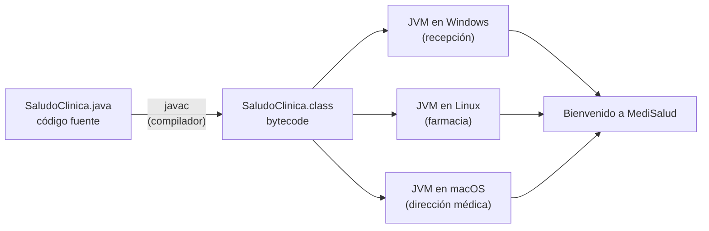

# 💡 Ejemplo 02 — ¿Cómo funciona Java?

## 🌍 Contexto

Un computador no entiende el texto que escribe una persona: solo ejecuta
instrucciones en su propio lenguaje. Por eso, casi todo lenguaje necesita un
**traductor**. Java usa dos pasos:

1. **Compilar**: un programa llamado compilador (`javac`) traduce tu código a un
   formato intermedio llamado ***bytecode***.
2. **Ejecutar**: la **JVM** (*Java Virtual Machine*, máquina virtual de Java) lee ese
   *bytecode* y lo ejecuta en el computador donde esté instalada.

El *bytecode* no es específico de Windows, macOS ni Linux: es un formato común que
entiende cualquier JVM. Por eso el mismo archivo compilado sirve en los tres sistemas.

**Qué busca demostrar este ejemplo**: que existe un camino de tres etapas (escribir,
compilar, ejecutar), que cada etapa produce algo distinto, y que ese camino es lo que
hace portable a Java.

## 🏥 Caso de estudio

Recepción de MediSalud quiere un programa mínimo que muestre un saludo al iniciar. El
programa se escribe una vez en un archivo de texto y se lleva por las tres etapas.

## 💻 Archivo: SaludoClinica.java

El código fuente es un archivo de texto con extensión `.java`. Por ahora solo
necesitás reconocer que imprime dos líneas; su estructura se explica en los Ejemplos 05
a 07.

```java
public class SaludoClinica {
    public static void main(String[] args) {
        System.out.println("Bienvenido a MediSalud");
        System.out.println("Este mensaje lo ejecuta la JVM.");
    }
}
```

## 💻 Comandos: compilar y ejecutar

Guardá el código en un archivo llamado exactamente `SaludoClinica.java`, abrí una
terminal en esa carpeta y ejecutá los comandos (el `$` representa el prompt y no se
escribe):

```text
$ ls
SaludoClinica.java

$ javac SaludoClinica.java
(sin mensajes: la compilación fue exitosa)

$ ls
SaludoClinica.class
SaludoClinica.java

$ java SaludoClinica
Bienvenido a MediSalud
Este mensaje lo ejecuta la JVM.
```

Además, desde Java 11 existe un atajo para programas de un solo archivo: `java
SaludoClinica.java` compila en memoria y ejecuta en un solo paso, sin dejar el archivo
`.class`. Sirve para pruebas rápidas, pero **no reemplaza** entender las dos etapas.

## 🗺️ Diagrama



El archivo `.class` se genera **una sola vez**. Cada equipo necesita su propia JVM
(hecha para su sistema operativo), y todas leen el mismo *bytecode*.

## 🧭 Explicación paso a paso

1. **Escribir**: el programador crea `SaludoClinica.java`, un archivo de texto con el
   código fuente.
2. **Compilar**: `javac SaludoClinica.java` revisa el código (si hay errores, se
   detiene y los muestra) y genera `SaludoClinica.class` con el *bytecode*. Que el
   comando no muestre mensajes significa que todo salió bien.
3. **Ejecutar**: `java SaludoClinica` inicia la JVM, que carga `SaludoClinica.class` y
   ejecuta el programa. Se escribe el nombre de la clase, sin la extensión.
4. **Portabilidad**: para usar el programa en otro sistema operativo se copia el
   archivo `.class` y se ejecuta con la JVM de ese sistema; no hace falta volver a
   escribir ni a compilar el programa.
5. **Rendimiento**: mientras el programa corre, la JVM identifica las partes que más se
   ejecutan y las convierte a instrucciones nativas del equipo (compilación *just in
   time*, JIT) para que vayan más rápido.

## ✅ Resultado esperado

Al ejecutar `java SaludoClinica` en cualquiera de los tres sistemas, la consola
muestra:

```text
Bienvenido a MediSalud
Este mensaje lo ejecuta la JVM.
```

## ❓ Preguntas de repaso

**1. [Selección]** ¿Qué archivo genera el compilador `javac` a partir de
`SaludoClinica.java`?

- **A.** `SaludoClinica.exe`
- **B.** `SaludoClinica.txt`
- **C.** `SaludoClinica.class`
- **D.** `SaludoClinica.jvm`

<details>
<summary>🔑 Ver respuesta</summary>

**Respuesta correcta: C**. El compilador genera un archivo `.class` que contiene el
*bytecode*.

</details>

**2. [Selección múltiple]** Seleccioná **todas** las afirmaciones correctas.

- **A.** El *bytecode* lo ejecuta la JVM.
- **B.** El archivo `.class` generado en Windows no puede usarse en Linux.
- **C.** Para ejecutar un programa se escribe `java` seguido del nombre de la clase.
- **D.** `javac` ejecuta el programa y muestra su resultado.

<details>
<summary>🔑 Ver respuesta</summary>

**Respuesta correcta: A y C**. La B es falsa: el *bytecode* es portable, sirve en
cualquier sistema con JVM. La D es falsa: `javac` solo compila; quien ejecuta es
`java`.

</details>

**3. [Abierta]** Ordená las etapas y explicá qué produce cada una: ejecutar en la JVM,
escribir el código fuente, compilar con `javac`.

<details>
<summary>🔑 Ver respuesta modelo</summary>

**Respuesta modelo**: 1) Escribir el código fuente, que produce un archivo `.java`.
2) Compilar con `javac`, que produce un archivo `.class` con *bytecode*. 3) Ejecutar
en la JVM con el comando `java`, que produce el comportamiento del programa (por
ejemplo, los mensajes en consola).

</details>
