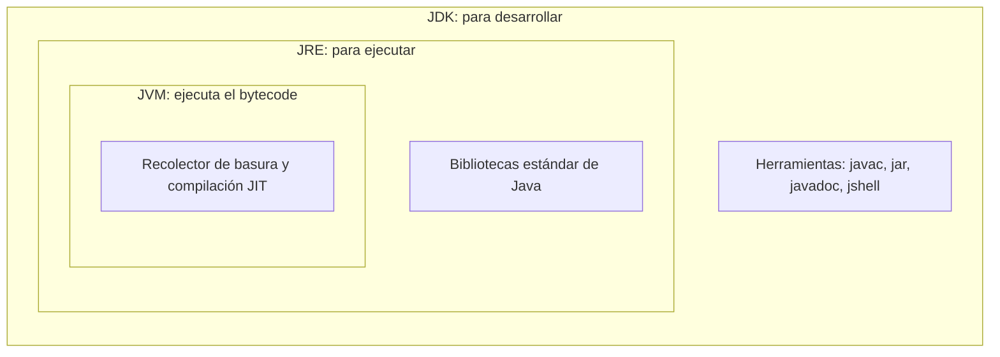

# 💡 Ejemplo 03 — JDK, JRE y JVM

## 🌍 Contexto

En el Ejemplo 02 aparecieron dos herramientas: `javac` (para compilar) y `java` (para
ejecutar). Ambas pertenecen a una "familia" de tres siglas que suelen confundirse:

- **JVM** (*Java Virtual Machine*): el programa que **ejecuta** el *bytecode*. También
  administra la memoria (recolector de basura) y optimiza el código mientras corre
  (JIT).
- **JRE** (*Java Runtime Environment*): la JVM **más las bibliotecas estándar** de
  Java (código ya escrito que los programas usan, por ejemplo para imprimir en la
  consola). Es lo necesario para **ejecutar** programas Java.
- **JDK** (*Java Development Kit*): el JRE **más las herramientas de desarrollo**
  (`javac`, `jar`, `javadoc`, `jshell`…). Es lo necesario para **desarrollar** programas
  Java.

Cada una **contiene** a la anterior: JDK ⊃ JRE ⊃ JVM.

**Qué busca demostrar este ejemplo**: que las tres siglas no son sinónimos, sino capas
que se incluyen unas en otras, y que quien programa necesita el JDK completo.

## 📚 Caso de estudio

Una **biblioteca universitaria** es una buena analogía:

- La **JVM** es la **sala de lectura**: el lugar donde los libros (el *bytecode*) se
  "leen" (se ejecutan).
- El **JRE** es la sala de lectura **con su colección de consulta** (las bibliotecas
  estándar): lo que necesita cualquier lector para trabajar.
- El **JDK** es todo lo anterior **más el taller de edición** (`javac` y demás
  herramientas): lo que necesita quien no solo lee, sino que **escribe** libros
  nuevos.

Un estudiante que solo consulta libros necesita la sala de lectura; el docente que
escribe un texto necesita además el taller. En Java, quien ejecuta programas necesita
un JRE; quien los desarrolla necesita el JDK.

## 🗺️ Diagrama

## 🔍 Comparación

| Sigla | Significa | Contiene | Sirve para | En la analogía |
|---|---|---|---|---|
| **JVM** | Java Virtual Machine | Ejecución del *bytecode*, memoria, JIT | Ejecutar | Sala de lectura |
| **JRE** | Java Runtime Environment | JVM + bibliotecas estándar | Ejecutar programas Java | Sala + colección de consulta |
| **JDK** | Java Development Kit | JRE + herramientas (`javac`…) | Desarrollar y ejecutar | Sala + colección + taller |

## 🧭 Explicación paso a paso

1. `javac SaludoClinica.java` (Ejemplo 02) es una **herramienta de desarrollo**: solo
   viene en el **JDK**.
2. `java SaludoClinica` inicia la **JVM**, que trabaja junto con las **bibliotecas
   estándar** del **JRE** (por ejemplo, la que sabe imprimir en la consola).
3. Como el JDK contiene al JRE y a la JVM, **instalar el JDK alcanza para todo**: por
   eso en este curso instalamos el JDK 25 y no las tres piezas por separado.
4. **Una aclaración actual**: desde Java 11 el JDK ya no viene acompañado de un JRE
   separado, y muchas distribuciones dejaron de publicar el JRE por su cuenta (algunas,
   como Temurin, todavía lo ofrecen como paquete opcional). El concepto de JRE sigue
   siendo válido y aparece en libros y entrevistas, pero hoy lo habitual es instalar
   el JDK completo.
5. Visual Studio Code, el editor del curso, **no es** ninguna de las tres: es un editor
   de texto al que la extensión de Java le agrega la capacidad de usar el JDK para
   revisar, compilar y ejecutar tus proyectos.

## ✅ Resultado esperado

Al terminar este ejemplo deberías poder:

- Dibujar de memoria las tres capas (JDK ⊃ JRE ⊃ JVM) y decir qué agrega cada una.
- Decidir qué necesita instalar un estudiante que **desarrolla** y qué necesita un
  computador que **solo ejecuta** un programa ya compilado.
- Explicar por qué en este curso se instala el JDK.

## ❓ Preguntas de repaso

**1. [Selección]** ¿Cuál de estas herramientas viene **solo** en el JDK y no en un JRE?

- **A.** La JVM.
- **B.** El compilador `javac`.
- **C.** Las bibliotecas estándar de Java.
- **D.** El recolector de basura.

🔑 Ver respuesta

**Respuesta correcta: B**. El compilador es una herramienta de desarrollo y pertenece
al JDK. La JVM, las bibliotecas estándar y el recolector de basura forman parte del
entorno de ejecución.

**2. [Selección múltiple]** Seleccioná **todas** las afirmaciones correctas.

- **A.** El JDK incluye al JRE.
- **B.** El JRE incluye a la JVM.
- **C.** La JVM incluye al JDK.
- **D.** Para desarrollar programas Java se necesita el JDK.

🔑 Ver respuesta

**Respuesta correcta: A, B y D**. La relación es JDK ⊃ JRE ⊃ JVM. La C invierte la
relación: la JVM es la pieza más pequeña.

**3. [Abierta]** Un docente de la biblioteca universitaria te pide instalar Java en el
computador de una sala donde solo se ejecutará un sistema de préstamos ya compilado, y
en el suyo, donde escribirá código nuevo. Explicá qué necesita cada equipo.

🔑 Ver respuesta modelo

**Respuesta modelo**: El equipo de la sala solo necesita un entorno de ejecución (JRE,
que incluye la JVM y las bibliotecas estándar), porque nada se compila allí. El
equipo del docente necesita el JDK, que además del entorno de ejecución trae las
herramientas de desarrollo, como el compilador `javac`. En la práctica actual se
instala el JDK completo, porque contiene ambos.

