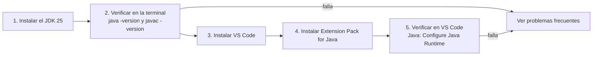

# 💡 Ejemplo 04 — Configuración del entorno de desarrollo

## 🌍 Contexto

Antes de escribir tu primer programa necesitás un **entorno de desarrollo**: el
conjunto de herramientas que te permite escribir, compilar y ejecutar código. En este
curso son tres piezas que se instalan en orden:

- El **JDK 25** (Eclipse Temurin): trae el compilador `javac` y la JVM (Ejemplo 03).
- **Visual Studio Code** (VS Code): un **editor de código** gratuito, con explorador de
  archivos, terminal integrada y paleta de comandos.
- La extensión **Extension Pack for Java**: le enseña a VS Code a trabajar con Java
  (resaltar errores mientras escribís, ejecutar y depurar programas, administrar
  proyectos). VS Code, por sí solo, no sabe compilar Java: usa el JDK que tenés
  instalado.

El orden importa: **primero el JDK, después VS Code y por último la extensión**. Así
podés comprobar cada pieza por separado y ver la diferencia entre "el JDK" y "el
editor".

**Qué busca demostrar este ejemplo**: que dejar el entorno listo es un procedimiento de
cinco pasos con una verificación al final de cada pieza, y que la mayoría de los
problemas tienen una causa conocida y una solución concreta.

## 🏥 Caso de estudio

El equipo de sistemas de **MediSalud** incorpora a nuevos desarrolladores y necesita
que todos trabajen con el mismo entorno, para que un programa que funciona en un
computador funcione igual en los demás. La guía de abajo es el procedimiento que
seguirá cada persona, en Windows, macOS o Linux.

> 📝 Los menús de VS Code se escriben en inglés (el idioma por defecto) con su
> equivalente en español entre paréntesis. Los comandos de la extensión de Java (los
> que empiezan con `Java:`) aparecen **siempre en inglés**, aunque VS Code esté en
> español. Esta guía no usa capturas de pantalla porque la interfaz cambia cada mes.

## 🗺️ Diagrama



## 🪜 Paso 1 — Instalar el JDK 25

### 🪟 Windows

Opción A, con el instalador (`.msi`):

1. Descargá el instalador `.msi` de Temurin 25 desde la
   [página de descargas de Adoptium](https://adoptium.net/temurin/releases).
2. Ejecutalo, aceptá la licencia y, en la pantalla **Custom Setup**, dejá marcada
   **Add to PATH** (viene marcada por defecto) y marcá también **Set JAVA_HOME
   variable**.
3. Presioná **Next**, **Install** y **Finish**.

Opción B, desde una terminal (PowerShell o Símbolo del sistema):

```powershell
winget install EclipseAdoptium.Temurin.25.JDK
```

### 🍎 macOS

1. Descargá el instalador `.pkg` de Temurin 25 desde la
   [página de descargas de Adoptium](https://adoptium.net/temurin/releases).
2. Abrilo con doble clic y seguí el asistente (te pedirá la contraseña de
   administrador). También podés instalarlo desde la terminal:

```bash
sudo installer -pkg ruta/al/instalador.pkg -target /
```

El JDK queda en `/Library/Java/JavaVirtualMachines/`.

### 🐧 Linux (Debian y Ubuntu)

```bash
sudo apt install -y wget apt-transport-https gpg
wget -qO - https://packages.adoptium.net/artifactory/api/gpg/key/public | gpg --dearmor | sudo tee /etc/apt/trusted.gpg.d/adoptium.gpg > /dev/null
echo "deb https://packages.adoptium.net/artifactory/deb $(awk -F= '/^VERSION_CODENAME/{print$2}' /etc/os-release) main" | sudo tee /etc/apt/sources.list.d/adoptium.list
sudo apt update
sudo apt install temurin-25-jdk
```

En Fedora, RHEL y derivadas, seguí la
[guía de instalación para Linux de Adoptium](https://adoptium.net/installation/linux/)
para agregar el repositorio y después ejecutá `sudo dnf install temurin-25-jdk`.

## 🪜 Paso 2 — Verificar el JDK en la terminal

Cerrá y **abrí una terminal nueva** (la anterior no conoce la instalación reciente) y
ejecutá:

```text
$ java -version
openjdk version "25" 2025-09-16 LTS
OpenJDK Runtime Environment Temurin-25+36 (build 25+36-LTS)
OpenJDK 64-Bit Server VM Temurin-25+36 (build 25+36-LTS, mixed mode, sharing)

$ javac -version
javac 25
```

Cómo leer el resultado:

- `java -version` confirma que la **JVM** está instalada y que es la versión **25**.
- `javac -version` confirma que el **compilador** (el JDK completo) está instalado.
- Tu salida puede diferir en el número de compilación (`25+36`) y, si instalaste otra
  distribución, en el nombre (`Temurin`). Lo importante es que la versión sea **25**.

## 🪜 Paso 3 — Instalar Visual Studio Code

Descargá VS Code desde [code.visualstudio.com](https://code.visualstudio.com/download)
e instalalo según tu sistema operativo:

- **🪟 Windows**: ejecutá el instalador **User Setup**. Es el recomendado: no requiere
  permisos de administrador y agrega VS Code al `PATH`. Reiniciá la terminal al
  terminar.
- **🍎 macOS**: abrí el archivo `.dmg` descargado y arrastrá **Visual Studio Code.app** a
  la carpeta **Aplicaciones**. Para poder abrirlo desde la terminal, abrí VS Code, abrí
  la paleta de comandos (`Cmd+Shift+P`) y ejecutá **Shell Command: Install 'code'
  command in PATH**.
- **🐧 Linux**: la forma más simple es `snap` (sirve en casi todas las distribuciones):

```bash
sudo snap install --classic code
```

  También podés instalar el paquete `.deb` con `sudo apt install ./archivo.deb`, o desde
  el repositorio con `sudo apt install code` (Debian y Ubuntu) o `sudo dnf install code`
  (Fedora y RHEL).

Para comprobar que VS Code quedó instalado, abrí una terminal **nueva** y ejecutá:

```text
$ code --version
1.138.0
7debcd0e2acdea1c52de81bf9ee1620444407dda
x64
```

La primera línea es la versión de VS Code; **tus números serán distintos** porque VS
Code se actualiza todos los meses.

## 🪜 Paso 4 — Instalar la extensión de Java

1. Abrí VS Code y abrí la vista **Extensions** (*Extensiones*) con `Ctrl+Shift+X`
   (`Cmd+Shift+X` en macOS).
2. Buscá **Extension Pack for Java** (el autor es **Microsoft**) y presioná **Install**.
3. Esperá a que termine. El paquete instala varias extensiones juntas, entre ellas
   **Language Support for Java™ by Red Hat** (el "cerebro" que entiende el código),
   **Debugger for Java** (ejecutar y depurar) y **Project Manager for Java**.

También podés instalarla desde la terminal:

```bash
code --install-extension vscjava.vscode-java-pack
```

## 🪜 Paso 5 — Verificar el JDK dentro de VS Code

1. Abrí la paleta de comandos con `Ctrl+Shift+P` (`Cmd+Shift+P` en macOS).
2. Escribí **Java: Configure Java Runtime** y presioná `Enter`.
3. Se abre una pestaña con los JDK que la extensión encontró en tu computador. Debe
   aparecer el **JDK 25** que instalaste en el paso 1.

Si no aparece, indicale a la extensión dónde está el JDK. Abrí la configuración con
`Ctrl+Shift+P` → **Preferences: Open User Settings (JSON)** y agregá esta entrada
(cambiá la ruta por la de tu instalación):

```json
"java.configuration.runtimes": [
    {
        "name": "JavaSE-25",
        "path": "/usr/lib/jvm/temurin-25-jdk-amd64",
        "default": true
    }
]
```

Rutas habituales de instalación (varían según la versión exacta):

```text
Windows:  C:\Program Files\Eclipse Adoptium\jdk-25...
macOS:    /Library/Java/JavaVirtualMachines/temurin-25.jdk/Contents/Home
Linux:    /usr/lib/jvm/temurin-25-jdk-amd64
```

En Windows, las barras invertidas se escriben **dobles** dentro del archivo JSON. La
ruta debe ser la carpeta del JDK, **no** su subcarpeta `bin`.

## 🧭 Explicación paso a paso

1. Se instala primero el **JDK** porque es la base: sin él no hay compilador. Sirve
   también fuera del editor (Ejemplo 02).
2. Se verifica con **dos comandos** porque cubren cosas distintas: `java` prueba la JVM
   y `javac` prueba el compilador. Si `java` funciona pero `javac` no, tenés un entorno
   de ejecución sin herramientas de desarrollo.
3. **VS Code** es solo el editor: no trae Java. Por eso la **extensión** es una pieza
   aparte, y por eso se instala después de tener el JDK.
4. La extensión **busca el JDK** en tu computador. Se verifica con **Java: Configure
   Java Runtime** porque un JDK instalado en el sistema no sirve de nada si el editor
   no lo encuentra.
5. Al terminar los cinco pasos, el entorno está listo para el Ejemplo 05, donde
   crearás tu primer proyecto.

## 🧩 Problemas frecuentes

| Síntoma | Causa probable | Qué hacer |
|---|---|---|
| `javac` "no se reconoce como un comando" (Windows) o `command not found` (macOS y Linux) | El JDK no está instalado o la terminal es anterior a la instalación. | Abrí una terminal nueva. Si persiste, reinstalá el JDK marcando **Add to PATH** (Windows) o repetí el paso 1. |
| `java -version` muestra otra versión (por ejemplo 17 o 21) | Hay otro JDK instalado que aparece primero en el `PATH`. | Desinstalá el otro JDK o poné la carpeta `bin` del JDK 25 antes que las demás en el `PATH` y en `JAVA_HOME`. |
| `java` funciona pero `javac` no | Se instaló solo un entorno de ejecución (JRE) y no el JDK. | Instalá el JDK completo (`temurin-25-jdk`). |
| `code` "no se reconoce" en la terminal | VS Code no está en el `PATH`. | En Windows, reiniciá la terminal (el instalador lo agrega). En macOS, ejecutá **Shell Command: Install 'code' command in PATH**. En Linux, instalalo con `snap` o con el paquete `.deb`. |
| Los comandos `Java: ...` no aparecen en la paleta | La extensión no está instalada o todavía se está cargando. | Revisá la vista **Extensions** y esperá a que termine; si persiste, ejecutá **Developer: Reload Window**. |
| **Java: Configure Java Runtime** no muestra el JDK 25 | La extensión no lo detectó. | Agregá `java.configuration.runtimes` como se muestra en el paso 5. |
| No tenés permisos de administrador | El instalador necesita escribir en carpetas del sistema. | En Windows usá **User Setup** para VS Code. Para el JDK, descargá el archivo comprimido (`.zip` o `.tar.gz`) de Temurin, descomprimilo en una carpeta tuya y agregá su `bin` al `PATH` de tu usuario; o pedí los instaladores al docente. |
| No tenés conexión a internet | La descarga y la instalación de la extensión no son posibles. | Pedí al docente los instaladores y el archivo de la extensión (`.vsix`), que se instala con `code --install-extension archivo.vsix`. |

## ✅ Resultado esperado

Al terminar deberías tener:

- La terminal mostrando `java -version` con la versión **25** y `javac -version` con
  `javac 25`, como en el paso 2.
- `code --version` mostrando una versión de VS Code.
- La pestaña **Java: Configure Java Runtime** listando un JDK **25**.

## ❓ Preguntas de repaso

**1. [Selección]** En la terminal, `java -version` muestra la versión 25, pero
`javac -version` dice que el comando no existe. **Pregunta:** ¿qué falta?

- **A.** Instalar VS Code.
- **B.** Instalar el JDK completo, que incluye el compilador.
- **C.** Reiniciar el editor.
- **D.** Nada: `javac` no hace falta para compilar.

<details>
<summary>🔑 Ver respuesta</summary>

**Respuesta correcta: B**. `java` prueba que hay una JVM, pero el compilador `javac`
solo viene en el JDK. Hay que instalar el JDK completo.

</details>

**2. [Selección múltiple]** Seleccioná **todas** las afirmaciones correctas sobre la
configuración del entorno.

- **A.** Conviene instalar primero el JDK y después VS Code y la extensión de Java.
- **B.** Después de instalar el JDK hay que abrir una terminal nueva para verificarlo.
- **C.** Si la extensión no encuentra el JDK 25, se puede indicar con
  `java.configuration.runtimes`.
- **D.** VS Code reemplaza al JDK, por lo que no hace falta instalarlo.

<details>
<summary>🔑 Ver respuesta</summary>

**Respuesta correcta: A, B y C**. La D es falsa: VS Code es un editor y la extensión
usa un JDK para compilar y ejecutar; no lo reemplazan.

</details>

**3. [Abierta]** Un compañero instala el JDK, VS Code y la extensión de Java, pero al
ejecutar `javac -version` en la terminal aparece "comando no encontrado". Nombrá dos
causas posibles y cómo comprobarías cada una.

<details>
<summary>🔑 Ver respuesta modelo</summary>

**Respuesta modelo**: 1) La terminal se abrió antes de la instalación: se comprueba
abriendo una terminal nueva y repitiendo el comando. 2) El JDK no quedó en el `PATH`
(en Windows, no se marcó **Add to PATH**): se comprueba revisando si la carpeta `bin`
del JDK figura en el `PATH` y, si no, reinstalando o agregándola. También podría ser
que solo se haya instalado un entorno de ejecución sin el compilador.

</details>
