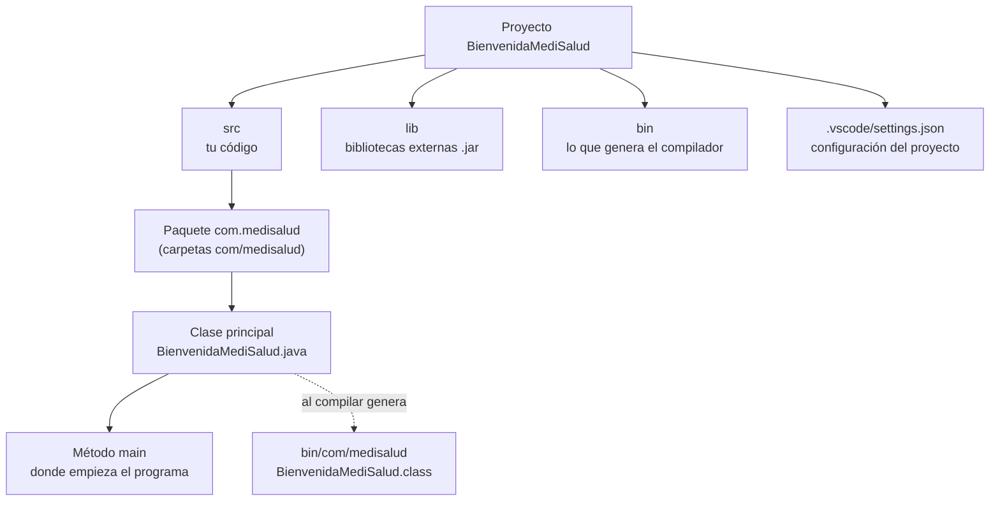

# 💡 Ejemplo 07 — Estructura de un proyecto de consola

## 🌍 Contexto

Cuando VS Code crea un proyecto genera varias carpetas y archivos. No necesitás conocerlos
todos, pero sí saber **dónde va tu código** y **qué es cada parte** de la clase
principal. Así podés abrir un proyecto que no escribiste y orientarte rápido.

VS Code ofrece dos vistas del mismo proyecto:

- El **Explorer** (`Ctrl+Shift+E`): la vista **física**, con las carpetas y archivos tal
  como están en el disco.
- La vista **Java Projects**, que aparece debajo del Explorer cuando hay un proyecto de
  Java: una vista **lógica**, organizada por paquetes y clases.

**Qué busca demostrar este ejemplo**: que cada carpeta del proyecto tiene un propósito,
que tu código vive en un solo lugar (`src`), y que la clase principal se lee por partes:
paquete, clase y método `main`.

## 🏥 Caso de estudio

Retomamos el proyecto **BienvenidaMediSalud** de los Ejemplos 05 y 06. Vas a
"recorrerlo" carpeta por carpeta y línea por línea.

## 🌳 Árbol de archivos (como se vería en VS Code)

Vista **Explorer**, después de ejecutar el proyecto al menos una vez:

```text
BienvenidaMediSalud
├── .vscode
│   └── settings.json
├── bin
│   └── com
│       └── medisalud
│           └── BienvenidaMediSalud.class
├── lib
├── src
│   └── com
│       └── medisalud
│           └── BienvenidaMediSalud.java
└── README.md
```

## 🗺️ Diagrama



## 🔍 ¿Qué es cada parte del proyecto?

| Carpeta o archivo | Para qué sirve | ¿Lo editás vos? |
|---|---|---|
| `src` | Aquí vive tu código, organizado en carpetas que forman los paquetes. | Sí |
| `lib` | Aquí van las bibliotecas externas (archivos `.jar`). En este módulo queda vacía. | Rara vez |
| `bin` | Archivos `.class` con el *bytecode* que genera el compilador (Ejemplo 02). La extensión lo crea sola al compilar. | No |
| `.vscode/settings.json` | Configuración del proyecto para el editor. | No por ahora |
| `README.md` | Nota de bienvenida que trae la plantilla. | Opcional |

El archivo `.vscode/settings.json` de un proyecto **No build tools** dice tres cosas:

```json
{
    "java.project.sourcePaths": ["src"],
    "java.project.outputPath": "bin",
    "java.project.referencedLibraries": [
        "lib/**/*.jar"
    ]
}
```

- `sourcePaths`: **dónde está el código** (`src`).
- `outputPath`: **dónde se guarda lo compilado** (`bin`).
- `referencedLibraries`: **dónde buscar bibliotecas** externas (los `.jar` dentro de
  `lib`).

## 💻 Archivo: BienvenidaMediSalud.java

<details>
<summary>📄 Ver código completo de BienvenidaMediSalud.java (creado en el Ejemplo 05)</summary>

```java
package com.medisalud;

public class BienvenidaMediSalud {

    public static void main(String[] args) {
        System.out.println("Bienvenido a MediSalud");
        System.out.println("Su salud, nuestra prioridad.");
    }
}
```

</details>

Las partes de la clase, línea por línea:

| Línea | Código | Qué es |
|---|---|---|
| 1 | `package com.medisalud;` | El **paquete**: la "carpeta" lógica de la clase. |
| 3 | `public class BienvenidaMediSalud {` | La **clase principal**. Su nombre debe coincidir con el del archivo. |
| 5 | `public static void main(String[] args) {` | El método **`main`**: el punto donde empieza el programa. |
| 6 y 7 | `System.out.println(...);` | Las **instrucciones** que se ejecutan de arriba hacia abajo. |
| 8 | `}` | Cierra el método `main`. |
| 9 | `}` | Cierra la clase. |

## 🧩 El nombre de la clase debe coincidir con el del archivo

Si la clase se llama distinto del archivo, el compilador se queja. Por ejemplo, si el
archivo es `BienvenidaMediSalud.java` pero la clase se declara como `Bienvenida`:

```java
package com.medisalud;

public class Bienvenida {

    public static void main(String[] args) {
        System.out.println("Bienvenido a MediSalud");
        System.out.println("Su salud, nuestra prioridad.");
    }
}
```

VS Code subraya en rojo el nombre de la clase y el panel **Problems** muestra:

```text
✖ The public type Bienvenida must be defined in its own file Java(16777541) [Ln 3, Col 14]
```

Con `javac` (terminal) el mismo problema se ve así:

```text
BienvenidaMediSalud.java:3: error: class Bienvenida is public, should be declared in a file named Bienvenida.java
```

La solución es que el nombre de la clase y el del archivo sean **idénticos**, incluyendo
mayúsculas y minúsculas: cambiá el nombre de la clase en el código, o cambiale el nombre
al archivo con clic derecho → **Rename**.

## 🧭 Explicación paso a paso

1. **Tu código va en `src`**. Las demás carpetas las gestiona la extensión.
2. **El paquete** agrupa clases relacionadas. La línea `package` debe coincidir con las
   carpetas donde está el archivo (`src/com/medisalud`).
3. **La clase principal** es la que contiene el método `main`. Java empieza a ejecutar el
   programa por ahí.
4. **`main` es el punto de partida**: dentro de sus llaves están las instrucciones que se
   ejecutan en orden. Por ahora es suficiente entender eso; sus palabras (`public`,
   `static`, `void`, `String[] args`) se explican más adelante.
5. **`bin`** guarda el resultado de compilar. Es el mismo tipo de archivo (`.class`) que
   generaste con `javac` en el Ejemplo 02, y no se edita.
6. **El nombre de la clase y del archivo coinciden**: es una regla de Java, y romperla
   es una causa muy común de errores de compilación en los primeros proyectos.

## ✅ Resultado esperado

Al terminar deberías poder abrir cualquier proyecto de consola creado con **No build
tools** y señalar: la carpeta de código fuente, el paquete, la clase principal y el
método `main`. También deberías reconocer el error "The public type X must be defined in
its own file" como una diferencia entre el nombre de la clase y el del archivo.

## ❓ Preguntas de repaso

**1. [Selección]** ¿En qué carpeta de un proyecto de consola de VS Code escribís tu
código?

- **A.** `lib`
- **B.** `bin`
- **C.** `src`
- **D.** `.vscode`

<details>
<summary>🔑 Ver respuesta</summary>

**Respuesta correcta: C**. `src` es la carpeta de código fuente. En `bin` solo queda el
resultado de compilar.

</details>

**2. [Selección múltiple]** Seleccioná **todas** las afirmaciones correctas sobre la
clase principal.

- **A.** Está dentro de un paquete, declarado con la línea `package`.
- **B.** Contiene el método `main`.
- **C.** Su nombre debe coincidir con el del archivo `.java`.
- **D.** Se guarda en `bin` como archivo `.java`.

<details>
<summary>🔑 Ver respuesta</summary>

**Respuesta correcta: A, B y C**. La D es falsa: en `bin` se guardan los archivos
`.class` (*bytecode*), no los `.java`.

</details>

**3. [Abierta]** Un compañero te muestra un error: `The public type Prestamos must be
defined in its own file`, pero su archivo se llama `PrestamosBiblioteca.java`. Explicá
qué pasó y cómo se corrige.

<details>
<summary>🔑 Ver respuesta modelo</summary>

**Respuesta modelo**: La clase se declaró como `Prestamos`, pero el archivo se llama
`PrestamosBiblioteca.java`: Java exige que una clase pública se llame igual que su
archivo. Se corrige haciendo que ambos nombres coincidan, por ejemplo cambiando el
nombre de la clase a `PrestamosBiblioteca` (o el del archivo a `Prestamos.java`).

</details>
