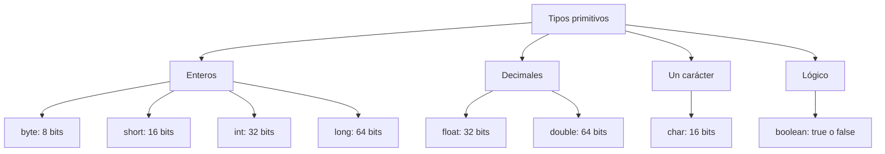

# 💡 Ejemplo 09 — Datos primitivos

## 🌍 Contexto

Todo dato que guardás en una variable tiene un **tipo**: le dice a Java qué clase de
valor es (un entero, un decimal, un carácter…) y cuánta memoria ocupa. Java tiene
**ocho tipos primitivos**, los más básicos del lenguaje. Elegir el adecuado importa:
uno demasiado pequeño no alcanza para el valor, y uno demasiado grande desperdicia
memoria.

Los ocho tipos se agrupan en cuatro familias:

- **Enteros**: `byte`, `short`, `int`, `long`.
- **Decimales**: `float`, `double`.
- **Un carácter**: `char`.
- **Lógico** (verdadero o falso): `boolean`.

**Qué busca demostrar este ejemplo**: cuáles son los ocho tipos primitivos, en qué se
diferencian por tamaño y rango, cómo elegir uno según el dato de negocio, y qué errores
comunes aparecen al escribir sus valores.

## 🏥 Caso de estudio

Los datos de un **paciente de MediSalud** y de un **libro de la Biblioteca
Universitaria** son un buen catálogo: hay números pequeños (los días de préstamo),
grandes (el número de historia clínica), decimales (el peso) y de verdadero/falso (si el
paciente es afiliado).

## 🗺️ Diagrama



## 🔍 Los ocho tipos primitivos

| Tipo | Tamaño | Rango o valores | Ejemplo de uso |
|---|---|---|---|
| `byte` | 8 bits | −128 a 127 | `diasPrestamo` (días de préstamo de un libro) |
| `short` | 16 bits | −32 768 a 32 767 | `numeroPaginas` (páginas de un libro) |
| `int` | 32 bits | −2 147 483 648 a 2 147 483 647 | `edadPaciente`, `codigoUsuario` |
| `long` | 64 bits | −9 223 372 036 854 775 808 a 9 223 372 036 854 775 807 | `numeroHistoria`, `isbn` |
| `float` | 32 bits | decimal, unos 7 dígitos significativos | `precioLibro` |
| `double` | 64 bits | decimal, unos 15 dígitos significativos | `pesoKg` |
| `char` | 16 bits | un carácter (de 0 a 65 535 como código) | `grupoSanguineo` |
| `boolean` | — | `true` o `false` | `esAfiliado`, `disponible` |

Cómo elegir, en la práctica:

- Para **enteros** usá `int` por defecto; pasá a `long` cuando el valor **no cabe** en
  un `int` (por ejemplo, un ISBN de 13 dígitos). `byte` y `short` se usan cuando se sabe
  que el rango es pequeño; en este ejemplo aparecen para conocer sus límites.
- Para **decimales** usá `double` por defecto. `float` ocupa la mitad y es menos
  preciso: en un sistema real, el dinero se maneja con tipos más precisos que se verán
  más adelante.
- Para **una letra o símbolo** usá `char`; para **verdadero/falso**, `boolean`.

## 🌳 Árbol de archivos (como se vería en VS Code)

```text
TiposPrimitivos
└── src
    └── com
        └── medisalud
            └── TiposPrimitivos.java
```

## 💻 Archivo: TiposPrimitivos.java

```java
package com.medisalud;

public class TiposPrimitivos {

    public static void main(String[] args) {
        byte diasPrestamo = 7;
        short numeroPaginas = 471;
        int edadPaciente = 34;
        long numeroHistoria = 9876543210L;
        float precioLibro = 59.9f;
        double pesoKg = 62.5;
        char grupoSanguineo = 'O';
        boolean esAfiliado = true;

        System.out.println(diasPrestamo);
        System.out.println(numeroPaginas);
        System.out.println(edadPaciente);
        System.out.println(numeroHistoria);
        System.out.println(precioLibro);
        System.out.println(pesoKg);
        System.out.println(grupoSanguineo);
        System.out.println(esAfiliado);

        System.out.println(Byte.MAX_VALUE);
        System.out.println(Integer.MAX_VALUE);
        System.out.println(Long.MAX_VALUE);
    }
}
```

Las tres últimas instrucciones muestran el **valor máximo** de `byte`, `int` y `long`.
`Byte.MAX_VALUE` y sus similares son nombres que Java ya trae definidos; por ahora
copialos tal cual, sin preocuparte por el punto: su forma se explicará más adelante.

## ✅ Resultado esperado

```text
7
471
34
9876543210
59.9
62.5
O
true
127
2147483647
9223372036854775807
```

## 🧭 Explicación paso a paso

1. Cada línea declara una variable de un tipo distinto y le da un valor inicial. Los
   nombres de las variables siguen las convenciones del Ejemplo 08.
2. `9876543210L` lleva una **`L`** al final: los números enteros escritos en el código
   se consideran `int` por defecto, y este no cabe en un `int`; la `L` le indica a Java
   que es un `long`.
3. `59.9f` lleva una **`f`** al final: los decimales escritos en el código se consideran
   `double` por defecto; la `f` indica que es un `float`.
4. `'O'` usa **comillas simples**: un `char` guarda **un solo** carácter. El texto (un
   `String`) usa comillas dobles.
5. `true` y `false` se escriben en **minúsculas** y **sin comillas**.
6. El programa muestra los ocho valores y, al final, los máximos de `byte`, `int` y
   `long`, que coinciden con la tabla.

## 🧩 Errores frecuentes

Los mensajes de abajo son los que muestra el panel **Problems** de VS Code (Ejemplo 06).
La posición `[Ln 6, Col 31]` se refiere al archivo completo, con su línea `package`.

**1. Un entero grande sin la `L`.**

```java
long numeroHistoria = 9876543210;
```

```text
✖ The literal 9876543210 of type int is out of range Java(536871066) [Ln 6, Col 31]
```

Aunque la variable sea `long`, el número escrito se lee primero como `int` y "está fuera
de rango" (*out of range*). Agregá la `L`: `9876543210L`.

**2. Un decimal sin la `f` en un `float`.**

```java
float precioLibro = 59.9;
```

```text
✖ Type mismatch: cannot convert from double to float Java(16777233) [Ln 6, Col 29]
```

`59.9` es un `double`; el mensaje dice que no se puede convertir (*Type mismatch*) a
`float`, porque podría perder precisión. Escribí `59.9f` o declará la variable como
`double`.

**3. Un carácter con comillas dobles.**

```java
char grupoSanguineo = "O";
```

```text
✖ Type mismatch: cannot convert from String to char Java(16777233) [Ln 6, Col 31]
```

Las comillas dobles crean un texto (`String`). Para un `char`, usá comillas simples:
`'O'`.

**4. Un valor fuera del rango del tipo.**

```java
byte diasPrestamo = 200;
```

```text
✖ Type mismatch: cannot convert from int to byte Java(16777233) [Ln 6, Col 29]
```

`200` supera el máximo de `byte` (127). Usá un tipo con más rango, por ejemplo `short` o
`int`.

**5. Un decimal en una variable entera.**

```java
int edadPaciente = 34.5;
```

```text
✖ Type mismatch: cannot convert from double to int Java(16777233) [Ln 6, Col 28]
```

Un `int` no guarda decimales. Usá `double`, o un valor entero.

## ❓ Preguntas de repaso

**1. [Selección]** El número de historia clínica de un paciente es `9876543210`.
**Pregunta:** ¿qué tipo primitivo entero usarías?

- **A.** `byte`
- **B.** `short`
- **C.** `int`
- **D.** `long`

<details>
<summary>🔑 Ver respuesta</summary>

**Respuesta correcta: D**. El valor supera el máximo de un `int` (2 147 483 647), así
que se necesita `long` (y escribir el valor con `L`).

</details>

**2. [Selección múltiple]** Seleccioná **todas** las declaraciones correctas.

- **A.** `char categoria = 'N';`
- **B.** `boolean disponible = true;`
- **C.** `char categoria = "N";`
- **D.** `float precio = 59.9;`

<details>
<summary>🔑 Ver respuesta</summary>

**Respuesta correcta: A y B**. La C usa comillas dobles en un `char` y la D asigna un
`double` a un `float` sin la `f`.

</details>

**3. [Abierta]** Un compañero quiere guardar el peso de un paciente (`62.5`) y escribe
`int pesoKg = 62.5;`. Explicá por qué falla y cómo lo corregirías.

<details>
<summary>🔑 Ver respuesta modelo</summary>

**Respuesta modelo**: Falla porque un `int` solo guarda números enteros y `62.5` es un
decimal; el compilador muestra `possible lossy conversion from double to int`. Se
corrige declarando la variable como `double`: `double pesoKg = 62.5;`.

</details>
