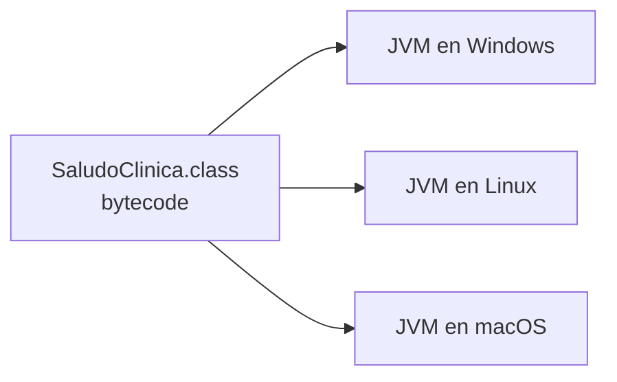
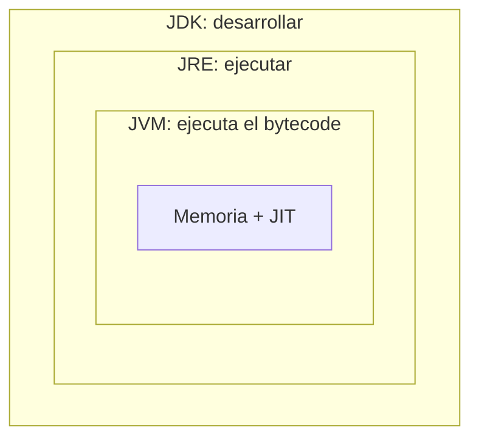

# 📘 Módulo 1 — Introducción

Curso de Java

---

## 🎯 Objetivos del módulo

- Entender qué es Java y cómo se ejecuta un programa.
- Diferenciar JDK, JRE y JVM.
- Dejar listo el entorno: JDK 25 y Visual Studio Code.
- Crear, ejecutar y reconocer la estructura de un proyecto de consola.
- Declarar variables y constantes con tipos primitivos.
- Mostrar datos en la consola.

---

## 🗺️ Ruta de la sesión

1. ¿Qué es Java?
2. Configuración del entorno
3. Creación de proyectos (VS Code)
4. Variables y constantes
5. Taller, resumen y evaluación

---

## 🧠 ¿Qué es Java?

Un **lenguaje de programación** de propósito general, presentado en 1995.

```text
Java 25 = versión LTS (soporte a largo plazo)
```

Lo usamos en todo el curso.

---

## 🧠 ¿Para qué se usa Java?

- Sistemas empresariales (salud, banca, logística)
- Servicios web y APIs
- Herramientas de desarrollo (Eclipse e IntelliJ están hechos en Java)

Ejemplo: el sistema de citas de **MediSalud**.

---

## 🧠 Características de Java (1/2)

| Característica | Idea |
|---|---|
| Portable | El mismo programa corre en Windows, Linux y macOS |
| Orientado a objetos | El programa se organiza en objetos |
| Tipado estático | El compilador revisa los tipos antes de ejecutar |

---

## 🧠 Características de Java (2/2)

| Característica | Idea |
|---|---|
| Memoria automática | El recolector de basura libera lo que no se usa |
| Seguro | Verifica el código antes de ejecutarlo |
| Multihilo | Varias tareas a la vez |

---

## 🧠 ¿Cómo funciona Java?

```text
SaludoClinica.java  →  javac  →  SaludoClinica.class  →  java  →  consola
   código fuente      compilar      bytecode              ejecutar
```

Tres etapas: **escribir**, **compilar**, **ejecutar**.

---

## 🗺️ Un `.class`, muchos sistemas



Cada sistema tiene su JVM; todas leen el mismo *bytecode*.

---

## 🧠 JDK, JRE y JVM



---

## 🔍 ¿Qué instalo yo?

| Sigla | Contiene | Para |
|---|---|---|
| JVM | Ejecución del bytecode | Ejecutar |
| JRE | JVM + bibliotecas | Ejecutar |
| JDK | JRE + `javac` y herramientas | **Desarrollar** |

En el curso: el **JDK 25**.

---

## 🧠 Entorno de desarrollo = JDK + editor

- **JDK 25** (Eclipse Temurin): compilador y JVM.
- **Visual Studio Code**: el editor.
- **Extension Pack for Java**: le enseña Java al editor.

Orden: JDK, VS Code, extensión.

---

## 🪜 Instalar y verificar el JDK

```text
$ java -version
openjdk version "25" 2025-09-16 LTS

$ javac -version
javac 25
```

Abrí una terminal **nueva** después de instalar.

---

## 🪜 Instalar VS Code y la extensión de Java

1. Instalar VS Code.
2. `Ctrl+Shift+X`: **Extension Pack for Java**.
3. `Ctrl+Shift+P`: **Java: Configure Java Runtime**.
4. Debe aparecer un JDK **25**.

---

## 🧩 Problemas frecuentes

| Síntoma | Qué hacer |
|---|---|
| `javac` no se reconoce | Terminal nueva o revisar el `PATH` |
| `java -version` dice otra versión | Poné el JDK 25 primero en el `PATH` |
| No aparece el JDK 25 en VS Code | `java.configuration.runtimes` |

---

## 🪜 Crear un proyecto de consola

1. `Ctrl+Shift+P`: **Java: Create Java Project...**
2. **No build tools**
3. Nombre: `BienvenidaMediSalud`
4. En `src`: carpeta `com/medisalud`
5. Archivo `BienvenidaMediSalud.java`

---

## 🔍 Nombres de clase válidos

| Nombre | ¿Válido? |
|---|---|
| `BienvenidaMediSalud` | ✅ |
| `Bienvenida MediSalud` | ❌ espacio |
| `1erProyecto` | ❌ empieza con número |

---

## 💻 Tu primer programa

```java
package com.medisalud;

public class BienvenidaMediSalud {

    public static void main(String[] args) {
        System.out.println("Bienvenido a MediSalud");
    }
}
```

`main` es donde empieza el programa.

---

## 🪜 Ejecutar un proyecto

- Clic en **Run**, sobre `main`
- La salida aparece en la **terminal**

```text
Bienvenido a MediSalud
Su salud, nuestra prioridad.
```

---

## 🧩 Leer un error de compilación

```text
✖ Syntax error, insert ";" to complete BlockStatements Java(1610612976) [Ln 6, Col 52]
```

- **Mensaje**: qué pasó
- **[Ln, Col]**: dónde
- Panel **Problems**: `Ctrl+Shift+M`

---

## 🌳 Estructura de un proyecto

```text
BienvenidaMediSalud
├── bin
├── lib
└── src
    └── com
        └── medisalud
            └── BienvenidaMediSalud.java
```

Tu código va en **src**.

---

## 🧠 Variables y constantes

```java
int edadPaciente = 34;              // variable: puede cambiar
final double TASA_IVA = 0.19;       // constante: no cambia
```

Forma: `tipo nombre = valor;`

---

## 🔍 Nombres y convenciones

| Elemento | Convención | Ejemplo |
|---|---|---|
| Variable | `camelCase` | `edadPaciente` |
| Constante | `MAYUSCULAS_CON_GUION_BAJO` | `TASA_IVA` |

Sin espacios, sin tildes, sin palabras reservadas.

---

## 🧠 Los ocho tipos primitivos

| Familia | Tipos |
|---|---|
| Enteros | `byte`, `short`, `int`, `long` |
| Decimales | `float`, `double` |
| Un carácter | `char` |
| Lógico | `boolean` |

Por defecto: `int` y `double`.

---

## 🧩 Sufijos y comillas

```java
long numeroHistoria = 9876543210L;   // L para long
float precioLibro = 59.9f;           // f para float
char grupoSanguineo = 'O';           // comillas simples: char
```

Comillas dobles: texto (`String`).

---

## 💻 Imprimir en la consola

```java
System.out.print("Título: ");
System.out.println("ISBN: " + isbn);
System.out.printf("Precio: %.2f%n", precioLibro);
```

`print` no salta, `println` salta, `printf` da formato.

---

## 💻 Formatos y secuencias de escape

| Marcador | Muestra |
|---|---|
| `%s` | Texto |
| `%d` | Entero |
| `%.2f` | Decimal con 2 cifras |
| `%n` | Salto de línea |

`\n` salto · `\t` tabulación · `\"` comilla

---

## 🛠️ Taller: ficha de registro de un paciente

1. Crear `FichaRegistroPaciente`
2. Declarar 2 constantes y 6 variables
3. Imprimir la ficha con `println` y `printf`
4. Provocar y leer un error

---

## 📌 Resumen

- Java: **escribir → compilar → ejecutar**
- **JDK ⊃ JRE ⊃ JVM**
- Entorno: JDK 25 + VS Code + extensión de Java
- Proyecto de consola: `main` es el punto de partida
- Variables, constantes y ocho primitivos
- `print`, `println`, `printf`

---

## 📝 Evaluación

- **Quiz 01**: 12 preguntas tipo entrevista técnica
- **Ejercicios**: Básicos, Intermedios, Avanzado y Desafío

Siguiente paso: practicar con los ejercicios del módulo.
