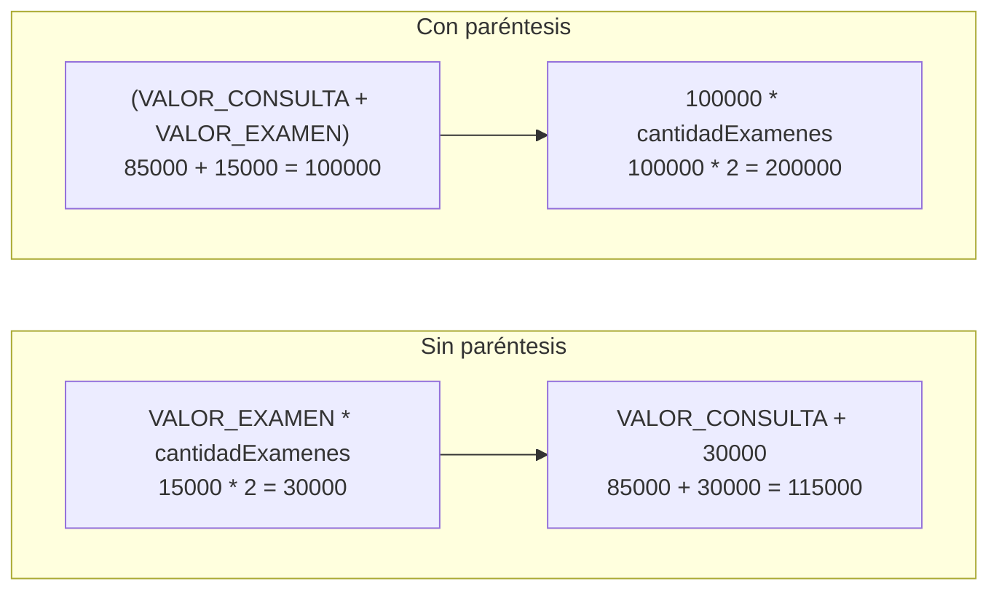

# 💡 Ejemplo 01 — Operadores de asignación y aritméticos

## 🌍 Contexto

Hasta ahora tus programas guardaban datos y los mostraban. Un **operador** es un símbolo que
combina o transforma valores para obtener un resultado, y con ellos el programa empieza a
**calcular**. Este ejemplo reúne dos familias:

- **Operadores aritméticos**: `+` (suma), `-` (resta), `*` (multiplicación), `/` (división) y `%`
  (residuo de una división).
- **Operadores de asignación**: `=` guarda un valor en una variable. Las **asignaciones
  compuestas** (`+=`, `-=`, `*=`, `/=`, `%=`) calculan y guardan en un solo paso:
  `cupos -= 3` equivale a `cupos = cupos - 3`.
- **Incremento y decremento**: `++` suma 1 y `--` resta 1 a una variable.

Una **expresión** es una combinación de valores, variables y operadores que produce un valor,
por ejemplo `VALOR_CONSULTA * cantidadConsultas`.

**Qué busca demostrar este ejemplo**: cómo calcular con datos de negocio, cómo actualizar una
variable con las asignaciones compuestas y qué resultados sorprendentes evitar (división
entera, orden de evaluación y `+` con texto).

## 🏥 Caso de estudio

**MediSalud** factura las consultas de un paciente afiliado. Con los datos de una factura
vas a calcular el total, el descuento del 10% para afiliados, las cuotas en que se puede
pagar y el promedio de consultas por paciente.

## 🌳 Árbol de archivos (como se vería en VS Code)

Crea un proyecto llamado `Modulo02Decisiones` como aprendiste en el Módulo 1 (**Java: Create
Java Project... → No build tools**) y ve agregando en él una clase por cada ejemplo. En este
ejemplo agregas `FacturaConsulta.java` dentro de `src/com/medisalud`:

```text
Modulo02Decisiones
└── src
    └── com
        └── medisalud
            └── FacturaConsulta.java   ← nuevo en este ejemplo
```

## 💻 Archivo: FacturaConsulta.java

```java
package com.medisalud;

public class FacturaConsulta {

    public static void main(String[] args) {
        // Datos de entrada
        final double VALOR_CONSULTA = 85000.0;
        final double VALOR_EXAMEN = 15000.0;
        final double DESCUENTO_AFILIADO = 0.10;
        int cantidadConsultas = 3;
        int cantidadExamenes = 2;
        int totalFacturado = 255000;
        int cuotas = 7;
        int cupos = 20;
        int turno = 5;
        int consultasMes = 7;
        int pacientes = 2;

        // 1. Operadores aritméticos y asignación
        double total = VALOR_CONSULTA * cantidadConsultas;
        double descuento = total * DESCUENTO_AFILIADO;
        System.out.printf("Total: %.0f%n", total);
        System.out.printf("Descuento: %.0f%n", descuento);

        // 2. Asignación compuesta: actualiza la misma variable
        total -= descuento;
        System.out.printf("Total con descuento: %.0f%n", total);
        cupos -= 3;
        System.out.println("Cupos tras asignar 3: " + cupos);
        cupos += 5;
        System.out.println("Cupos tras liberar 5: " + cupos);
        cupos *= 2;
        System.out.println("Cupos tras duplicar: " + cupos);
        cupos /= 4;
        System.out.println("Cupos tras dividir entre 4: " + cupos);
        cupos %= 4;
        System.out.println("Cupos tras el residuo entre 4: " + cupos);

        // 3. División entera y residuo
        int valorCuota = totalFacturado / cuotas;
        int sobrante = totalFacturado % cuotas;
        System.out.println("Cuota: " + valorCuota);
        System.out.println("Sobrante: " + sobrante);

        // 4. Precedencia y paréntesis
        double sinParentesis = VALOR_CONSULTA + VALOR_EXAMEN * cantidadExamenes;
        double conParentesis = (VALOR_CONSULTA + VALOR_EXAMEN) * cantidadExamenes;
        System.out.printf("Sin paréntesis: %.0f%n", sinParentesis);
        System.out.printf("Con paréntesis: %.0f%n", conParentesis);

        // 5. División entre enteros y conversión a double
        System.out.println("Promedio con enteros: " + consultasMes / pacientes);
        System.out.println("Promedio con decimales: " + (double) consultasMes / pacientes);

        // 6. Incremento antes y después
        int turnoAtendido = turno++;
        System.out.println("Turno atendido: " + turnoAtendido + ", turno actual: " + turno);
        int turnoSiguiente = ++turno;
        System.out.println("Turno siguiente: " + turnoSiguiente + ", turno actual: " + turno);

        // 7. El signo + con texto: se evalúa de izquierda a derecha
        System.out.println("Consultas: " + cantidadConsultas + 1);
        System.out.println("Consultas: " + (cantidadConsultas + 1));
    }
}
```

`%.0f` es como `%.2f` (lo viste en el Módulo 1), pero sin cifras decimales: muestra el monto en
pesos enteros.

## 🗺️ Diagrama

El orden en que Java evalúa `VALOR_CONSULTA + VALOR_EXAMEN * cantidadExamenes` (sin paréntesis)
y `(VALOR_CONSULTA + VALOR_EXAMEN) * cantidadExamenes` (con paréntesis):



La multiplicación y la división se evalúan **antes** que la suma y la resta; los paréntesis
cambian ese orden.

## 🧭 Explicación paso a paso

1. Los **datos de entrada** están al inicio de `main`. Para probar otra situación solo cambias
   esos valores y vuelves a ejecutar.
2. `double total = VALOR_CONSULTA * cantidadConsultas;` multiplica y guarda el resultado con
   `=`. El `double` multiplicado por un `int` da un `double`.
3. `total -= descuento;` resta el descuento **y** actualiza `total` en un solo paso.
4. Las cinco asignaciones compuestas sobre `cupos` se leen una tras otra: `20 - 3 = 17`,
   `17 + 5 = 22`, `22 * 2 = 44`, `44 / 4 = 11` y `11 % 4 = 3`.
5. `totalFacturado / cuotas` es una **división entre enteros**: descarta los decimales y da
   `36428`. `totalFacturado % cuotas` da el **residuo**, lo que sobra (`4`).
6. Sin paréntesis, `VALOR_CONSULTA + VALOR_EXAMEN * cantidadExamenes` multiplica primero. Con
   paréntesis, suma primero: el resultado cambia de `115000` a `200000`.
7. `consultasMes / pacientes` (`7 / 2`) da `3`, porque ambos son enteros. `(double) consultasMes
   / pacientes` convierte **antes de dividir** el primer valor a `double` y así da `3.5`.
8. `turno++` entrega el valor **actual** y después suma 1 (`turnoAtendido` vale `5`); `++turno`
   suma 1 y **después** entrega el valor (`turnoSiguiente` vale `7`).
9. En `"Consultas: " + cantidadConsultas + 1`, Java evalúa de izquierda a derecha: une el texto
   con `3` y luego con `1`, y da `Consultas: 31`. Con paréntesis, `(cantidadConsultas + 1)` suma
   primero y da `Consultas: 4`.

## ✅ Resultado esperado

```text
Total: 255000
Descuento: 25500
Total con descuento: 229500
Cupos tras asignar 3: 17
Cupos tras liberar 5: 22
Cupos tras duplicar: 44
Cupos tras dividir entre 4: 11
Cupos tras el residuo entre 4: 3
Cuota: 36428
Sobrante: 4
Sin paréntesis: 115000
Con paréntesis: 200000
Promedio con enteros: 3
Promedio con decimales: 3.5
Turno atendido: 5, turno actual: 6
Turno siguiente: 7, turno actual: 7
Consultas: 31
Consultas: 4
```

Las cifras son enteras para que tu salida coincida con esta. Si algún día imprimes decimales
con `%.2f`, el separador decimal (`3.5` o `3,5`) depende de la configuración regional de tu
equipo.

## 🧪 Casos de prueba

Cambia `cantidadConsultas` en los datos de entrada y ejecuta de nuevo. Con el descuento del 10%
para afiliados:

| cantidadConsultas | Total | Descuento | Total con descuento |
|---|---|---|---|
| `1` | `85000` | `8500` | `76500` |
| `2` | `170000` | `17000` | `153000` |
| `3` | `255000` | `25500` | `229500` |

## 🔍 Análisis: errores frecuentes

**Error 1 — División entera (error lógico).** Se esperaba el promedio `3.5`:

```java error-logico
package com.medisalud;

public class FacturaConsulta {

    public static void main(String[] args) {
        int consultasMes = 7;
        int pacientes = 2;
        double promedio = consultasMes / pacientes;
        System.out.println("Promedio: " + promedio);
    }
}
```

```text
Promedio: 3.0
```

El resultado es `3.0`, no `3.5`: la división se hace entre enteros **antes** de guardar el
resultado en un `double`. El panel Problems no marca ningún problema. Se corrige convirtiendo
antes de dividir: `(double) consultasMes / pacientes`.

**Error 2 — División entre cero (error lógico).** Con enteros, dividir entre cero detiene el
programa:

```java error-logico
package com.medisalud;

public class FacturaConsulta {

    public static void main(String[] args) {
        int totalFacturado = 255000;
        int pacientesAtendidos = 0;
        int promedio = totalFacturado / pacientesAtendidos;
        System.out.println("Promedio: " + promedio);
    }
}
```

```text
Exception in thread "main" java.lang.ArithmeticException: / by zero
	at com.medisalud.FacturaConsulta.main(FacturaConsulta.java:8)
```

El programa compila (el panel Problems no marca ningún problema) y falla al ejecutarse. Con
decimales (`5.0 / 0`) no falla: da `Infinity`. En el Ejemplo 03 aprenderás a evitar el error con
una condición.

**Error 3 — `+=` con un decimal sobre un entero (error lógico).**

```java error-logico
package com.medisalud;

public class FacturaConsulta {

    public static void main(String[] args) {
        int totalFacturado = 255000;
        totalFacturado += 1500.75;
        System.out.println("Total: " + totalFacturado);
    }
}
```

```text
Total: 256500
```

Se esperaba `256500.75`, pero la variable es `int`: la asignación compuesta convierte sola el
resultado y **descarta los decimales**, sin avisar. El panel Problems no marca ningún problema.
Usa una variable `double` cuando el resultado pueda tener decimales.

**Error 4 — Desbordamiento (error lógico).** Un `int` no puede pasar de su valor máximo:

```java error-logico
package com.medisalud;

public class FacturaConsulta {

    public static void main(String[] args) {
        int ingresosTotales = Integer.MAX_VALUE;
        ingresosTotales += 1;
        System.out.println("Ingresos: " + ingresosTotales);
    }
}
```

```text
Ingresos: -2147483648
```

Al sumar 1 al máximo, el valor "da la vuelta" y queda negativo, sin error ni aviso. El panel
Problems no marca ningún problema. Si el dato puede ser tan grande, usa `long`.

**Error 5 — Guardar un decimal en un `int` (error de compilación).**

```java no-compila
package com.medisalud;

public class FacturaConsulta {

    public static void main(String[] args) {
        int totalFacturado = 255000;
        int cuota = totalFacturado / 2.5;
        System.out.println("Cuota: " + cuota);
    }
}
```

Con `=` (no con `+=`), Java **sí** rechaza el código. Este es el mensaje del panel Problems;
la posición se refiere al archivo completo:

```text
✖ Type mismatch: cannot convert from double to int Java(16777233) [Ln 7, Col 21]
```

El mensaje dice que no se puede convertir de `double` a `int`, porque `2.5` es decimal y
`totalFacturado / 2.5` da un `double`. Guarda el resultado en una variable `double`.

## ❓ Preguntas de repaso

**1. [Selección]** Un `int cupos = 20;` pasa por `cupos -= 3;` y luego por `cupos *= 2;`.
**Pregunta:** ¿cuánto vale `cupos` al final?

- **A.** `17`
- **B.** `34`
- **C.** `40`
- **D.** `14`

<details>
<summary>🔑 Ver respuesta</summary>

**Respuesta correcta: B.** Primero `20 - 3 = 17` y luego `17 * 2 = 34`.

</details>

**2. [Selección múltiple]** Con `int a = 7;` y `int b = 2;`.
**Pregunta:** ¿cuáles afirmaciones son verdaderas?

- **A.** `a / b` da `3`.
- **B.** `a % b` da `1`.
- **C.** `(double) a / b` da `3.5`.
- **D.** `(double) (a / b)` da `3.5`.

<details>
<summary>🔑 Ver respuesta</summary>

**Respuestas correctas: A, B y C.** La división entre enteros descarta los decimales (`3`), el
residuo de `7 / 2` es `1`, y el cast antes de dividir da `3.5`. En D el cast llega **después**
de dividir, cuando ya se perdieron los decimales: da `3.0`.

</details>

**3. [Abierta]** Explica con tus palabras por qué `VALOR_CONSULTA + VALOR_EXAMEN * 2` y
`(VALOR_CONSULTA + VALOR_EXAMEN) * 2` dan resultados distintos.

<details>
<summary>🔑 Ver respuesta modelo</summary>

La multiplicación se evalúa antes que la suma. En la primera expresión solo se duplica el
examen y luego se suma la consulta; en la segunda, los paréntesis obligan a sumar primero y
después se duplica todo. Los paréntesis expresan la intención.

</details>
