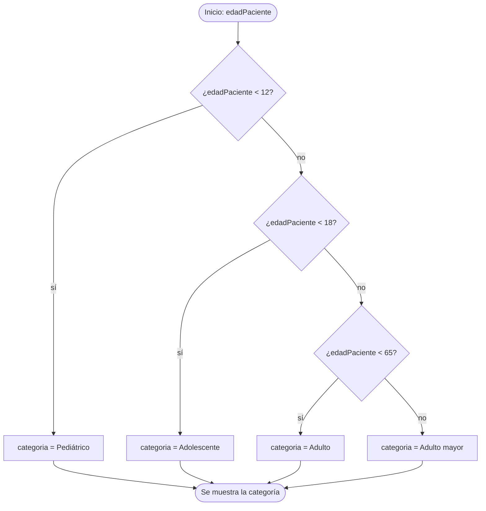

# 💡 Ejemplo 04 — If-else

## 🌍 Contexto

Un programa sin decisiones ejecuta siempre las mismas instrucciones. Con `if` el programa
**elige** qué código ejecutar según una condición (una expresión `boolean`, como las de los
ejemplos anteriores). Hay tres formas:

- **`if`**: ejecuta un bloque **solo si** la condición es verdadera.
- **`if - else`**: elige entre **dos** caminos; siempre se ejecuta exactamente uno.
- **`if - else if - else`**: elige entre **varios** tramos; se ejecuta el primero cuya
  condición sea verdadera y el `else` final recoge todo lo demás.

Sus formas son estas (la condición va entre paréntesis y cada bloque entre llaves):

```text
if (condición) {
    instrucciones si es verdadera
} else if (otra condición) {
    instrucciones si la primera fue falsa y esta es verdadera
} else {
    instrucciones si ninguna fue verdadera
}
```

Un `if` puede ir **dentro** de otro `if` (decisiones anidadas).

**Qué busca demostrar este ejemplo**: cómo escribir cada forma del `if`, cómo traducir una
regla de negocio con tramos a código y por qué se prueba con un valor de cada tramo y con
cada valor límite.

## 🏥 Caso de estudio

**MediSalud** clasifica a sus pacientes por edad para asignar la tarifa y el tipo de atención:

| Categoría | Edad |
|---|---|
| Pediátrico | menos de 12 |
| Adolescente | de 12 a 17 |
| Adulto | de 18 a 64 |
| Adulto mayor | 65 o más |

Además, decide si autoriza la cita según sea afiliado y tenga o no deuda.

## 🌳 Árbol de archivos (como se vería en VS Code)

Agrega la clase `CategoriaPaciente.java` al paquete `com.medisalud` del proyecto
`Modulo02Decisiones`:

```text
Modulo02Decisiones
└── src
    └── com
        ├── biblioteca
        │   └── ControlPrestamo.java
        └── medisalud
            ├── AutorizacionCita.java
            ├── CategoriaPaciente.java   ← nuevo en este ejemplo
            └── FacturaConsulta.java
```

## 💻 Archivo: CategoriaPaciente.java

```java
package com.medisalud;

public class CategoriaPaciente {

    public static void main(String[] args) {
        // Datos de entrada
        int edadPaciente = 65;
        boolean esAfiliado = true;
        boolean tieneDeuda = false;

        // if: ejecuta el bloque solo si la condición es verdadera
        if (edadPaciente >= 65 || edadPaciente < 5) {
            System.out.println("Atención prioritaria");
        }

        // if - else: elige entre dos caminos
        if (esAfiliado) {
            System.out.println("Tarifa de afiliado");
        } else {
            System.out.println("Tarifa particular");
        }

        // if - else if - else: elige entre varios tramos
        String categoria;
        if (edadPaciente < 12) {
            categoria = "Pediátrico";
        } else if (edadPaciente < 18) {
            categoria = "Adolescente";
        } else if (edadPaciente < 65) {
            categoria = "Adulto";
        } else {
            categoria = "Adulto mayor";
        }
        System.out.println("Categoría: " + categoria);

        // if anidado: una decisión dentro de otra
        if (esAfiliado) {
            if (tieneDeuda) {
                System.out.println("Afiliado con deuda: debe ponerse al día");
            } else {
                System.out.println("Afiliado al día: cita autorizada");
            }
        } else {
            System.out.println("No afiliado: cita particular");
        }
    }
}
```

## 🗺️ Diagrama

El flujo del `if - else if - else` que clasifica por edad. Se sigue el primer camino cuyo
resultado sea `sí`:



## 🧭 Explicación paso a paso

1. El primer `if` no tiene `else`: si la condición es falsa, simplemente no hace nada. Con
   `edadPaciente = 65` la condición `edadPaciente >= 65 || edadPaciente < 5` es verdadera y
   muestra `Atención prioritaria`.
2. `if (esAfiliado) { ... } else { ... }` siempre ejecuta uno de los dos bloques: como
   `esAfiliado` es `true`, muestra `Tarifa de afiliado`.
3. `String categoria;` **declara** la variable sin darle valor; cada rama del `if - else if -
   else` le asigna uno. Como todas las ramas (incluido el `else`) le dan valor, Java sabe que
   siempre tendrá uno antes de usarla.
4. Java evalúa las condiciones **de arriba hacia abajo** y se detiene en la primera verdadera.
   Con `65`: `65 < 12` es falso, `65 < 18` es falso, `65 < 65` es falso, y entra al `else`: `Adulto
   mayor`. Solo hace falta escribir el límite superior de cada tramo, porque los anteriores ya
   descartaron los valores menores.
5. El `if` anidado primero pregunta si es afiliado y, **dentro** de ese bloque, si tiene deuda.
   Con `esAfiliado = true` y `tieneDeuda = false` muestra `Afiliado al día: cita autorizada`.
6. Las llaves `{ }` delimitan qué instrucciones dependen de la condición. Úsalas siempre, aunque
   el bloque tenga una sola instrucción.

## ✅ Resultado esperado

```text
Atención prioritaria
Tarifa de afiliado
Categoría: Adulto mayor
Afiliado al día: cita autorizada
```

## 🧪 Casos de prueba

Probar una regla con tramos significa ejecutarla **con un valor de cada tramo y con cada valor
límite**: los que están justo en el borde entre dos tramos, donde suelen esconderse los
errores. Cambia `edadPaciente` y ejecuta de nuevo:

| edadPaciente | Categoría |
|---|---|
| `11` | Pediátrico |
| `12` | Adolescente |
| `17` | Adolescente |
| `18` | Adulto |
| `64` | Adulto |
| `65` | Adulto mayor |

Los valores `11`, `17` y `64` son el último de cada tramo, y `12`, `18` y `65` son el primero del
siguiente.

## 🔍 Análisis: errores frecuentes

**Error 1 — Punto y coma después del `if` (error lógico).**

```java error-logico
package com.medisalud;

public class CategoriaPaciente {

    public static void main(String[] args) {
        int edadPaciente = 10;
        if (edadPaciente >= 65);
        {
            System.out.println("Atención prioritaria");
        }
    }
}
```

```text
Atención prioritaria
```

Un paciente de 10 años queda con atención prioritaria. El `;` termina el `if` con un bloque
vacío, y el bloque de llaves de abajo **siempre** se ejecuta. El panel Problems no marca ningún
problema.

**Error 2 — Olvidar las llaves (error lógico).**

```java error-logico
package com.medisalud;

public class CategoriaPaciente {

    public static void main(String[] args) {
        int edadPaciente = 10;
        if (edadPaciente >= 65)
            System.out.println("Atención prioritaria");
            System.out.println("Pase por la ventanilla 1");
    }
}
```

```text
Pase por la ventanilla 1
```

Sin llaves, el `if` solo controla la instrucción **siguiente**. La segunda línea, aunque esté
sangrada, se ejecuta siempre. El panel Problems no marca ningún problema.

**Error 3 — Condiciones en el orden equivocado (error lógico).**

```java error-logico
package com.medisalud;

public class CategoriaPaciente {

    public static void main(String[] args) {
        int edadPaciente = 8;
        String categoria;
        if (edadPaciente < 65) {
            categoria = "Adulto";
        } else if (edadPaciente < 12) {
            categoria = "Pediátrico";
        } else {
            categoria = "Adulto mayor";
        }
        System.out.println("Categoría: " + categoria);
    }
}
```

```text
Categoría: Adulto
```

Un niño de 8 años queda clasificado como `Adulto`: como `8 < 65` es verdadero, la primera
condición atrapa todos los casos y las demás nunca se ejecutan. Las condiciones deben ir de la
más específica a la más general. El panel Problems no marca ningún problema.

**Error 4 — Usar una variable que no siempre tiene valor (error de compilación).**

```java no-compila
package com.medisalud;

public class CategoriaPaciente {

    public static void main(String[] args) {
        int edadPaciente = 20;
        String categoria;
        if (edadPaciente >= 18) {
            categoria = "Adulto";
        }
        System.out.println("Categoría: " + categoria);
    }
}
```

Mensaje del panel Problems (la posición se refiere al archivo completo):

```text
✖ The local variable categoria may not have been initialized Java(536870963) [Ln 11, Col 44]
```

Si `edadPaciente` fuera menor de 18, `categoria` no tendría valor. Java lo detecta y exige un
`else` (o darle un valor inicial).

## ❓ Preguntas de repaso

**1. [Selección]** Un paciente tiene 17 años. **Pregunta:** ¿qué categoría asigna el
`if - else if - else` de este ejemplo?

- **A.** Pediátrico
- **B.** Adolescente
- **C.** Adulto
- **D.** Adulto mayor

<details>
<summary>🔑 Ver respuesta</summary>

**Respuesta correcta: B.** `17 < 12` es falso y `17 < 18` es verdadero: se asigna
`Adolescente` y no se evalúa lo demás.

</details>

**2. [Selección múltiple]** **Pregunta:** ¿cuáles afirmaciones sobre `if - else if - else` son
verdaderas?

- **A.** Se ejecuta el primer bloque cuya condición sea verdadera.
- **B.** Pueden ejecutarse dos bloques a la vez.
- **C.** El orden de las condiciones puede cambiar el resultado.
- **D.** El `else` final recoge los casos que ninguna condición anterior cumplió.

<details>
<summary>🔑 Ver respuesta</summary>

**Respuestas correctas: A, C y D.** Solo se ejecuta un bloque. El orden importa: una condición
general antes de una específica hace que la específica nunca se ejecute.

</details>

**3. [Abierta]** Una regla dice "menos de 12", "de 12 a 17", "de 18 a 64" y "65 o más".
¿Qué valores probarías y por qué?

<details>
<summary>🔑 Ver respuesta modelo</summary>

Los valores límite de cada tramo: `11` y `12`, `17` y `18`, `64` y `65`, además de un valor
típico de cada tramo. Los errores de `<` frente a `<=` aparecen justo en el borde entre dos
tramos.

</details>
