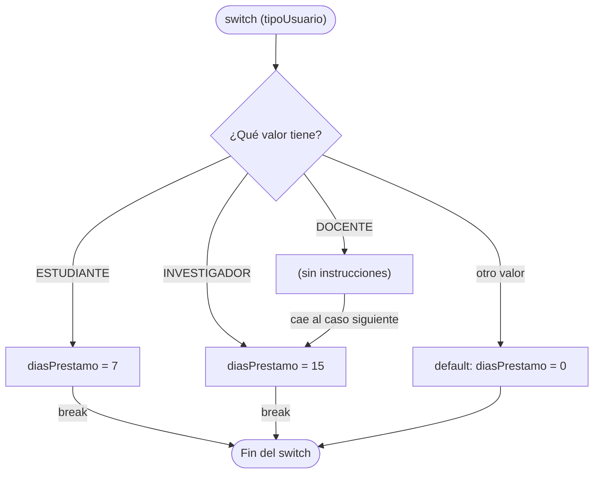

# 💡 Ejemplo 05 — Switch

## 🌍 Contexto

Cuando una decisión consiste en **elegir entre varias opciones exactas de un mismo valor**
(el tipo de usuario, el código de una categoría), una cadena larga de `if - else if` se vuelve
repetitiva. El `switch` la expresa de forma más ordenada: evalúa **un** valor y ejecuta el caso
(`case`) que coincide, o el caso por defecto (`default`) si ninguno coincide.

El valor evaluado puede ser un entero, un carácter (`char`) o un texto (`String`). Java tiene
dos formas de escribirlo y las dos son válidas:

| Forma | Cómo se escribe | Particularidad |
|---|---|---|
| **Clásica** | `case X:` y termina cada caso con `break` | Si falta el `break`, la ejecución **cae** al caso siguiente |
| **Con flecha** | `case X ->` | No cae al siguiente caso y admite varios valores por caso |

Además, el `switch` con flecha puede usarse como **expresión**: produce un valor que se guarda
en una variable.

**Qué busca demostrar este ejemplo**: cómo escribir un `switch` en sus dos formas y como
expresión, por qué se necesita `default` y qué ocurre cuando falta un `break`.

## 📚 Caso de estudio

La **Biblioteca Universitaria** concede un plazo de préstamo según el tipo de usuario:

| Tipo de usuario | Días de préstamo |
|---|---|
| `"ESTUDIANTE"` | 7 |
| `"DOCENTE"` o `"INVESTIGADOR"` | 15 |
| cualquier otro valor | 0 (sin derecho a préstamo) |

También traduce el código de categoría de un libro (`'N'`, `'C'`, `'T'`) a su nombre.

## 🌳 Árbol de archivos (como se vería en VS Code)

Agrega la clase `DiasPrestamo.java` al paquete `com.biblioteca` del proyecto
`Modulo02Decisiones`:

```text
Modulo02Decisiones
└── src
    └── com
        ├── biblioteca
        │   ├── ControlPrestamo.java
        │   └── DiasPrestamo.java   ← nuevo en este ejemplo
        └── medisalud
            ├── AutorizacionCita.java
            ├── CategoriaPaciente.java
            └── FacturaConsulta.java
```

## 💻 Archivo: DiasPrestamo.java

```java
package com.biblioteca;

public class DiasPrestamo {

    public static void main(String[] args) {
        // Datos de entrada
        String tipoUsuario = "DOCENTE";
        char codigoCategoria = 'T';

        // 1. switch clásico: cada caso termina con break
        int diasPrestamo;
        switch (tipoUsuario) {
            case "ESTUDIANTE":
                diasPrestamo = 7;
                break;
            case "DOCENTE":
            case "INVESTIGADOR":
                diasPrestamo = 15;
                break;
            default:
                diasPrestamo = 0;
        }
        System.out.println("Días de préstamo (clásico): " + diasPrestamo);

        // 2. switch con flecha: no necesita break y admite varios valores por caso
        switch (tipoUsuario) {
            case "ESTUDIANTE" -> System.out.println("Préstamo de 7 días");
            case "DOCENTE", "INVESTIGADOR" -> System.out.println("Préstamo de 15 días");
            default -> System.out.println("Sin derecho a préstamo");
        }

        // 3. switch como expresión: produce un valor
        int diasExpresion = switch (tipoUsuario) {
            case "ESTUDIANTE" -> 7;
            case "DOCENTE", "INVESTIGADOR" -> 15;
            default -> 0;
        };
        System.out.println("Días de préstamo (expresión): " + diasExpresion);

        String nombreCategoria = switch (codigoCategoria) {
            case 'N' -> "Narrativa";
            case 'C' -> "Ciencia";
            case 'T' -> {
                String area = "Tecnología";
                yield area;
            }
            default -> "Otra";
        };
        System.out.println("Categoría: " + nombreCategoria);
    }
}
```

## 🗺️ Diagrama

El `switch` clásico, con y sin `break`. Con `break`, la ejecución sale del `switch` al terminar
el caso; sin `break`, **cae** al caso siguiente:



## 🧭 Explicación paso a paso

1. **Forma clásica.** `switch (tipoUsuario)` evalúa el texto. El caso `"DOCENTE"` no tiene
   instrucciones ni `break`: **cae** al caso siguiente (`"INVESTIGADOR"`), y así los dos
   comparten el mismo resultado. Aquí la caída es intencional y útil. Cada caso termina con
   `break` para salir del `switch`.
2. `default` recoge cualquier valor que no coincida con un caso. Es el equivalente del `else`
   final.
3. **Forma con flecha.** `case "DOCENTE", "INVESTIGADOR" ->` agrupa varios valores en un solo
   caso y no necesita `break`: ejecuta solo su instrucción.
4. **Como expresión.** `int diasExpresion = switch (tipoUsuario) { ... };` produce un valor y lo
   guarda. Cada caso da el valor con `->`. Una expresión **debe cubrir todos los valores
   posibles**, por eso necesita `default`.
5. Cuando un caso necesita varias instrucciones, se escribe un bloque `{ }` y el valor se
   entrega con `yield`, como en el caso `'T'`.
6. El `char` se escribe con comillas simples (`'N'`) y el texto con comillas dobles
   (`"ESTUDIANTE"`), igual que en el Módulo 1.

## ✅ Resultado esperado

```text
Días de préstamo (clásico): 15
Préstamo de 15 días
Días de préstamo (expresión): 15
Categoría: Tecnología
```

## 🧪 Casos de prueba

Cambia `tipoUsuario` y `codigoCategoria` en los datos de entrada y ejecuta de nuevo. Prueba
siempre un valor de cada caso **y uno que no exista**, para ver el `default`:

**Días de préstamo** (`tipoUsuario`):

| tipoUsuario | Días de préstamo |
|---|---|
| ESTUDIANTE | `7` |
| DOCENTE | `15` |
| INVESTIGADOR | `15` |
| VISITANTE | `0` |

**Nombre de la categoría** (`codigoCategoria`):

| codigoCategoria | Categoría |
|---|---|
| `'N'` | Narrativa |
| `'C'` | Ciencia |
| `'T'` | Tecnología |
| `'X'` | Otra |

## 🔍 Análisis: errores frecuentes

**Error 1 — Olvidar el `break` (error lógico).** Un docente (`tipoUsuario = 2`) debería ver solo
su línea:

```java error-logico
package com.biblioteca;

public class DiasPrestamo {

    public static void main(String[] args) {
        int tipoUsuario = 2;
        switch (tipoUsuario) {
            case 1:
                System.out.println("Estudiante: 7 días");
            case 2:
                System.out.println("Docente: 15 días");
            case 3:
                System.out.println("Investigador: 15 días");
                break;
            default:
                System.out.println("Sin derecho a préstamo");
        }
    }
}
```

```text
Docente: 15 días
Investigador: 15 días
```

Se muestran dos líneas: el caso `2` no termina con `break` y **cae** al caso `3`. El panel
Problems no marca ningún problema. Cada caso de un `switch` clásico debe terminar con `break`,
salvo que quieras la caída a propósito. La forma con flecha evita este error.

**Error 2 — `switch` sin `default` (error lógico).** Con un valor no previsto no pasa nada:

```java error-logico
package com.biblioteca;

public class DiasPrestamo {

    public static void main(String[] args) {
        String tipoUsuario = "VISITANTE";
        switch (tipoUsuario) {
            case "ESTUDIANTE" -> System.out.println("Préstamo de 7 días");
            case "DOCENTE" -> System.out.println("Préstamo de 15 días");
        }
        System.out.println("Fin de la consulta");
    }
}
```

```text
Fin de la consulta
```

Para `"VISITANTE"` ningún caso coincide y el `switch` no imprime nada: el usuario no recibe
ninguna respuesta. El panel Problems no marca ningún problema. Agrega siempre un `default` que
atienda el valor inesperado.

**Error 3 — Expresión `switch` sin `default` (error de compilación).**

```java no-compila
package com.biblioteca;

public class DiasPrestamo {

    public static void main(String[] args) {
        String tipoUsuario = "DOCENTE";
        int diasPrestamo = switch (tipoUsuario) {
            case "ESTUDIANTE" -> 7;
            case "DOCENTE" -> 15;
        };
        System.out.println("Días de préstamo: " + diasPrestamo);
    }
}
```

Mensaje del panel Problems (la posición se refiere al archivo completo):

```text
✖ A switch expression should have a default case Java(1073743531) [Ln 7, Col 36]
```

Una **expresión** siempre debe producir un valor, así que Java exige cubrir todos los casos.

**Error 4 — Mezclar `->` y `:` (error de compilación).**

```java no-compila
package com.biblioteca;

public class DiasPrestamo {

    public static void main(String[] args) {
        String tipoUsuario = "DOCENTE";
        switch (tipoUsuario) {
            case "ESTUDIANTE" -> System.out.println("Préstamo de 7 días");
            case "DOCENTE": System.out.println("Préstamo de 15 días");
        }
    }
}
```

```text
✖ Mixing of '->' and ':' case statement styles is not allowed within a switch Java(1073743530) [Ln 9, Col 13]
```

En un mismo `switch` se usa una forma u otra, no las dos.

**Error 5 — Un caso repetido (error de compilación).**

```java no-compila
package com.biblioteca;

public class DiasPrestamo {

    public static void main(String[] args) {
        String tipoUsuario = "DOCENTE";
        switch (tipoUsuario) {
            case "ESTUDIANTE" -> System.out.println("Préstamo de 7 días");
            case "ESTUDIANTE" -> System.out.println("Préstamo de 10 días");
            default -> System.out.println("Sin derecho a préstamo");
        }
    }
}
```

```text
✖ Duplicate case Java(33554602) [Ln 9, Col 18]
```

No puede haber dos casos con el mismo valor.

## ❓ Preguntas de repaso

**1. [Selección]** En un `switch` clásico, el caso `1` no termina con `break` y el valor
evaluado es `1`. **Pregunta:** ¿qué ocurre?

- **A.** Se ejecuta solo el caso `1`.
- **B.** Se ejecuta el caso `1` y también el caso siguiente.
- **C.** Da un error de compilación.
- **D.** No se ejecuta ningún caso.

<details>
<summary>🔑 Ver respuesta</summary>

**Respuesta correcta: B.** Sin `break`, la ejecución **cae** al caso siguiente y continúa hasta
encontrar un `break` o terminar el `switch`.

</details>

**2. [Selección múltiple]** **Pregunta:** ¿cuáles afirmaciones sobre el `switch` son verdaderas?

- **A.** El valor evaluado puede ser un `int`, un `char` o un `String`.
- **B.** La forma con flecha admite varios valores en un mismo caso.
- **C.** Un `switch` usado como expresión debe cubrir todos los valores posibles.
- **D.** `default` es obligatorio en todo `switch`.

<details>
<summary>🔑 Ver respuesta</summary>

**Respuestas correctas: A, B y C.** D es falsa: en un `switch` como sentencia, `default` es
opcional (aunque conviene ponerlo); en una expresión sí es obligatorio.

</details>

**3. [Abierta]** ¿Cuándo prefieres un `switch` a una cadena de `if - else if`?

<details>
<summary>🔑 Ver respuesta modelo</summary>

Cuando la decisión compara **un mismo valor** con varias opciones **exactas** (un tipo de
usuario, un código). Si la regla trabaja con **rangos** (`edad < 18`) o combina varias
condiciones, `if - else if` es la herramienta adecuada.

</details>
