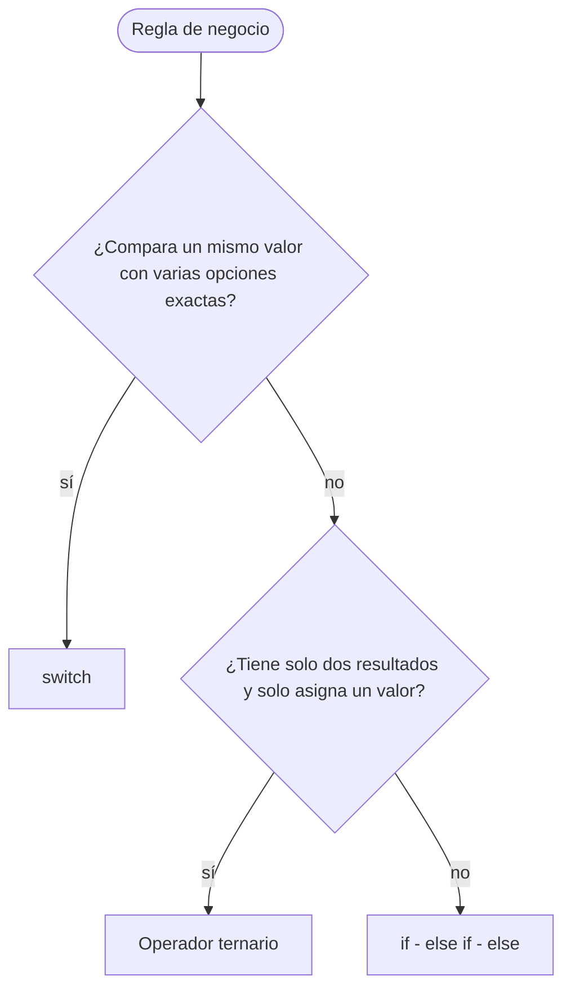

# 💡 Ejemplo 06 — Operador ternario

## 🌍 Contexto

Muchas decisiones tienen solo **dos resultados** y lo único que hacen es **asignar un valor**:
"si el libro está disponible, el estado es `Disponible`; si no, `Prestado`". Escribirlas con
`if - else` ocupa siete líneas. El **operador ternario** (`?:`) las resume en una sola
expresión, que produce un valor:

```text
condición ? valorSiEsVerdadera : valorSiEsFalsa
```

Se lee: "si la condición es verdadera, este valor; si no, este otro". Las dos ramas deben producir
un valor de un tipo compatible con la variable donde se guarda.

**Qué busca demostrar este ejemplo**: cómo escribir un operador ternario, en qué casos
reemplaza a un `if - else` y en cuáles **no** conviene, y cómo elegir entre `if`, `switch` y
ternario para una regla de negocio.

## 🏥📚 Caso de estudio

Dos decisiones simples, una en cada dominio del curso:

- **Biblioteca Universitaria**: mostrar si un libro está `Disponible` o `Prestado`, y escribir
  `libro` o `libros` según la cantidad de préstamos.
- **MediSalud**: mostrar si el paciente es `Afiliado` o `Particular`, y si su atención es
  `Prioritaria` o `General`.

## 🌳 Árbol de archivos (como se vería en VS Code)

Agrega dos clases al proyecto `Modulo02Decisiones`, una en cada paquete:

```text
Modulo02Decisiones
└── src
    └── com
        ├── biblioteca
        │   ├── ControlPrestamo.java
        │   ├── DiasPrestamo.java
        │   └── EstadoLibro.java   ← nuevo en este ejemplo
        └── medisalud
            ├── AutorizacionCita.java
            ├── CategoriaPaciente.java
            ├── FacturaConsulta.java
            └── MensajeCita.java   ← nuevo en este ejemplo
```

## 💻 Archivo: EstadoLibro.java

```java
package com.biblioteca;

public class EstadoLibro {

    public static void main(String[] args) {
        // Datos de entrada
        boolean disponible = false;
        int librosPrestados = 1;

        // if-else: dos resultados que solo asignan un valor
        String estadoConIf;
        if (disponible) {
            estadoConIf = "Disponible";
        } else {
            estadoConIf = "Prestado";
        }

        // Operador ternario: la misma decisión en una sola expresión
        String estado = disponible ? "Disponible" : "Prestado";

        System.out.println("Con if-else: " + estadoConIf);
        System.out.println("Con ternario: " + estado);
        System.out.println("Tienes " + librosPrestados + (librosPrestados == 1 ? " libro" : " libros"));
    }
}
```

## 💻 Archivo: MensajeCita.java

```java
package com.medisalud;

public class MensajeCita {

    public static void main(String[] args) {
        // Datos de entrada
        boolean esAfiliado = true;
        int edadPaciente = 65;

        String tipoPaciente = esAfiliado ? "Afiliado" : "Particular";
        String atencion = (edadPaciente >= 65 || edadPaciente < 5) ? "Prioritaria" : "General";
        System.out.printf("Paciente: %s - Atención %s%n", tipoPaciente, atencion);
    }
}
```

## 🗺️ Diagrama

Una guía para elegir la estructura de decisión según la forma de la regla:



- **`switch`**: un valor y varias opciones exactas (tipo de usuario, código de categoría).
- **Ternario**: dos resultados y una asignación simple (estado, etiqueta, singular o plural).
- **`if - else if - else`**: rangos, condiciones combinadas o varias instrucciones por rama.

## 🧭 Explicación paso a paso

1. El bloque `if - else` de `EstadoLibro` y el ternario `disponible ? "Disponible" :
   "Prestado"` hacen **lo mismo**; el ternario es más corto porque solo asigna un valor.
2. La condición va antes del `?`. Si es verdadera se entrega el valor entre `?` y `:`; si es
   falsa, el que va después de `:`.
3. Como el ternario produce un valor, puede usarse **dentro de otra expresión**:
   `(librosPrestados == 1 ? " libro" : " libros")` se une con `+` al resto del mensaje. Los
   paréntesis son necesarios para que `+` no se mezcle con la condición.
4. En `MensajeCita` la condición es compuesta: `(edadPaciente >= 65 || edadPaciente < 5) ?
   "Prioritaria" : "General"`. Puedes usar cualquier expresión `boolean`.
5. `printf` con `%s` inserta cada texto en su lugar dentro del mensaje.
6. Cuando la regla necesita **más de dos resultados** o **varias instrucciones** por rama, el
   ternario deja de ser una buena opción y se vuelve a `if - else if - else`.

## ✅ Resultado esperado

```text
Con if-else: Prestado
Con ternario: Prestado
Tienes 1 libro
```

```text
Paciente: Afiliado - Atención Prioritaria
```

## 🧪 Casos de prueba

Cambia `disponible` y `esAfiliado` y ejecuta de nuevo. Cada regla tiene solo dos ramas: prueba
las dos.

**Estado del libro** (`disponible ? "Disponible" : "Prestado"`):

| disponible | Estado |
|---|---|
| `true` | Disponible |
| `false` | Prestado |

**Tipo de paciente** (`esAfiliado ? "Afiliado" : "Particular"`):

| esAfiliado | Tipo de paciente |
|---|---|
| `true` | Afiliado |
| `false` | Particular |

## 🔍 Análisis: errores frecuentes

**Error 1 — Ramas de tipos distintos (error de compilación).**

```java no-compila
package com.biblioteca;

public class EstadoLibro {

    public static void main(String[] args) {
        boolean disponible = true;
        int diasPrestamo = disponible ? 7 : "sin préstamo";
        System.out.println("Días de préstamo: " + diasPrestamo);
    }
}
```

Mensaje del panel Problems (la posición se refiere al archivo completo):

```text
✖ Type mismatch: cannot convert from String to int Java(16777233) [Ln 7, Col 45]
```

Una rama da un número (`7`) y la otra un texto: no pueden guardarse en una misma variable
`int`. Las dos ramas deben producir un valor del mismo tipo.

**Error 2 — Ternarios anidados (práctica a evitar).** Compila y funciona, pero cuesta leerlo:

```java
package com.medisalud;

public class MensajeCitaAnidado {

    public static void main(String[] args) {
        int edadPaciente = 70;
        String categoria = edadPaciente < 12 ? "Pediátrico" : edadPaciente < 18 ? "Adolescente" : edadPaciente < 65 ? "Adulto" : "Adulto mayor";
        System.out.println("Categoría: " + categoria);
    }
}
```

```text
Categoría: Adulto mayor
```

Es la misma clasificación por edad del Ejemplo 04, apretada en una línea. Si necesitas más de
dos resultados, usa `if - else if - else`, que se lee de arriba hacia abajo y es más fácil de
probar y de modificar.

## ❓ Preguntas de repaso

**1. [Selección]** Con `boolean esAfiliado = false;`. **Pregunta:** ¿qué muestra
`esAfiliado ? "Afiliado" : "Particular"`?

- **A.** `Afiliado`
- **B.** `Particular`
- **C.** `false`
- **D.** Da un error de compilación.

<details>
<summary>🔑 Ver respuesta</summary>

**Respuesta correcta: B.** La condición es falsa, así que se entrega el valor que va después
de los dos puntos.

</details>

**2. [Selección múltiple]** **Pregunta:** ¿en qué reglas es adecuado un operador ternario?

- **A.** Mostrar `libro` o `libros` según una cantidad.
- **B.** Clasificar la edad de un paciente en cuatro categorías.
- **C.** Asignar `Prioritaria` o `General` según la edad.
- **D.** Ejecutar cinco instrucciones distintas según una condición.

<details>
<summary>🔑 Ver respuesta</summary>

**Respuestas correctas: A y C.** Son decisiones de dos resultados que solo asignan un valor. B
tiene cuatro resultados (`if - else if - else`) y D varias instrucciones por rama (`if -
else`).

</details>

**3. [Abierta]** Para cada regla, indica si usarías `if - else if`, `switch` o ternario y por
qué: (1) días de préstamo según el tipo de usuario; (2) estado `Disponible` o `Prestado`;
(3) multa según tramos de días de retraso.

<details>
<summary>🔑 Ver respuesta modelo</summary>

(1) `switch`: compara un mismo valor con opciones exactas. (2) Ternario: dos resultados y una
asignación simple. (3) `if - else if - else`: son rangos (tramos), que un `switch` no
expresa bien.

</details>
