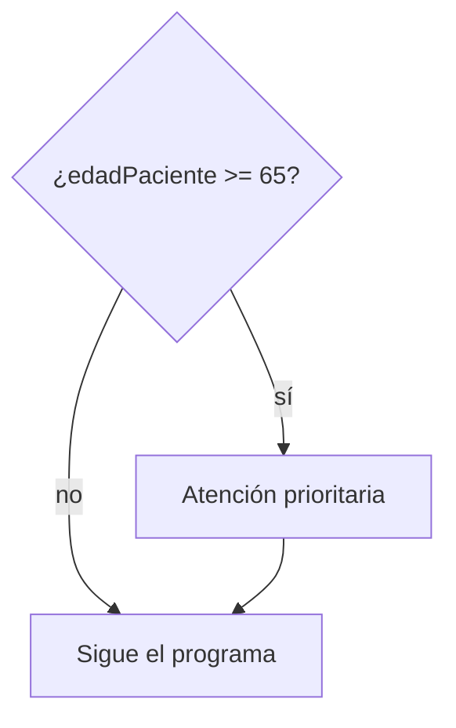
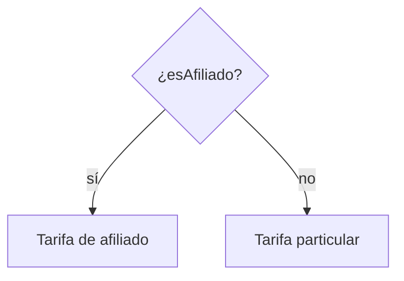
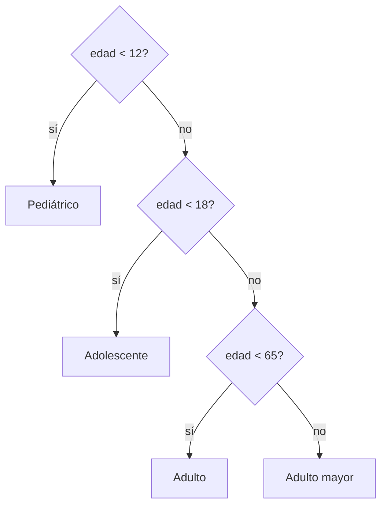
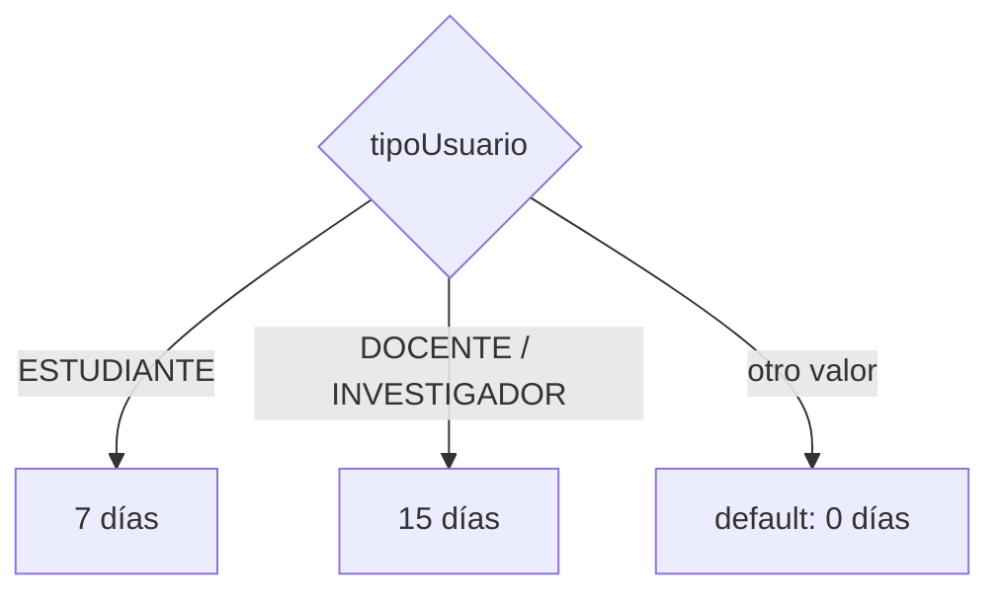
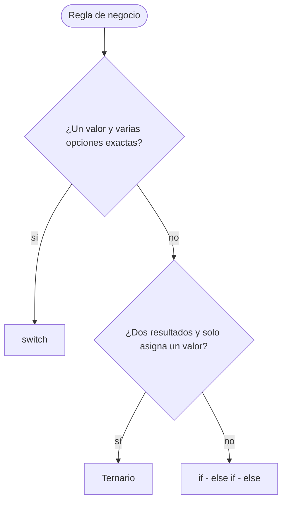

# 📘 Módulo 2 — Operadores y Estructuras de Decisión

Curso de Java

---

## 🎯 Objetivos del módulo

- Calcular con operadores aritméticos y de asignación.
- Comparar valores y combinar condiciones.
- Decidir con `if - else`, `switch` y ternario.
- Elegir la estructura adecuada para cada regla.
- Probar una decisión con valores límite.

---

## 🗺️ Ruta de la sesión

1. Operadores: asignación, aritméticos, comparación y condicionales
2. Estructuras de decisión: `if - else`, `switch` y ternario
3. Taller, resumen y evaluación

---

## 🧠 ¿Qué es un operador?

| Familia | Operadores |
|---|---|
| Aritméticos | `+` `-` `*` `/` `%` |
| Asignación | `=` `+=` `-=` `*=` `/=` `%=` |
| Igualdad y relacionales | `==` `!=` `<` `>` `<=` `>=` |
| Condicionales | `&&` `\|\|` `!` |

Un operador combina valores y produce un resultado.

---

## 🧠 Operadores aritméticos

| Expresión | Resultado |
|---|---|
| `85000.0 * 3` | `255000.0` |
| `255000 - 25500` | `229500` |
| `7 / 2` | `3` |
| `7 % 2` | `1` |

---

## 🧠 Asignación compuesta

```java
int cupos = 20;
cupos -= 3;   // 17
cupos += 5;   // 22
```

`cupos -= 3` equivale a `cupos = cupos - 3`.

---

## 🧠 División entera y residuo

| Expresión | Resultado |
|---|---|
| `7 / 2` | `3` |
| `7 % 2` | `1` |
| `7 / 2.0` | `3.5` |
| `(double) 7 / 2` | `3.5` |

Entre enteros, la división descarta los decimales.

---

## 🧠 Precedencia y paréntesis

| Expresión | Resultado |
|---|---|
| `85000 + 15000 * 2` | `115000` |
| `(85000 + 15000) * 2` | `200000` |

Primero `*` `/` `%`, después `+` `-`. Los paréntesis mandan.

---

## 🧠 Operadores de comparación

| Operador | Significa |
|---|---|
| `==` | igual a |
| `!=` | distinto de |
| `<` `>` | menor / mayor que |
| `<=` `>=` | menor o igual / mayor o igual |

Toda comparación da `true` o `false`.

---

## 🧠 `=` frente a `==`

```text
diasRetraso = 0    // asigna
diasRetraso == 0   // compara
```

Confundirlos es uno de los errores más comunes.

---

## 🧠 Comparar texto

```java
tipoUsuario.equals("DOCENTE")
```

Con texto se usa `equals`, no `==`.

---

## 🧠 Y, O y NO

| Operador | Da `true` cuando |
|---|---|
| `&&` (Y) | las dos son verdaderas |
| `\|\|` (O) | al menos una es verdadera |
| `!` (NO) | la condición es falsa |

---

## 🧮 Tabla de verdad

| A | B | `A && B` | `A \|\| B` |
|---|---|---|---|
| `true` | `true` | `true` | `true` |
| `true` | `false` | `false` | `true` |
| `false` | `true` | `false` | `true` |
| `false` | `false` | `false` | `false` |

---

## 🧠 Cortocircuito

```java
cantidadConsultas > 0 && total / cantidadConsultas > 100000
```

Si la primera es falsa, la segunda **no se evalúa**.

---

## 🧠 Rangos con `&&`

```java
edadPaciente >= 18 && edadPaciente < 65
```

En Java no se escribe `18 <= edad < 65`.

---

## 🧠 `if`: ejecutar solo si se cumple



---

## 🧠 `if - else`: elegir entre dos caminos



---

## 🧠 `if - else if - else`: varios tramos



---

## 🧠 Siempre usa llaves

```text
if (condición) {
    instrucciones
}
```

Sin llaves, el `if` solo controla la instrucción siguiente.

---

## 🧪 Prueba los valores límite

| Edad | Categoría |
|---|---|
| `11` | Pediátrico |
| `12` | Adolescente |
| `17` | Adolescente |
| `18` | Adulto |
| `64` | Adulto |
| `65` | Adulto mayor |

---

## 🧠 `switch` clásico

```java
switch (tipoUsuario) {
    case "ESTUDIANTE":
        diasPrestamo = 7;
        break;
    default:
        diasPrestamo = 0;
}
```

Sin `break`, la ejecución cae al caso siguiente.

---

## 🧠 `switch` con flecha

```java
switch (tipoUsuario) {
    case "ESTUDIANTE" -> System.out.println("7 días");
    case "DOCENTE", "INVESTIGADOR" -> System.out.println("15 días");
    default -> System.out.println("Sin préstamo");
}
```

---

## 🧠 `switch` como expresión

```java
int dias = switch (tipoUsuario) {
    case "ESTUDIANTE" -> 7;
    case "DOCENTE", "INVESTIGADOR" -> 15;
    default -> 0;
};
```

Debe cubrir todos los casos: necesita `default`.

---

## 🗺️ Flujo del `switch`



---

## 🧠 Operador ternario

```java
String estado = disponible ? "Disponible" : "Prestado";
```

`condición ? valorSiVerdadera : valorSiFalsa`

---

## 🧠 ¿Cuándo usar el ternario?

| Situación | Estructura |
|---|---|
| Dos resultados, asigna un valor | Ternario |
| Más de dos resultados | `if - else if - else` |
| Varias instrucciones por rama | `if - else` |

---

## 🗺️ Cómo elegir la estructura



---

## 🛠️ Actividad práctica: el taller

**Factura de una consulta médica** (MediSalud)

- Total y descuento
- Categoría por edad
- Copago con `switch`
- Tipo de paciente y atención con ternario
- Tres casos de prueba

---

## 📌 Resumen

- Los operadores calculan y comparan.
- `&&`, `||` y `!` combinan condiciones.
- `if`, `switch` y ternario deciden.
- Cada regla tiene su estructura adecuada.
- Se prueba con valores límite.

---

## 📝 Evaluación

Quiz de 12 preguntas (formato entrevista técnica) y los ejercicios del módulo.
