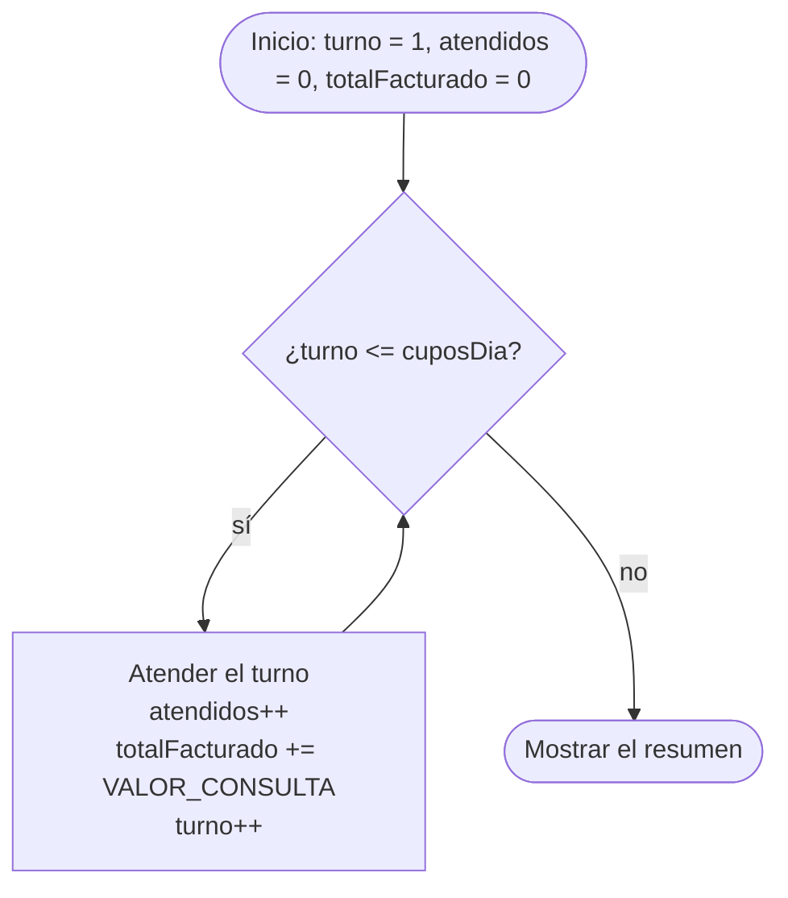

# 💡 Ejemplo 01 — While

## 🌍 Contexto

Hasta ahora, cada instrucción de tus programas se ejecutaba **una vez**. Muchas tareas de negocio se
repiten: atender los turnos de una agenda, cobrar cada día de retraso de un libro. Una **estructura
repetitiva** (o **bucle**) ejecuta un bloque de instrucciones varias veces, y cada ejecución del
bloque se llama **iteración** (o "vuelta").

El `while` repite un bloque **mientras una condición sea verdadera**. Su forma es:

```text
while (condición) {
    instrucciones que se repiten
}
```

El orden de cada vuelta es siempre el mismo:

1. Java evalúa la **condición** (una expresión `boolean`, como las del Módulo 2).
2. Si es verdadera, ejecuta el bloque y **vuelve al paso 1**.
3. Si es falsa, sale del bucle y sigue con la instrucción siguiente.

Como la condición se evalúa **antes** de cada vuelta, un `while` puede no ejecutarse ninguna vez. Y
como el bloque tiene que cambiar algo para que la condición llegue a ser falsa, casi todo `while`
usa dos variables de apoyo:

- Un **contador**: una variable entera que cuenta las vueltas (`turno++`).
- Un **acumulador**: una variable que va sumando un valor (`totalFacturado += ...`).

Los dos se **declaran antes del bucle**, y se actualizan **dentro** de él.

**Qué busca demostrar este ejemplo**: cómo escribir un `while` con un contador y un acumulador,
cómo seguir su ejecución con una tabla de valores y qué errores comunes evitar (el bucle que no
termina, una repetición de menos y el acumulador mal declarado).

## 🏥 Caso de estudio

La agenda de un día en **MediSalud** tiene una cantidad de cupos (`cuposDia`). El sistema debe
atender los turnos en orden, del 1 hasta el último cupo, contar cuántos atendió y sumar lo que
facturó: cada consulta vale $85.000.

## 🌳 Árbol de archivos (como se vería en VS Code)

Crea un proyecto llamado `Modulo03Repeticiones` como aprendiste en el Módulo 1 (**Java: Create Java
Project... → No build tools**) y ve agregando en él una clase por cada ejemplo. En este ejemplo
agregas `AtencionTurnos.java` dentro de `src/com/medisalud`:

```text
Modulo03Repeticiones
└── src
    └── com
        └── medisalud
            └── AtencionTurnos.java   ← nuevo en este ejemplo
```

## 💻 Archivo: AtencionTurnos.java

```java
package com.medisalud;

public class AtencionTurnos {

    public static void main(String[] args) {
        // Datos de entrada
        final double VALOR_CONSULTA = 85000.0;
        int cuposDia = 3;

        // El contador y el acumulador se declaran antes del bucle
        int turno = 1;
        int atendidos = 0;
        double totalFacturado = 0.0;

        while (turno <= cuposDia) {
            System.out.println("Atendiendo el turno " + turno);
            atendidos++;
            totalFacturado += VALOR_CONSULTA;
            turno++;
        }

        System.out.println("Turnos atendidos: " + atendidos);
        System.out.printf("Total facturado: %.0f%n", totalFacturado);
    }
}
```

## 🗺️ Diagrama

El flujo del `while`: la condición se comprueba **antes** de cada vuelta y, después de ejecutar el
bloque, el programa **vuelve** a comprobarla:



## 📋 Tabla de valores

Una **tabla de valores** (o prueba de escritorio) sigue el programa a mano: registra cuánto valen
las variables al **terminar** cada vuelta. Con `cuposDia = 3`, esta tabla sale de ejecutar el
programa:

| vuelta | turno | ¿turno <= cuposDia? | atendidos | totalFacturado |
|---|---|---|---|---|
| `1` | `1` | `true` | `1` | `85000` |
| `2` | `2` | `true` | `2` | `170000` |
| `3` | `3` | `true` | `3` | `255000` |
| — | `4` | `false` | `3` | `255000` |

La última fila no es una vuelta: es la comprobación que **termina** el bucle. Con `turno = 4` la
condición `4 <= 3` es falsa, así que el programa sale del `while`.

## 🧭 Explicación paso a paso

1. Los **datos de entrada** están al inicio de `main`. Para probar otra agenda solo cambias
   `cuposDia` y vuelves a ejecutar.
2. `turno`, `atendidos` y `totalFacturado` se declaran e inicializan **antes** del bucle. Si se
   declararan dentro, se reiniciarían en cada vuelta (ver el error 4).
3. `while (turno <= cuposDia)` evalúa la condición. Con `turno = 1` y `cuposDia = 3` es verdadera:
   entra al bloque.
4. Dentro del bloque, el programa atiende el turno: cuenta una consulta (`atendidos++`), suma su
   valor al acumulador (`totalFacturado += VALOR_CONSULTA`) y **avanza** el contador (`turno++`).
5. Al llegar a la llave de cierre, el programa **vuelve a la condición**. Repite hasta que
   `turno` vale 4 y la condición es falsa.
6. Cuando el bucle termina, las dos últimas instrucciones muestran el resumen. `%.0f` muestra el
   monto sin decimales, como en el Módulo 2.

## ✅ Resultado esperado

```text
Atendiendo el turno 1
Atendiendo el turno 2
Atendiendo el turno 3
Turnos atendidos: 3
Total facturado: 255000
```

## 🧪 Casos de prueba

Cambia `cuposDia` en los datos de entrada y ejecuta de nuevo. Prueba **cero, una y varias**
repeticiones:

| cuposDia | atendidos | totalFacturado |
|---|---|---|
| `0` | `0` | `0` |
| `1` | `1` | `85000` |
| `8` | `8` | `680000` |

Con `cuposDia = 0` la condición `1 <= 0` es falsa desde el principio: el bloque **no se ejecuta
ninguna vez**, y el resumen muestra 0 turnos y $0.

## 🔍 Análisis: errores frecuentes

**Error 1 — Olvidar actualizar el contador (el programa no termina).** Si `turno++` no está,
`turno` vale siempre `1`, la condición `1 <= 3` nunca deja de ser verdadera y el bucle se repite sin
fin:

> ⚠️ **Este programa no termina.** Si lo ejecutas, quedará en un bucle sin fin. Detenlo con `Ctrl+C`
> en la terminal donde se ejecuta, o con el botón de detener de la barra de depuración.

```java no-termina
package com.medisalud;

public class AtencionTurnos {

    public static void main(String[] args) {
        final double VALOR_CONSULTA = 85000.0;
        int cuposDia = 3;
        int turno = 1;
        int atendidos = 0;
        double totalFacturado = 0.0;

        System.out.println("Iniciando el cierre de agenda...");
        while (turno <= cuposDia) {
            atendidos++;
            totalFacturado += VALOR_CONSULTA;
        }
        System.out.println("Turnos atendidos: " + atendidos);
    }
}
```

Esto es lo único que verás en la consola:

```text
Iniciando el cierre de agenda...
```

El programa imprime esa línea y no imprime nada más: nunca llega a mostrar el resumen. El panel
Problems no marca ningún error (como mucho, una advertencia de variable sin usar), así que **el
editor no avisa de que un bucle no termina**. Cuando un programa "se queda colgado", lo primero que
hay que revisar es si la variable de la condición se actualiza dentro del bucle.

**Error 2 — Punto y coma después del `while` (el programa no termina).**

> ⚠️ **Este programa no termina.** Si lo ejecutas, quedará en un bucle sin fin. Detenlo con `Ctrl+C`
> en la terminal donde se ejecuta, o con el botón de detener de la barra de depuración.

```java no-termina
package com.medisalud;

public class AtencionTurnos {

    public static void main(String[] args) {
        final double VALOR_CONSULTA = 85000.0;
        int cuposDia = 3;
        int turno = 1;
        int atendidos = 0;
        double totalFacturado = 0.0;

        System.out.println("Iniciando el cierre de agenda...");
        while (turno <= cuposDia);
        {
            atendidos++;
            totalFacturado += VALOR_CONSULTA;
            turno++;
        }
        System.out.println("Turnos atendidos: " + atendidos);
    }
}
```

```text
Iniciando el cierre de agenda...
```

El `;` termina el `while` con un **cuerpo vacío**: la condición se repite sin cambiar nada, y el
bloque de llaves de abajo nunca llega a ejecutarse. El panel Problems no marca ningún error.

**Error 3 — Una repetición de menos (error lógico).** Con `<` en lugar de `<=`:

```java error-logico
package com.medisalud;

public class AtencionTurnos {

    public static void main(String[] args) {
        int cuposDia = 3;
        int turno = 1;
        int atendidos = 0;

        while (turno < cuposDia) {
            atendidos++;
            turno++;
        }
        System.out.println("Cupos de la agenda: " + cuposDia);
        System.out.println("Turnos atendidos: " + atendidos);
    }
}
```

```text
Cupos de la agenda: 3
Turnos atendidos: 2
```

Hay 3 cupos y solo se atienden 2 turnos: con `turno < cuposDia`, el turno 3 no cumple la condición.
El panel Problems no marca ningún problema. Se descubre probando con el valor límite.

**Error 4 — Declarar el acumulador dentro del bucle (error lógico).**

```java error-logico
package com.medisalud;

public class AtencionTurnos {

    public static void main(String[] args) {
        final double VALOR_CONSULTA = 85000.0;
        int cuposDia = 3;
        int turno = 1;

        while (turno <= cuposDia) {
            double totalFacturado = 0.0;
            totalFacturado += VALOR_CONSULTA;
            System.out.printf("Total facturado: %.0f%n", totalFacturado);
            turno++;
        }
    }
}
```

```text
Total facturado: 85000
Total facturado: 85000
Total facturado: 85000
```

Se esperaba el total que va creciendo (85000, 170000, 255000), pero `double totalFacturado = 0.0;`
se ejecuta en **cada vuelta** y reinicia el acumulador. El panel Problems no marca ningún problema.

**Error 5 — Usar el acumulador fuera del bucle cuando se declaró dentro (error de compilación).**
La variable declarada dentro de las llaves solo existe dentro de ellas:

```java no-compila
package com.medisalud;

public class AtencionTurnos {

    public static void main(String[] args) {
        final double VALOR_CONSULTA = 85000.0;
        int cuposDia = 3;
        int turno = 1;

        while (turno <= cuposDia) {
            double totalFacturado = 0.0;
            totalFacturado += VALOR_CONSULTA;
            turno++;
        }
        System.out.printf("Total facturado: %.0f%n", totalFacturado);
    }
}
```

Mensaje del panel Problems (la posición se refiere al archivo completo):

```text
✖ totalFacturado cannot be resolved to a variable Java(33554515) [Ln 15, Col 54]
```

Java no encuentra `totalFacturado` fuera del bucle. Se corrige declarándolo **antes** del `while`, como
en el ejemplo principal.

## ❓ Preguntas de repaso

**1. [Selección]** Con `int turno = 5;` y `int cuposDia = 3;`, se ejecuta un `while (turno <= cuposDia)`.
**Pregunta:** ¿cuántas veces se ejecuta el bloque?

- **A.** Ninguna vez.
- **B.** Una vez.
- **C.** Tres veces.
- **D.** Infinitas veces.

<details>
<summary>🔑 Ver respuesta</summary>

**Respuesta correcta: A.** La condición `5 <= 3` es falsa desde el principio y un `while` comprueba
la condición **antes** de la primera vuelta.

</details>

**2. [Selección múltiple]** **Pregunta:** ¿cuáles afirmaciones sobre el `while` son verdaderas?

- **A.** La condición se evalúa antes de cada vuelta.
- **B.** Un `while` siempre se ejecuta al menos una vez.
- **C.** Si la variable de la condición nunca cambia, el bucle puede no terminar.
- **D.** El acumulador se declara dentro del bucle para que se reinicie en cada vuelta.

<details>
<summary>🔑 Ver respuesta</summary>

**Respuestas correctas: A y C.** B es falsa: si la condición es falsa desde el principio, no se
ejecuta ninguna vez. D es falsa: declarar el acumulador dentro lo reinicia en cada vuelta y da un
total incorrecto; se declara **antes** del bucle.

</details>

**3. [Abierta]** Si en `AtencionTurnos` quitas la línea `turno++`, ¿qué le pasa al programa y por
qué?

<details>
<summary>🔑 Ver respuesta modelo</summary>

El programa no termina. `turno` vale siempre `1`, así que `turno <= cuposDia` es verdadera en todas
las vueltas y el bucle se repite sin fin (un bucle infinito). El contador es lo que hace que la
condición llegue a ser falsa.

</details>
