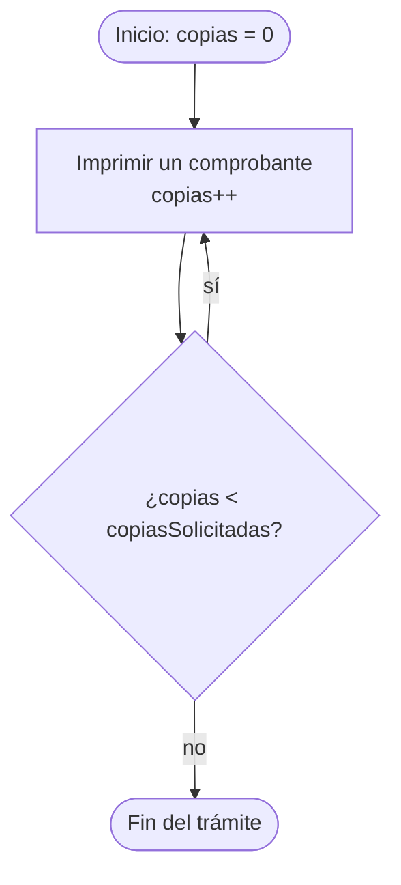

# 💡 Ejemplo 02 — Do-while

## 🌍 Contexto

En el `while`, la condición se comprueba **antes** de cada vuelta: si es falsa desde el principio, el
bloque no se ejecuta nunca. Hay situaciones en que el bloque **debe ejecutarse al menos una vez**,
pase lo que pase: imprimir un comprobante, mostrar un resumen antes de decidir si hay otra cita. Para
eso existe el `do-while`, que comprueba la condición **después** de cada vuelta:

```text
do {
    instrucciones que se repiten
} while (condición);
```

El orden de cada vuelta es:

1. Java ejecuta el bloque (siempre, la primera vez).
2. Java evalúa la **condición**.
3. Si es verdadera, **vuelve al paso 1**; si es falsa, sigue con la instrucción siguiente.

Dos detalles de escritura: la palabra `do` abre el bloque y el `while (condición)` va **después** de
la llave de cierre, y termina con **punto y coma** (`;`), que en el `while` normal no existe.

**Qué busca demostrar este ejemplo**: cómo escribir un `do-while`, por qué se ejecuta al menos una
vez y en qué casos da un resultado distinto al de un `while` con el mismo bloque y la misma
condición.

## 📚 Caso de estudio

La **Biblioteca Universitaria** imprime un comprobante cada vez que presta un libro. El comprobante
original se imprime **siempre**, y se imprimen además tantas copias como haya pedido el usuario
(`copiasSolicitadas`). Aunque el usuario pida cero copias, el comprobante original tiene que salir.

## 🌳 Árbol de archivos (como se vería en VS Code)

Agrega la clase `ComprobantePrestamo.java` al paquete `com.biblioteca` del proyecto
`Modulo03Repeticiones`:

```text
Modulo03Repeticiones
└── src
    └── com
        ├── biblioteca
        │   └── ComprobantePrestamo.java   ← nuevo en este ejemplo
        └── medisalud
            └── AtencionTurnos.java
```

## 💻 Archivo: ComprobantePrestamo.java

```java
package com.biblioteca;

public class ComprobantePrestamo {

    public static void main(String[] args) {
        // Datos de entrada
        int copiasSolicitadas = 3;

        // do-while: el comprobante se imprime al menos una vez
        int copias = 0;
        do {
            copias++;
            System.out.println("Imprimiendo el comprobante " + copias);
        } while (copias < copiasSolicitadas);
        System.out.println("Con do-while se imprimieron " + copias + " comprobantes");

        // while: la condición se comprueba antes, y puede no imprimir ninguno
        int impresos = 0;
        while (impresos < copiasSolicitadas) {
            impresos++;
        }
        System.out.println("Con while se imprimieron " + impresos + " comprobantes");
    }
}
```

## 🗺️ Diagrama

El flujo del `do-while`: el bloque se ejecuta **primero** y la condición se comprueba **al final** de
cada vuelta:



## 📋 Tabla de valores

Con `copiasSolicitadas = 3`, el valor de las variables al terminar cada vuelta, y el resultado de la
condición **que se evalúa al final**:

| vuelta | copias | ¿copias < copiasSolicitadas? |
|---|---|---|
| `1` | `1` | `true` |
| `2` | `2` | `true` |
| `3` | `3` | `false` |

En la tercera vuelta la condición `3 < 3` es falsa y el bucle termina. Fíjate en que el bloque ya se
ejecutó las tres veces **antes** de comprobar por última vez.

## 🧭 Explicación paso a paso

1. `int copias = 0;` es el contador y se declara **antes** del bucle.
2. `do {` abre el bloque, que se ejecuta **sin comprobar nada**: `copias` pasa a `1` y se imprime el
   primer comprobante.
3. Al llegar a `} while (copias < copiasSolicitadas);`, Java evalúa la condición: `1 < 3` es
   verdadera, así que vuelve al `do`.
4. Se repite hasta la tercera vuelta, donde `3 < 3` es falsa y el bucle termina.
5. Debajo, el mismo recorrido con un `while` da 3 comprobantes, porque con 3 copias solicitadas los dos
   bucles hacen lo mismo. **La diferencia aparece cuando la condición es falsa desde el principio**:
   mira la tabla de casos de abajo.
6. El `;` después de la condición del `do-while` es obligatorio.

## ✅ Resultado esperado

```text
Imprimiendo el comprobante 1
Imprimiendo el comprobante 2
Imprimiendo el comprobante 3
Con do-while se imprimieron 3 comprobantes
Con while se imprimieron 3 comprobantes
```

## 🧪 Casos de prueba

Cambia `copiasSolicitadas` y ejecuta de nuevo. Compara cuántos comprobantes imprime cada bucle:

| copiasSolicitadas | impresiones con do-while | impresiones con while |
|---|---|---|
| `0` | `1` | `0` |
| `1` | `1` | `1` |
| `3` | `3` | `3` |

Con `copiasSolicitadas = 0`, el `while` no imprime **ningún** comprobante (la condición `0 < 0` es
falsa desde el principio) y el `do-while` imprime **uno**. Con 1 y con 3 copias, los dos coinciden.

## 🔍 Análisis: errores frecuentes

**Error 1 — Olvidar el punto y coma final (error de compilación).**

```java no-compila
package com.biblioteca;

public class ComprobantePrestamo {

    public static void main(String[] args) {
        int copiasSolicitadas = 3;
        int copias = 0;
        do {
            copias++;
        } while (copias < copiasSolicitadas)
        System.out.println("Comprobantes impresos: " + copias);
    }
}
```

Mensaje del panel Problems (la posición se refiere al archivo completo):

```text
✖ Syntax error on token ")", ; expected after this token Java(1610612967) [Ln 10, Col 44]
```

Java espera el `;` después del `)` de la condición. Solo el `do-while` lo lleva.

**Error 2 — Usar `while` cuando el bloque debe ejecutarse al menos una vez (error lógico).**

```java error-logico
package com.biblioteca;

public class ComprobantePrestamo {

    public static void main(String[] args) {
        int copiasSolicitadas = 0;
        int copias = 0;
        while (copias < copiasSolicitadas) {
            copias++;
            System.out.println("Imprimiendo el comprobante " + copias);
        }
        System.out.println("Fin del trámite");
    }
}
```

```text
Fin del trámite
```

Con cero copias pedidas, el trámite termina **sin imprimir el comprobante original**. El panel
Problems no marca ningún problema. Cuando algo tiene que ocurrir una vez como mínimo, la estructura
adecuada es el `do-while`.

## ❓ Preguntas de repaso

**1. [Selección]** Con `int copias = 0;` y `int copiasSolicitadas = 0;`, se ejecuta un
`do { copias++; } while (copias < copiasSolicitadas);`. **Pregunta:** ¿cuántas veces se ejecuta el
bloque?

- **A.** Ninguna vez.
- **B.** Una vez.
- **C.** Dos veces.
- **D.** Infinitas veces.

<details>
<summary>🔑 Ver respuesta</summary>

**Respuesta correcta: B.** El `do-while` ejecuta el bloque **antes** de comprobar la condición: hace
una vuelta (`copias` pasa a `1`) y después `1 < 0` es falso.

</details>

**2. [Selección múltiple]** **Pregunta:** ¿cuáles afirmaciones sobre el `do-while` son verdaderas?

- **A.** La condición se evalúa después de cada vuelta.
- **B.** Se ejecuta al menos una vez.
- **C.** No lleva punto y coma después de la condición.
- **D.** Es equivalente a un `while` cuando la condición es verdadera al principio.

<details>
<summary>🔑 Ver respuesta</summary>

**Respuestas correctas: A, B y D.** C es falsa: el `do-while` **sí** termina con `;`. Cuando la
condición es verdadera desde el principio, `while` y `do-while` hacen las mismas vueltas.

</details>

**3. [Abierta]** Da un ejemplo de negocio en que convenga un `do-while` y no un `while`.

<details>
<summary>🔑 Ver respuesta modelo</summary>

Imprimir el comprobante de un préstamo, que debe salir al menos una vez aunque el usuario pida cero
copias adicionales; o mostrar el resumen de una cita antes de preguntar si hay otra. En ambos casos
el bloque tiene que ejecutarse una vez sin importar la condición.

</details>
