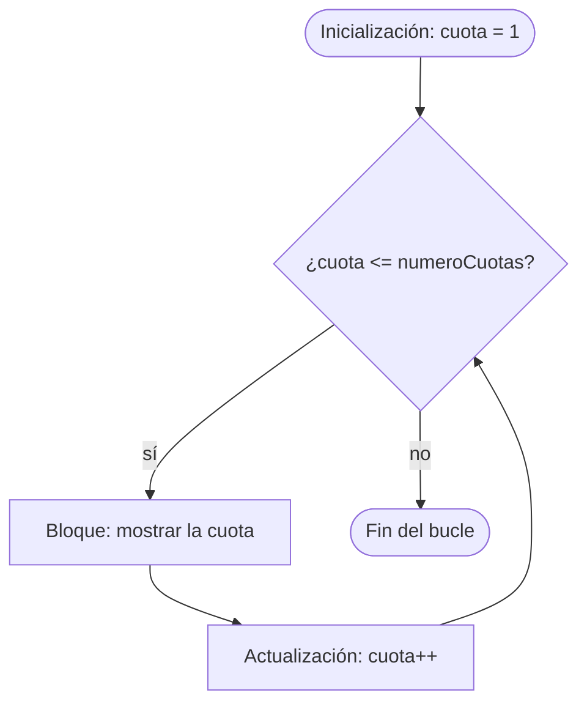
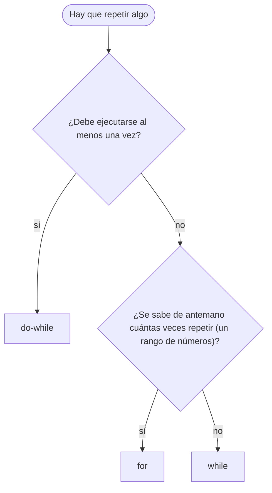

# 💡 Ejemplo 03 — For

## 🌍 Contexto

Cuando **sabes de antemano cuántas veces** hay que repetir algo (las cuotas de un pago, los días de un
tratamiento), el `for` reúne en **una sola línea** las tres piezas que un `while` reparte por el
código: dónde empieza el contador, hasta cuándo se repite y cómo avanza.

```text
for (inicialización; condición; actualización) {
    instrucciones que se repiten
}
```

El orden de ejecución es:

1. **Inicialización**: se ejecuta **una sola vez**, al empezar (`int cuota = 1`).
2. **Condición**: se evalúa antes de cada vuelta; si es falsa, el bucle termina (`cuota <= numeroCuotas`).
3. **Bloque**: se ejecuta si la condición es verdadera.
4. **Actualización**: se ejecuta al final de cada vuelta (`cuota++`), y vuelve al paso 2.

Con el `for` se puede contar hacia adelante (`cuota++`), hacia atrás (`dia--`) y de a más de uno
(`turno += 2`). La variable que se declara en la inicialización **solo existe dentro del bucle**.

Además, como la actualización está en la cabecera, es mucho más difícil olvidarla que en un `while`.

**Qué busca demostrar este ejemplo**: cómo escribir un `for` hacia adelante, hacia atrás y con paso
distinto de 1, cómo elegir entre `while`, `do-while` y `for`, y qué errores producen una repetición de
más o de menos.

## 🏥 Caso de estudio

**MediSalud** ofrece un plan de pago en cuotas iguales: el total ($255.000) se divide entre el número
de cuotas y se muestra una línea por cada cuota. También muestra la cuenta regresiva de los días de un
tratamiento y lista los turnos impares de la agenda.

## 🌳 Árbol de archivos (como se vería en VS Code)

Agrega la clase `PlanCuotas.java` al paquete `com.medisalud` del proyecto `Modulo03Repeticiones`:

```text
Modulo03Repeticiones
└── src
    └── com
        ├── biblioteca
        │   └── ComprobantePrestamo.java
        └── medisalud
            ├── AtencionTurnos.java
            └── PlanCuotas.java   ← nuevo en este ejemplo
```

## 💻 Archivo: PlanCuotas.java

```java
package com.medisalud;

public class PlanCuotas {

    public static void main(String[] args) {
        // Datos de entrada
        int totalAPagar = 255000;
        int numeroCuotas = 3;
        int diasTratamiento = 3;
        int cuposDia = 8;

        // for hacia adelante: una línea por cada cuota
        int valorCuota = totalAPagar / numeroCuotas;
        System.out.println("Plan de pago en " + numeroCuotas + " cuotas:");
        for (int cuota = 1; cuota <= numeroCuotas; cuota++) {
            System.out.println("Cuota " + cuota + ": " + valorCuota);
        }

        // for hacia atrás: cuenta regresiva de los días de tratamiento
        for (int dia = diasTratamiento; dia >= 1; dia--) {
            System.out.println("Cuenta regresiva del tratamiento: " + dia);
        }

        // for con paso 2: turnos impares de la agenda
        for (int turno = 1; turno <= cuposDia; turno += 2) {
            System.out.println("Turno impar: " + turno);
        }
    }
}
```

## 🗺️ Diagrama

El flujo del `for`: la inicialización ocurre una sola vez, y la actualización vuelve siempre a la
condición:



Y una guía de tres preguntas para **elegir la estructura repetitiva**:



## 📋 Tabla de valores

Con `numeroCuotas = 3`, el valor del contador en cada vuelta y el resultado de la condición **que
se evalúa antes** de esa vuelta:

| vuelta | cuota | ¿cuota <= numeroCuotas? | valorCuota |
|---|---|---|---|
| `1` | `1` | `true` | `85000` |
| `2` | `2` | `true` | `85000` |
| `3` | `3` | `true` | `85000` |
| — | `4` | `false` | — |

La última fila es la comprobación que termina el bucle: con `cuota = 4`, la condición `4 <= 3` es falsa.

## 🧭 Explicación paso a paso

1. `int valorCuota = totalAPagar / numeroCuotas;` calcula la cuota con una división entera:
   `255000 / 3 = 85000`.
2. `for (int cuota = 1; cuota <= numeroCuotas; cuota++)` empieza con `cuota = 1`, repite mientras
   `cuota <= 3` y suma 1 al final de cada vuelta: muestra las cuotas 1, 2 y 3.
3. La **cuenta regresiva** cambia las tres piezas: empieza en `diasTratamiento`, repite mientras
   `dia >= 1` y **resta** 1 (`dia--`). Muestra 3, 2 y 1.
4. El **paso 2** cambia la actualización: `turno += 2` avanza de a dos y muestra los turnos impares
   1, 3, 5 y 7 (el siguiente, 9, ya supera `cuposDia`).
5. Las variables `cuota`, `dia` y `turno` solo existen dentro de su `for`: por eso se puede reutilizar
   el nombre en otro bucle.
6. **Cómo elegir**: si hay que ejecutar sí o sí una vez, `do-while`; si se sabe cuántas veces, `for`;
   en los demás casos, `while`. Aquí todas las repeticiones son un rango conocido, así que el `for`
   es la elección natural.

## ✅ Resultado esperado

```text
Plan de pago en 3 cuotas:
Cuota 1: 85000
Cuota 2: 85000
Cuota 3: 85000
Cuenta regresiva del tratamiento: 3
Cuenta regresiva del tratamiento: 2
Cuenta regresiva del tratamiento: 1
Turno impar: 1
Turno impar: 3
Turno impar: 5
Turno impar: 7
```

## 🧪 Casos de prueba

Cambia los datos de entrada y ejecuta de nuevo. Prueba **cero, una y varias** repeticiones y los
valores límite.

**Valor de la cuota** según el número de cuotas (con `totalAPagar = 255000`):

| numeroCuotas | valorCuota |
|---|---|
| `1` | `255000` |
| `3` | `85000` |
| `5` | `51000` |
| `6` | `42500` |

**Cuenta regresiva** según `diasTratamiento` (con `0` no se ejecuta ninguna vez):

| diasTratamiento | primer valor | último valor | repeticiones |
|---|---|---|---|
| `0` | — | — | `0` |
| `1` | `1` | `1` | `1` |
| `5` | `5` | `1` | `5` |

## 🔍 Análisis: errores frecuentes

**Error 1 — Una repetición de menos o de más (error lógico).** Con `<` en lugar de `<=`:

```java error-logico
package com.medisalud;

public class PlanCuotas {

    public static void main(String[] args) {
        int totalAPagar = 255000;
        int numeroCuotas = 3;
        int valorCuota = totalAPagar / numeroCuotas;
        for (int cuota = 1; cuota < numeroCuotas; cuota++) {
            System.out.println("Cuota " + cuota + ": " + valorCuota);
        }
    }
}
```

```text
Cuota 1: 85000
Cuota 2: 85000
```

Son 3 cuotas y solo salen 2: `cuota < numeroCuotas` deja fuera la última. El panel Problems no marca
ningún problema. Se descubre probando con el valor límite. El error contrario (empezar en 0 con `<=`)
da una repetición de más.

**Error 2 — Punto y coma después del `for` (error lógico).**

```java error-logico
package com.medisalud;

public class PlanCuotas {

    public static void main(String[] args) {
        int totalAPagar = 255000;
        int numeroCuotas = 3;
        int valorCuota = totalAPagar / numeroCuotas;
        for (int cuota = 1; cuota <= numeroCuotas; cuota++);
        {
            System.out.println("Cuota pagada: " + valorCuota);
        }
    }
}
```

```text
Cuota pagada: 85000
```

El `;` termina el `for` con un cuerpo vacío: el bucle da sus 3 vueltas **sin hacer nada** y el bloque
de llaves se ejecuta **una sola vez**. El panel Problems no marca ningún problema.

**Error 3 — Un contador `double` (error lógico).**

```java error-logico
package com.medisalud;

public class PlanCuotas {

    public static void main(String[] args) {
        int repeticiones = 0;
        for (double avance = 0.0; avance < 1.0; avance += 0.1) {
            repeticiones++;
        }
        System.out.println("Se esperaban 10 repeticiones y hubo " + repeticiones);
    }
}
```

```text
Se esperaban 10 repeticiones y hubo 11
```

Diez sumas de `0.1` no dan exactamente `1.0` (dan `0.9999999999999999`), así que la condición
`avance < 1.0` sigue siendo verdadera y hay una repetición de más. El panel Problems no marca ningún
problema. **Los contadores se cuentan con enteros.**

**Error 4 — Usar el contador fuera del bucle (error de compilación).**

```java no-compila
package com.medisalud;

public class PlanCuotas {

    public static void main(String[] args) {
        int numeroCuotas = 3;
        for (int cuota = 1; cuota <= numeroCuotas; cuota++) {
            System.out.println("Cuota " + cuota);
        }
        System.out.println("Última cuota: " + cuota);
    }
}
```

Mensaje del panel Problems (la posición se refiere al archivo completo):

```text
✖ cuota cannot be resolved to a variable Java(33554515) [Ln 10, Col 47]
```

`cuota` solo existe dentro del `for`. Si necesitas su valor después, declara la variable **antes** del
bucle.

**Error 5 — Declarar otra vez una variable que ya existe (error de compilación).**

```java no-compila
package com.medisalud;

public class PlanCuotas {

    public static void main(String[] args) {
        int cuota = 0;
        for (int cuota = 1; cuota <= 3; cuota++) {
            System.out.println("Cuota " + cuota);
        }
    }
}
```

```text
✖ Duplicate local variable cuota Java(536870967) [Ln 7, Col 18]
```

La variable del `for` no puede llevar el nombre de otra que ya existe en el mismo método.

**Error 6 — Un `for` sin actualización (el programa no termina).**

> ⚠️ **Este programa no termina.** Si lo ejecutas, quedará en un bucle sin fin. Detenlo con `Ctrl+C`
> en la terminal donde se ejecuta, o con el botón de detener de la barra de depuración.

```java no-termina
package com.medisalud;

public class PlanCuotas {

    public static void main(String[] args) {
        int valorCuota = 85000;
        int numeroCuotas = 3;
        int total = 0;

        System.out.println("Iniciando el plan de pagos...");
        for (int cuota = 1; cuota <= numeroCuotas; ) {
            total += valorCuota;
        }
        System.out.println("Total: " + total);
    }
}
```

```text
Iniciando el plan de pagos...
```

Sin `cuota++`, `cuota` vale siempre `1` y la condición nunca se vuelve falsa. El programa imprime esa
única línea y no imprime nada más. El panel Problems no marca ningún error. En un `for` es más raro
olvidar la actualización porque está en la cabecera, pero puede dejarse en blanco.

## ❓ Preguntas de repaso

**1. [Selección]** Se ejecuta `for (int cuota = 1; cuota <= 4; cuota++)`. **Pregunta:** ¿cuántas veces
se ejecuta el bloque?

- **A.** 3 veces.
- **B.** 4 veces.
- **C.** 5 veces.
- **D.** Ninguna vez.

<details>
<summary>🔑 Ver respuesta</summary>

**Respuesta correcta: B.** El contador toma los valores 1, 2, 3 y 4; con 5 la condición `5 <= 4` es
falsa.

</details>

**2. [Selección múltiple]** Se ejecuta `for (int dia = 10; dia >= 1; dia -= 3)` con un `println(dia)`
dentro. **Pregunta:** ¿cuáles afirmaciones son verdaderas?

- **A.** El bloque se ejecuta 4 veces.
- **B.** El último valor mostrado es 1.
- **C.** Se muestran 10, 7, 4 y 1.
- **D.** También se muestra el 0.

<details>
<summary>🔑 Ver respuesta</summary>

**Respuestas correctas: A, B y C.** La secuencia es 10, 7, 4, 1; el siguiente valor sería -2, que no
cumple `dia >= 1`. D es falsa.

</details>

**3. [Abierta]** Para cada tarea, elige `while`, `do-while` o `for` y justifica: (1) mostrar las 6
cuotas de un pago; (2) imprimir un comprobante que debe salir al menos una vez; (3) atender turnos
mientras queden cupos y el número de cupos depende de otra parte del programa.

<details>
<summary>🔑 Ver respuesta modelo</summary>

(1) `for`: se sabe cuántas veces (un rango de 1 a 6). (2) `do-while`: el bloque debe ejecutarse al
menos una vez. (3) `while`: se repite mientras se cumpla una condición y puede no ejecutarse nunca.

</details>
