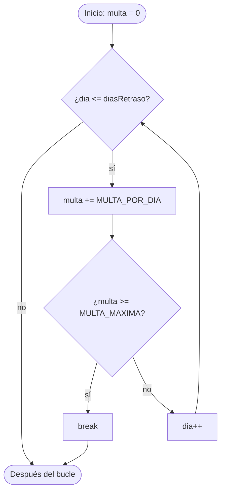

# 💡 Ejemplo 04 — Break

## 🌍 Contexto

A veces un bucle **no necesita llegar hasta el final**: ya se cumplió el criterio que buscaba, o se
alcanzó un tope. La sentencia `break` **termina el bucle de inmediato**: el programa salta la parte
del bloque que falta, ya no comprueba la condición y sigue con la primera instrucción que hay
**después** del bucle.

```text
for (...) {
    instrucciones
    if (criterio de parada) {
        break;
    }
    más instrucciones (no se ejecutan en la vuelta en que salta el break)
}
instrucciones que siguen después del bucle
```

Casi siempre se usa dentro de un `if` (Módulo 2), porque hay que decidir **cuándo** parar. Además:

- Con `while (true)` la condición **nunca** es falsa: el bucle solo puede terminar con un `break`. Es la
  única construcción del módulo en que un bucle "infinito" es intencional, y siempre termina.
- `break` ya lo conocías en el `switch`. Dentro de un `switch` que está dentro de un bucle, ese
  `break` **solo sale del `switch`**, no del bucle.

**Qué busca demostrar este ejemplo**: cómo terminar un bucle antes de tiempo con `break`, cómo usarlo
con `while (true)` y qué instrucciones dejan de ejecutarse.

## 📚 Caso de estudio

La **Biblioteca Universitaria** cobra $1.500 por cada día de retraso, pero la multa **nunca supera
$30.000**. Al recorrer los días de retraso, en cuanto la multa alcanza el tope no tiene sentido seguir
sumando: el bucle debe detenerse.

## 🌳 Árbol de archivos (como se vería en VS Code)

Agrega la clase `MultaConTope.java` al paquete `com.biblioteca` del proyecto `Modulo03Repeticiones`:

```text
Modulo03Repeticiones
└── src
    └── com
        ├── biblioteca
        │   ├── ComprobantePrestamo.java
        │   └── MultaConTope.java   ← nuevo en este ejemplo
        └── medisalud
            ├── AtencionTurnos.java
            └── PlanCuotas.java
```

## 💻 Archivo: MultaConTope.java

```java
package com.biblioteca;

public class MultaConTope {

    public static void main(String[] args) {
        // Datos de entrada
        final double MULTA_POR_DIA = 1500.0;
        final double MULTA_MAXIMA = 30000.0;
        int diasRetraso = 25;

        // for con break: se deja de sumar al alcanzar el tope
        double multa = 0.0;
        int diasCobrados = 0;
        for (int dia = 1; dia <= diasRetraso; dia++) {
            multa += MULTA_POR_DIA;
            diasCobrados++;
            if (multa >= MULTA_MAXIMA) {
                break;
            }
        }
        System.out.println("Días cobrados: " + diasCobrados);
        System.out.printf("Multa: %.0f%n", multa);

        // while (true) con break: ¿en qué día se alcanza el tope?
        int diaTope = 0;
        double acumulado = 0.0;
        while (true) {
            diaTope++;
            acumulado += MULTA_POR_DIA;
            if (acumulado >= MULTA_MAXIMA) {
                break;
            }
        }
        System.out.println("El tope se alcanza el día " + diaTope);

        // break dentro de un switch dentro de un bucle: solo sale del switch
        for (int dia = 1; dia <= 3; dia++) {
            switch (dia) {
                case 2:
                    System.out.println("Día 2: revisión especial");
                    break;
                default:
                    System.out.println("Día " + dia + ": revisión normal");
            }
            System.out.println("Fin de la revisión del día " + dia);
        }
    }
}
```

## 🗺️ Diagrama

El flujo de un `for` con `break`: cuando el criterio de parada se cumple, el bucle **termina** sin
volver a la condición:



## 📋 Tabla de valores

Con `diasRetraso = 25`, el bucle **no llega al día 25**: se detiene en el día 20. Para no repetir 20
filas se muestran las primeras, las últimas y una fila `…` que resume las intermedias:

| vuelta | dia | multa | ¿multa >= MULTA_MAXIMA? |
|---|---|---|---|
| `1` | `1` | `1500` | `false` |
| `2` | `2` | `3000` | `false` |
| `3` | `3` | `4500` | `false` |
| … | … | … | `false` |
| `19` | `19` | `28500` | `false` |
| `20` | `20` | `30000` | `true (break)` |

En la vuelta 20 la condición del tope se cumple y se ejecuta el `break`: los días 21 a 25 **nunca se
recorren**.

## 🧭 Explicación paso a paso

1. `multa` y `diasCobrados` se declaran **antes** del `for`. Dentro, cada vuelta suma la multa del día y
   cuenta un día cobrado.
2. Después de sumar, el `if (multa >= MULTA_MAXIMA)` decide si parar. En el día 20 la multa vale
   `30000`: el `break` termina el bucle.
3. El programa continúa con el `println` que sigue al bucle: **20 días cobrados** y **30000 de multa**,
   aunque el retraso sea de 25 días.
4. `while (true)` no tiene condición que pueda ser falsa: la única salida es el `break` del `if`. Sin
   ese `break`, el bucle no terminaría nunca.
5. En el `for` con `switch`, el `break` del `case 2` sale **solo del `switch`**. Por eso el mensaje
   `Fin de la revisión del día 2` se muestra igual: el bucle sigue y las instrucciones que hay
   después del `switch` también se ejecutan.

## ✅ Resultado esperado

```text
Días cobrados: 20
Multa: 30000
El tope se alcanza el día 20
Día 1: revisión normal
Fin de la revisión del día 1
Día 2: revisión especial
Fin de la revisión del día 2
Día 3: revisión normal
Fin de la revisión del día 3
```

## 🧪 Casos de prueba

Cambia `diasRetraso` y ejecuta de nuevo. Prueba **cero, una y varias** repeticiones y los valores
límite del tope (20 días llegan justo al tope):

| diasRetraso | multa | días cobrados |
|---|---|---|
| `0` | `0` | `0` |
| `1` | `1500` | `1` |
| `20` | `30000` | `20` |
| `21` | `30000` | `20` |
| `25` | `30000` | `20` |

Con `20` el `break` se ejecuta en la última vuelta; con `21` y `25` se ejecuta antes de terminar de
recorrer los días.

## 🔍 Análisis: errores frecuentes

**Error 1 — Olvidar el `break` (error lógico).**

```java error-logico
package com.biblioteca;

public class MultaConTope {

    public static void main(String[] args) {
        final double MULTA_POR_DIA = 1500.0;
        final double MULTA_MAXIMA = 30000.0;
        int diasRetraso = 25;

        double multa = 0.0;
        for (int dia = 1; dia <= diasRetraso; dia++) {
            multa += MULTA_POR_DIA;
        }
        System.out.printf("Multa: %.0f (el tope es %.0f)%n", multa, MULTA_MAXIMA);
    }
}
```

```text
Multa: 37500 (el tope es 30000)
```

Sin `break`, el bucle recorre los 25 días y la multa supera el tope ($37.500 en lugar de $30.000). El
panel Problems no marca ningún problema.

**Error 2 — Creer que el `break` de un `switch` termina el bucle (error lógico).**

```java error-logico
package com.biblioteca;

public class MultaConTope {

    public static void main(String[] args) {
        for (int dia = 1; dia <= 5; dia++) {
            switch (dia) {
                case 3:
                    System.out.println("Libro devuelto el día " + dia);
                    break;
                default:
                    System.out.println("Sigue prestado el día " + dia);
            }
        }
    }
}
```

```text
Sigue prestado el día 1
Sigue prestado el día 2
Libro devuelto el día 3
Sigue prestado el día 4
Sigue prestado el día 5
```

Se esperaba dejar de revisar cuando el libro se devuelve (día 3), pero los días 4 y 5 siguen
apareciendo: ese `break` solo sale del `switch`. El panel Problems no marca ningún problema. Para
terminar el bucle hay que poner un `break` **fuera** del `switch` (por ejemplo, en un `if`).

**Error 3 — `break` fuera de un bucle o de un `switch` (error de compilación).**

```java no-compila
package com.biblioteca;

public class MultaConTope {

    public static void main(String[] args) {
        double multa = 30000.0;
        if (multa >= 30000.0) {
            break;
        }
    }
}
```

Mensaje del panel Problems (la posición se refiere al archivo completo):

```text
✖ break cannot be used outside of a loop or a switch Java(536871084) [Ln 8, Col 13]
```

`break` solo tiene sentido dentro de un bucle o de un `switch`.

**Error 4 — Una instrucción justo después del `break` (error de compilación).**

```java no-compila
package com.biblioteca;

public class MultaConTope {

    public static void main(String[] args) {
        for (int dia = 1; dia <= 3; dia++) {
            break;
            System.out.println("Día " + dia);
        }
    }
}
```

```text
⚠ Dead code Java(536871061) [Ln 6, Col 37]
✖ Unreachable code Java(536871073) [Ln 8, Col 13]
```

Después de un `break` (que siempre se ejecuta en esa vuelta) el resto del bloque no puede
ejecutarse nunca. El panel lo señala como error y, además, con una advertencia de código muerto.

**Error 5 — Una instrucción después de un `while (true)` sin `break` (error de compilación).**

```java no-compila
package com.biblioteca;

public class MultaConTope {

    public static void main(String[] args) {
        double multa = 0.0;
        while (true) {
            multa += 1500.0;
        }
        System.out.println("Multa: " + multa);
    }
}
```

```text
✖ Unreachable code Java(536871073) [Ln 10, Col 9]
```

Un `while (true)` sin `break` no termina nunca, así que la instrucción que le sigue jamás se
ejecutaría. Java lo detecta y lo rechaza: por eso los bucles infinitos de este módulo usan
condiciones normales que nunca cambian, no `while (true)`.

## ❓ Preguntas de repaso

**1. [Selección]** Se ejecuta `for (int dia = 1; dia <= 10; dia++) { if (dia == 4) { break; }
System.out.println(dia); }`. **Pregunta:** ¿qué muestra?

- **A.** `1 2 3`
- **B.** `1 2 3 4`
- **C.** `1 2 3 5 6 7 8 9 10`
- **D.** No muestra nada.

<details>
<summary>🔑 Ver respuesta</summary>

**Respuesta correcta: A.** En la vuelta en que `dia` vale 4, el `break` termina el bucle **antes** del
`println`, así que el 4 no se muestra y tampoco los días siguientes.

</details>

**2. [Selección múltiple]** **Pregunta:** ¿cuáles afirmaciones sobre `break` son verdaderas?

- **A.** Un `while (true)` con un `break` alcanzable termina cuando se ejecuta el `break`.
- **B.** Un `break` dentro de un `switch` dentro de un bucle termina el bucle.
- **C.** Una instrucción escrita después de un `while (true)` sin `break` es un error de compilación.
- **D.** `break` se puede escribir fuera de cualquier bucle o `switch`.

<details>
<summary>🔑 Ver respuesta</summary>

**Respuestas correctas: A y C.** B es falsa: ese `break` solo sale del `switch`. D es falsa: fuera de un
bucle o `switch` es un error de compilación.

</details>

**3. [Abierta]** Explica con tus palabras qué instrucciones dejan de ejecutarse cuando un bucle
ejecuta un `break` y cuál es la primera que se ejecuta después.

<details>
<summary>🔑 Ver respuesta modelo</summary>

Dejan de ejecutarse el resto del bloque de esa vuelta y todas las vueltas siguientes. La primera
instrucción que se ejecuta es la que está **después** del bucle.

</details>
