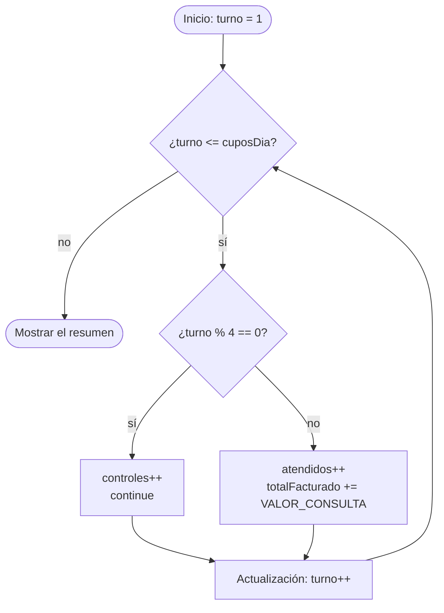

# 💡 Ejemplo 05 — Continue

## 🌍 Contexto

`break` termina el bucle entero. A veces solo hay que **saltarse una vuelta**: un caso especial que no
debe procesarse, pero el recorrido tiene que seguir con los demás. Para eso está `continue`: **salta el
resto del bloque en la vuelta actual** y pasa a la siguiente. El bucle **no termina**.

```text
for (...) {
    if (caso especial) {
        continue;
    }
    instrucciones (no se ejecutan en la vuelta en que salta el continue)
}
```

| | `break` | `continue` |
|---|---|---|
| Qué hace | **Termina** el bucle | **Salta** solo la vuelta actual |
| Qué ocurre después | Sigue la instrucción que hay **después** del bucle | Se pasa a la **siguiente vuelta** del mismo bucle |
| Uso típico | Se alcanzó un tope o se encontró lo buscado | Hay un caso que se omite |

Lo más importante es **qué ocurre con la actualización del contador**:

- En un **`for`**, `continue` salta al paso de **actualización** (`turno++`) y luego comprueba la
  condición. La actualización **siempre se ejecuta**.
- En un **`while`** (y en un `do-while`), `continue` salta directamente a la **condición**. Si la
  actualización está al final del bloque, se **salta**, y el bucle puede volverse infinito.

**Qué busca demostrar este ejemplo**: cómo omitir una vuelta con `continue`, en qué se diferencia de
`break` y por qué en un `while` hay que actualizar el contador **antes** del `continue`.

## 🏥 Caso de estudio

En **MediSalud**, cada cuarto turno de la agenda (los turnos 4, 8, 12...) es un turno de **control**:
el paciente se atiende, pero **no se factura**. Al recorrer los turnos, los de control se cuentan aparte
y se saltan sin facturar.

## 🌳 Árbol de archivos (como se vería en VS Code)

Agrega la clase `TurnosDeControl.java` al paquete `com.medisalud` del proyecto `Modulo03Repeticiones`:

```text
Modulo03Repeticiones
└── src
    └── com
        ├── biblioteca
        │   ├── ComprobantePrestamo.java
        │   └── MultaConTope.java
        └── medisalud
            ├── AtencionTurnos.java
            ├── PlanCuotas.java
            └── TurnosDeControl.java   ← nuevo en este ejemplo
```

## 💻 Archivo: TurnosDeControl.java

```java
package com.medisalud;

public class TurnosDeControl {

    public static void main(String[] args) {
        // Datos de entrada
        final double VALOR_CONSULTA = 85000.0;
        int cuposDia = 8;

        // for con continue: los turnos de control (múltiplos de 4) no se facturan
        int atendidos = 0;
        int controles = 0;
        double totalFacturado = 0.0;
        for (int turno = 1; turno <= cuposDia; turno++) {
            if (turno % 4 == 0) {
                controles++;
                continue;
            }
            atendidos++;
            totalFacturado += VALOR_CONSULTA;
        }
        System.out.println("Turnos atendidos: " + atendidos);
        System.out.println("Turnos de control: " + controles);
        System.out.printf("Total facturado: %.0f%n", totalFacturado);

        // El mismo recorrido con while: el contador se actualiza ANTES del continue
        int turno = 1;
        int atendidosConWhile = 0;
        while (turno <= cuposDia) {
            if (turno % 4 == 0) {
                turno++;
                continue;
            }
            atendidosConWhile++;
            turno++;
        }
        System.out.println("Con while también se atendieron " + atendidosConWhile + " turnos");
    }
}
```

## 🗺️ Diagrama

El flujo de un `for` con `continue`: en los turnos de control se salta a la **actualización**, sin
facturar, y el bucle sigue:



## 📋 Tabla de valores

Con `cuposDia = 8`, el valor de las variables al terminar cada vuelta. En los turnos 4 y 8 se ejecuta
`continue`: el turno **no se factura**, pero el bucle sigue:

| vuelta | turno | ¿turno % 4 == 0? | atendidos | controles | totalFacturado |
|---|---|---|---|---|---|
| `1` | `1` | `false` | `1` | `0` | `85000` |
| `2` | `2` | `false` | `2` | `0` | `170000` |
| `3` | `3` | `false` | `3` | `0` | `255000` |
| `4` | `4` | `true (continue)` | `3` | `1` | `255000` |
| `5` | `5` | `false` | `4` | `1` | `340000` |
| `6` | `6` | `false` | `5` | `1` | `425000` |
| `7` | `7` | `false` | `6` | `1` | `510000` |
| `8` | `8` | `true (continue)` | `6` | `2` | `510000` |

Observa que en las vueltas 4 y 8 `atendidos` y `totalFacturado` **no cambian**: lo que viene después del
`continue` no se ejecutó.

## 🧭 Explicación paso a paso

1. `atendidos`, `controles` y `totalFacturado` se declaran **antes** del `for`.
2. En cada vuelta, `if (turno % 4 == 0)` pregunta si el turno es de control. El operador `%` (residuo,
   del Módulo 2) da `0` en los múltiplos de 4.
3. Si es de control, se cuenta (`controles++`) y `continue` **salta el resto del bloque**: no se
   ejecutan `atendidos++` ni la suma al total.
4. Al saltar, el `for` ejecuta su **actualización** (`turno++`) y comprueba la condición: el recorrido
   sigue con el turno 5.
5. El resumen muestra 6 turnos atendidos y 2 de control, con un total de $510.000.
6. En el **`while`** equivalente, el `continue` saltaría directamente a la condición; por eso el
   `turno++` se escribe **antes** del `continue` (y también al final del bloque para los demás turnos).

## ✅ Resultado esperado

```text
Turnos atendidos: 6
Turnos de control: 2
Total facturado: 510000
Con while también se atendieron 6 turnos
```

## 🧪 Casos de prueba

Cambia `cuposDia` en los datos de entrada y ejecuta de nuevo. Prueba **sin controles, con uno y con
varios**:

| cuposDia | atendidos | controles | totalFacturado |
|---|---|---|---|
| `3` | `3` | `0` | `255000` |
| `4` | `3` | `1` | `255000` |
| `8` | `6` | `2` | `510000` |

Con `cuposDia = 3` no hay turnos de control (el `continue` nunca se ejecuta); con `4`, el último turno
es de control.

## 🔍 Análisis: errores frecuentes

**Error 1 — Un `continue` que salta la actualización de un `while` (el programa no termina).**

> ⚠️ **Este programa no termina.** Si lo ejecutas, quedará en un bucle sin fin. Detenlo con `Ctrl+C`
> en la terminal donde se ejecuta, o con el botón de detener de la barra de depuración.

```java no-termina
package com.medisalud;

public class TurnosDeControl {

    public static void main(String[] args) {
        int cuposDia = 8;
        int turno = 1;
        int atendidos = 0;

        System.out.println("Cerrando la agenda...");
        while (turno <= cuposDia) {
            if (turno % 4 == 0) {
                continue;
            }
            atendidos++;
            turno++;
        }
        System.out.println("Turnos atendidos: " + atendidos);
    }
}
```

```text
Cerrando la agenda...
```

Al llegar al turno 4, el `continue` salta el `turno++` que está al final del bloque: `turno` sigue
valiendo 4, la condición sigue siendo verdadera y se repite el mismo turno **para siempre**. El
programa imprime esa línea y no imprime nada más. El panel Problems no marca ningún error. En un `for`
esto no pasa, porque `continue` siempre ejecuta la actualización. La solución en un `while` es
actualizar el contador **antes** del `continue`.

**Error 2 — Usar `break` cuando se quería `continue` (error lógico).**

```java error-logico
package com.medisalud;

public class TurnosDeControl {

    public static void main(String[] args) {
        int cuposDia = 8;
        int atendidos = 0;
        for (int turno = 1; turno <= cuposDia; turno++) {
            if (turno % 4 == 0) {
                break;
            }
            atendidos++;
        }
        System.out.println("Turnos atendidos: " + atendidos + " de " + cuposDia);
    }
}
```

```text
Turnos atendidos: 3 de 8
```

El recorrido se detiene en el primer turno de control y quedan **5 turnos sin atender**. Con `break` se
termina el bucle; con `continue` solo se omite ese turno. El panel Problems no marca ningún problema.

**Error 3 — `continue` fuera de un bucle (error de compilación).**

```java no-compila
package com.medisalud;

public class TurnosDeControl {

    public static void main(String[] args) {
        int turno = 4;
        if (turno % 4 == 0) {
            continue;
        }
    }
}
```

Mensaje del panel Problems (la posición se refiere al archivo completo):

```text
✖ continue cannot be used outside of a loop Java(536871085) [Ln 8, Col 13]
```

`continue` solo tiene sentido dentro de un bucle (a diferencia de `break`, no se usa en un `switch`).

**Error 4 — Una instrucción justo después del `continue` (error de compilación).**

```java no-compila
package com.medisalud;

public class TurnosDeControl {

    public static void main(String[] args) {
        for (int turno = 1; turno <= 3; turno++) {
            continue;
            System.out.println("Turno " + turno);
        }
    }
}
```

```text
✖ Unreachable code Java(536871073) [Ln 8, Col 13]
```

Después de un `continue` que siempre se ejecuta, el resto del bloque no puede ejecutarse nunca.

## ❓ Preguntas de repaso

**1. [Selección]** Se ejecuta `for (int turno = 1; turno <= 5; turno++) { if (turno == 3) { continue; }
System.out.print(turno + " "); }`. **Pregunta:** ¿qué muestra?

- **A.** `1 2`
- **B.** `1 2 4 5`
- **C.** `1 2 3 4 5`
- **D.** `3`

<details>
<summary>🔑 Ver respuesta</summary>

**Respuesta correcta: B.** Cuando `turno` vale 3, el `continue` salta el `print` y el bucle sigue con el 4.
Con `break` habría mostrado solo `1 2`.

</details>

**2. [Selección múltiple]** **Pregunta:** ¿cuáles afirmaciones sobre `continue` son verdaderas?

- **A.** Termina el bucle.
- **B.** En un `for`, la actualización del contador se ejecuta después de un `continue`.
- **C.** En un `while`, si la actualización está al final del bloque, un `continue` la salta.
- **D.** Salta solo el resto de la vuelta actual.

<details>
<summary>🔑 Ver respuesta</summary>

**Respuestas correctas: B, C y D.** A es falsa: eso lo hace `break`. En el `for` la actualización siempre se
ejecuta; en el `while` puede saltarse y provocar un bucle infinito.

</details>

**3. [Abierta]** Explica con tus palabras la diferencia entre `break` y `continue`, y da un ejemplo de
negocio de cada uno.

<details>
<summary>🔑 Ver respuesta modelo</summary>

`break` termina el bucle (por ejemplo, dejar de cobrar días de multa al alcanzar el tope). `continue`
salta solo la vuelta actual y el bucle sigue (por ejemplo, no facturar un turno de control y pasar al
siguiente turno).

</details>
