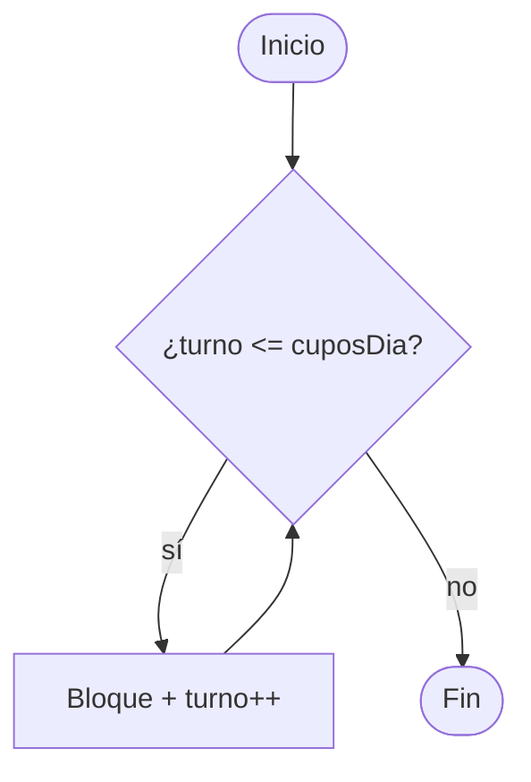
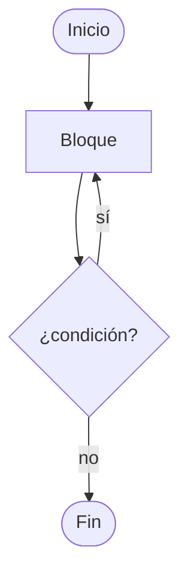
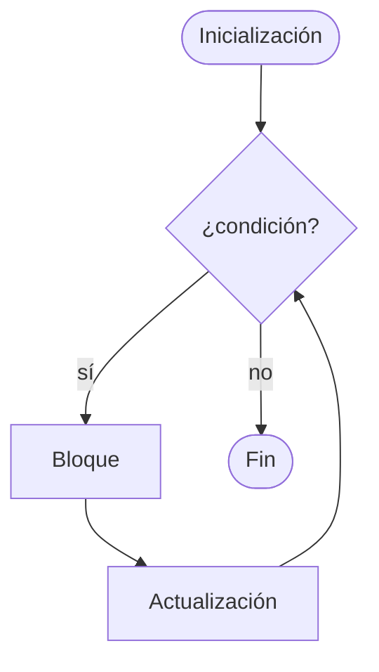
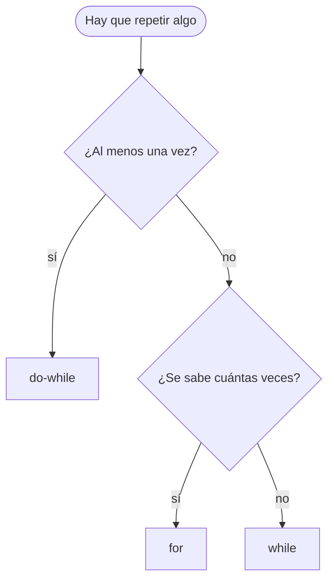
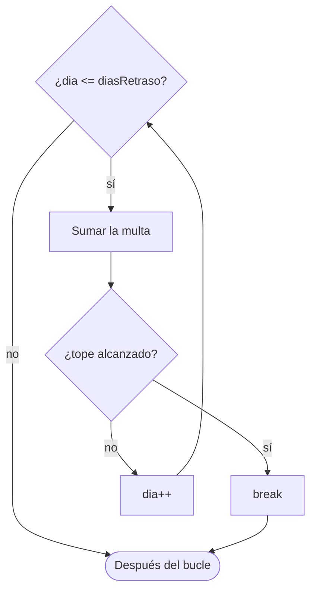
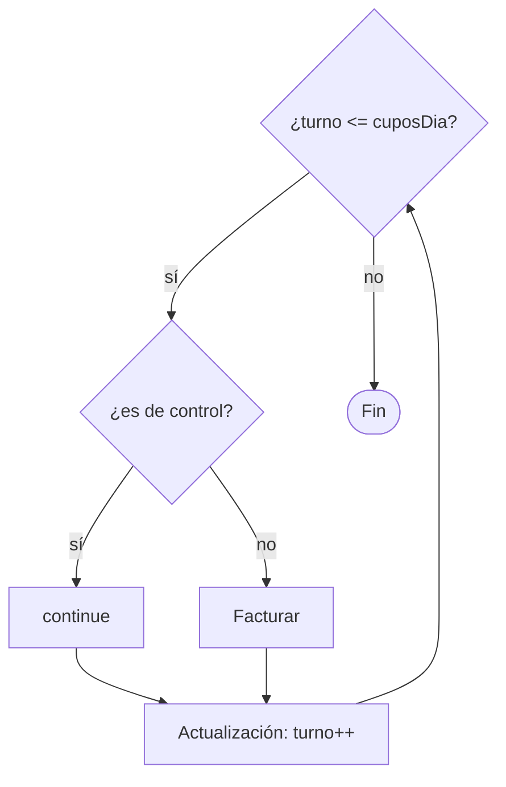

# 📘 Módulo 3 — Estructuras Repetitivas

Curso de Java

---

## 🎯 Objetivos del módulo

- Repetir instrucciones con `while`, `do-while` y `for`.
- Usar contadores y acumuladores.
- Seguir un bucle con una tabla de valores.
- Terminar un bucle con `break` y saltar una vuelta con `continue`.
- Reconocer y evitar el bucle infinito.

---

## 🗺️ Ruta de la sesión

1. Estructuras repetitivas: `while`, `do-while` y `for`
2. Sentencias de ramificación: `break` y `continue`
3. Taller, resumen y evaluación

---

## 🧠 ¿Qué es un bucle?

| Término | Significa |
|---|---|
| Bucle | Bloque que se ejecuta varias veces |
| Iteración | Cada ejecución del bloque |
| Condición | Decide si hay otra vuelta |

Una regla de oro: algo dentro del bucle debe hacer falsa la condición.

---

## 📋 La prueba de escritorio

| vuelta | turno | ¿turno <= 3? | atendidos | totalFacturado |
|---|---|---|---|---|
| `1` | `1` | `true` | `1` | `85000` |
| `2` | `2` | `true` | `2` | `170000` |
| `3` | `3` | `true` | `3` | `255000` |
| — | `4` | `false` | `3` | `255000` |

Registra cuánto valen las variables al terminar cada vuelta.

---

## 🧠 `while`: repetir mientras se cumpla

```java
while (turno <= cuposDia) {
    atendidos++;
    turno++;
}
```

La condición se evalúa **antes** de cada vuelta.

---

## 🗺️ Flujo del `while`



---

## 🧠 El `while` puede no ejecutarse

| cuposDia | atendidos | totalFacturado |
|---|---|---|
| `0` | `0` | `0` |
| `1` | `1` | `85000` |
| `8` | `8` | `680000` |

Con `cuposDia = 0` la condición es falsa desde el principio.

---

## 🧠 La variable de control

```java
int turno = 1;
while (turno <= 3) {
    turno++;
}
```

Sin `turno++`, el bucle no termina.

---

## 🧠 `do-while`: al menos una vez

```java
do {
    copias++;
} while (copias < copiasSolicitadas);
```

Lleva `;` al final y evalúa la condición **después**.

---

## 🗺️ Flujo del `do-while`



---

## 🧠 `do-while` frente a `while`

| copiasSolicitadas | con do-while | con while |
|---|---|---|
| `0` | `1` | `0` |
| `1` | `1` | `1` |
| `3` | `3` | `3` |

Solo difieren cuando la condición es falsa desde el principio.

---

## 🧠 `for`: tres partes en una línea

```java
for (int cuota = 1; cuota <= numeroCuotas; cuota++) {
    System.out.println("Cuota " + cuota);
}
```

Inicialización, condición y actualización.

---

## 🗺️ Flujo del `for`



---

## 🧠 Hacia atrás y con paso

```java
for (int dia = 5; dia >= 1; dia--) {
    System.out.println(dia);
}
for (int turno = 1; turno <= 8; turno += 2) {
    System.out.println(turno);
}
```

Cuenta regresiva y turnos impares.

---

## 🧠 Cuidado con `<` y `<=`

| Condición | Repeticiones |
|---|---|
| `cuota <= 5` | 5 |
| `cuota < 5` | 4 |

Prueba siempre el valor límite.

---

## 🗺️ Cómo elegir la estructura



---

## 🧠 El contador

- Variable **entera** que cuenta las vueltas.
- Se declara **antes** del bucle.
- Se actualiza **dentro** (o en la cabecera del `for`).

Un contador `double` puede dar una repetición de más.

---

## 🧠 El acumulador

```java
double totalFacturado = 0.0;
while (turno <= cuposDia) {
    totalFacturado += VALOR_CONSULTA;
    turno++;
}
```

Declarado dentro del bucle, se reinicia en cada vuelta.

---

## 🧠 `break`: terminar el bucle

```java
for (int dia = 1; dia <= diasRetraso; dia++) {
    multa += MULTA_POR_DIA;
    if (multa >= MULTA_MAXIMA) {
        break;
    }
}
```

El programa sigue **después** del bucle.

---

## 🗺️ Flujo con `break`



---

## 🧠 `while (true)` con `break`

```java
while (true) {
    diaTope++;
    acumulado += MULTA_POR_DIA;
    if (acumulado >= MULTA_MAXIMA) {
        break;
    }
}
```

La única salida es el `break`.

---

## 🧠 `break` dentro de un `switch`

```java
for (int dia = 1; dia <= 3; dia++) {
    switch (dia) {
        case 2:
            break;
        default:
            System.out.println(dia);
    }
}
```

Ese `break` sale del `switch`, **no** del bucle.

---

## 🧠 `continue`: saltar una vuelta

```java
for (int turno = 1; turno <= cuposDia; turno++) {
    if (turno % 4 == 0) {
        continue;
    }
    totalFacturado += VALOR_CONSULTA;
}
```

El bucle **no** termina.

---

## 🗺️ Flujo con `continue`



---

## 🧠 `break` frente a `continue`

| | `break` | `continue` |
|---|---|---|
| Efecto | Termina el bucle | Salta la vuelta actual |
| Después | Sigue tras el bucle | Sigue la vuelta siguiente |

En un `while`, actualiza el contador **antes** del `continue`.

---

## 🧠 Errores frecuentes

| Error | Síntoma |
|---|---|
| Falta actualizar la variable | El programa no termina |
| `;` tras `for` o `while` | Cuerpo vacío |
| `<` en vez de `<=` | Una repetición de menos |
| Acumulador dentro | Total incorrecto |

El editor **no avisa** de un bucle infinito.

---

## 🛠️ Actividad práctica: el taller

**Cierre de la agenda diaria** (MediSalud)

- Recorrer turnos con un `for`
- Omitir turnos de control con `continue`
- Detener al alcanzar la meta con `break`
- Tres casos de prueba

---

## 📌 Resumen

- `while`: mientras se cumpla; `do-while`: al menos una vez; `for`: número conocido.
- Contador y acumulador: antes del bucle.
- `break` termina; `continue` salta una vuelta.
- Toda vuelta debe acercar el fin del bucle.

---

## 📝 Evaluación

Quiz de 12 preguntas (formato entrevista técnica) y los ejercicios del módulo.
