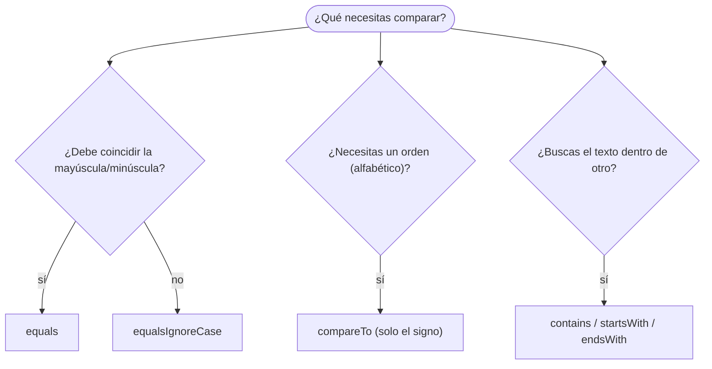

# 💡 Ejemplo 05 — Comparación de cadenas

## 🌍 Contexto

Ya sabes (desde el Módulo 2) que `==` no compara el contenido de un texto. Ahora vas a conocer las
herramientas correctas, y cuándo usar cada una:

| Método | Para qué sirve |
|---|---|
| `.equals(otro)` | ¿dicen exactamente lo mismo? (distingue mayúsculas) |
| `.equalsIgnoreCase(otro)` | ¿dicen lo mismo, sin importar mayúsculas o minúsculas? |
| `.compareTo(otro)` | ¿cuál va antes en orden alfabético? Da negativo, cero o positivo — **solo el signo es
  fiable**, el valor exacto no |
| `.contains(texto)` | ¿el texto aparece en algún lugar? |
| `.startsWith(texto)` / `.endsWith(texto)` | ¿empieza o termina con ese texto? |

**Qué busca demostrar este ejemplo**: cómo elegir el método correcto para cada tipo de comparación, y
por qué comparar con `==` sigue siendo un error incluso ahora que sabes más de objetos.

## 🏥 Caso de estudio

**MediSalud** necesita verificar el plan de cobertura de un paciente, que puede llegar escrito con
distintas mayúsculas o con espacios de más.

## 🌳 Árbol de archivos (como se vería en VS Code)

Agrega la clase `VerificarPlan.java` al paquete `com.medisalud`:

```text
Modulo04CadenasConversiones
└── src
    └── com
        ├── biblioteca
        │   ├── ConteoDeLetras.java
        │   └── LongitudDelTitulo.java
        └── medisalud
            ├── CodigoDeCita.java
            ├── CreacionDeCadenas.java
            ├── PartesDeLaHistoriaClinica.java
            └── VerificarPlan.java   ← nuevo en este ejemplo
```

## 💻 Archivo: VerificarPlan.java

```java
package com.medisalud;

public class VerificarPlan {

    public static void main(String[] args) {
        // Datos de entrada
        String planCobertura = "Premium";

        System.out.println("equals 'premium': " + planCobertura.equals("premium"));
        System.out.println("equalsIgnoreCase 'premium': " + planCobertura.equalsIgnoreCase("premium"));

        String planConEspacios = " Premium ";
        System.out.println("Coincide tras trim: " + planCobertura.equalsIgnoreCase(planConEspacios.trim()));

        System.out.println("compareTo 'Premium': " + planCobertura.compareTo("Premium"));
        System.out.println("compareTo 'Basico': " + planCobertura.compareTo("Basico"));
        System.out.println("compareTo 'Estandar': " + planCobertura.compareTo("Estandar"));

        System.out.println("contains 'mium': " + planCobertura.contains("mium"));
        System.out.println("startsWith 'Prem': " + planCobertura.startsWith("Prem"));
        System.out.println("endsWith 'ium': " + planCobertura.endsWith("ium"));
    }
}
```

## 🗺️ Diagrama

Cómo elegir el método de comparación adecuado:



## 🧭 Explicación paso a paso

1. `planCobertura.equals("premium")` da `false`: `equals` distingue mayúsculas de minúsculas.
2. `planCobertura.equalsIgnoreCase("premium")` da `true`: ignora esa diferencia.
3. `planConEspacios.trim()` quita los espacios antes de comparar; sin ese paso, la comparación con
   espacios de más también daría `false`.
4. `compareTo` da `0` cuando los textos son iguales, y un número distinto de cero según el orden
   alfabético; el valor exacto (`14`, `11`...) depende de las letras, así que solo el **signo**
   (positivo o negativo) debe usarse para decidir el orden.
5. `contains`, `startsWith` y `endsWith` responden preguntas de sí o no sobre el contenido, sin
   necesidad de calcular índices a mano.

## ✅ Resultado esperado

```text
equals 'premium': false
equalsIgnoreCase 'premium': true
Coincide tras trim: true
compareTo 'Premium': 0
compareTo 'Basico': 14
compareTo 'Estandar': 11
contains 'mium': true
startsWith 'Prem': true
endsWith 'ium': true
```

## 🧪 Casos de prueba

| `planCobertura` | ¿Coincide con "premium" (`equalsIgnoreCase`)? |
|---|---|
| `""` | `false` |
| `"PREMIUM"` | `true` |
| `" premium "` (tras `.trim()`) | `true` |

## 🔍 Análisis: errores frecuentes

**Error — Comparar con `==` cuando uno de los textos se construyó por separado (error lógico).**

```java error-logico
package com.medisalud;

public class VerificarPlan {

    public static void main(String[] args) {
        String planGuardado = "Premium";
        String planConsultado = new String("Premium");
        System.out.println("¿Es el mismo plan? " + (planGuardado == planConsultado));
    }
}
```

```text
¿Es el mismo plan? false
```

Aunque los dos textos dicen "Premium", `planConsultado` se creó con `new String(...)`: es un objeto
distinto, así que `==` da `false`. El panel Problems no marca ningún problema. La comparación de
cadenas **siempre** se hace con `equals` o `equalsIgnoreCase`, nunca con `==` (Módulo 2, ahora
explicado con la idea de objetos y referencias del Ejemplo 01).

## ❓ Preguntas de repaso

**1. [Selección]** **Pregunta:** ¿qué método usarías para saber si `"Cien Años"` y `"cien años"`
"dicen lo mismo", sin importar las mayúsculas?

- **A.** `equals`
- **B.** `equalsIgnoreCase`
- **C.** `==`
- **D.** `contains`

<details>
<summary>🔑 Ver respuesta</summary>

**Respuesta correcta: B.** `equalsIgnoreCase` compara el contenido ignorando mayúsculas y minúsculas.

</details>

**2. [Selección múltiple]** **Pregunta:** ¿cuáles afirmaciones sobre `compareTo` son verdaderas?

- **A.** Da `0` cuando las dos cadenas son iguales.
- **B.** Un resultado positivo siempre vale exactamente `1`.
- **C.** Solo el signo del resultado es fiable para decidir el orden.
- **D.** Puede usarse para ordenar textos alfabéticamente.

<details>
<summary>🔑 Ver respuesta</summary>

**Respuestas correctas: A, C y D.** B es falsa: el valor exacto depende de las letras comparadas, no
siempre es `1` o `-1`.

</details>

**3. [Abierta]** ¿Por qué comparar dos cadenas con `==` puede dar `false` aunque las dos "digan lo
mismo"?

<details>
<summary>🔑 Ver respuesta modelo</summary>

Porque `==` compara si son el mismo objeto en memoria, no si el contenido es igual. Dos cadenas con el
mismo texto pueden ser objetos distintos (por ejemplo, si una se creó con `new String(...)` o llegó de
otra parte del programa). Para comparar contenido se usa `equals` o `equalsIgnoreCase`.

</details>
