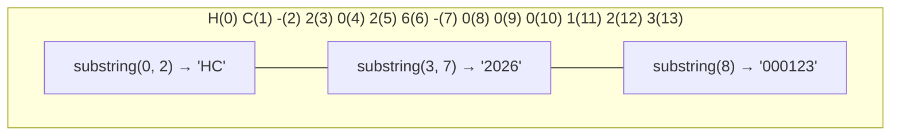

# 💡 Ejemplo 07 — Subcadenas

## 🌍 Contexto

`substring` extrae una parte de una cadena. Tiene dos formas:

- `cadena.substring(inicio)`: desde el índice `inicio` hasta el final.
- `cadena.substring(inicio, fin)`: desde `inicio` hasta `fin`, **sin incluir** el carácter de la
  posición `fin`.

`indexOf(texto)` devuelve la posición de la primera aparición de `texto`, o `-1` si no lo encuentra.
Combinar los dos permite descomponer un código con formato fijo, o encontrar dónde corta una cadena.

**Qué busca demostrar este ejemplo**: cómo extraer partes de un texto con `substring` e `indexOf`, por
qué el segundo índice de `substring` no se incluye, y qué pasa cuando `indexOf` no encuentra lo que
buscas y su resultado (`-1`) se usa sin comprobarlo.

## 🏥 Caso de estudio

Cada historia clínica de **MediSalud** tiene el formato `HC-AAAA-NNNNNN` (prefijo, año, número). Vas a
descomponerla en sus tres partes, y a obtener las iniciales del nombre completo de un paciente.

## 🌳 Árbol de archivos (como se vería en VS Code)

Agrega la clase `PartesDeLaHistoriaClinica.java` al paquete `com.medisalud`:

```text
Modulo04CadenasConversiones
└── src
    └── com
        ├── biblioteca
        │   ├── ConteoDeLetras.java
        │   └── LongitudDelTitulo.java
        └── medisalud
            ├── CodigoDeCita.java
            ├── CreacionDeCadenas.java
            └── PartesDeLaHistoriaClinica.java   ← nuevo en este ejemplo
```

## 💻 Archivo: PartesDeLaHistoriaClinica.java

```java
package com.medisalud;

public class PartesDeLaHistoriaClinica {

    public static void main(String[] args) {
        // Datos de entrada
        String historiaClinica = "HC-2026-000123";
        String nombreCompletoPaciente = "Ana Torres";

        // Subcadenas: partes de la historia clínica
        String prefijo = historiaClinica.substring(0, 2);
        String anio = historiaClinica.substring(3, 7);
        String numero = historiaClinica.substring(8);
        System.out.println("Prefijo: " + prefijo + " | Año: " + anio + " | Número: " + numero);

        // indexOf + substring: iniciales del nombre
        int espacio = nombreCompletoPaciente.indexOf(" ");
        String nombre = nombreCompletoPaciente.substring(0, espacio);
        String apellido = nombreCompletoPaciente.substring(espacio + 1);
        String iniciales = "" + nombre.charAt(0) + apellido.charAt(0);
        System.out.println("Nombre: " + nombre + " | Apellido: " + apellido + " | Iniciales: " + iniciales);
    }
}
```

## 🗺️ Diagrama

Los índices de `"HC-2026-000123"` y dónde corta cada `substring` (el segundo índice queda **excluido**):



## 🧭 Explicación paso a paso

1. `substring(0, 2)` toma los índices 0 y 1 (`"HC"`); el índice 2 (el guion) queda fuera.
2. `substring(3, 7)` toma del índice 3 al 6 (`"2026"`); el índice 7 (el segundo guion) queda fuera.
3. `substring(8)` toma desde el índice 8 **hasta el final**: `"000123"`.
4. `indexOf(" ")` encuentra la posición del espacio en `"Ana Torres"` (posición 3).
5. `substring(0, espacio)` da el nombre; `substring(espacio + 1)` da el apellido (se salta el espacio).
6. `nombre.charAt(0)` y `apellido.charAt(0)` dan las iniciales: `"AT"`.

## ✅ Resultado esperado

```text
Prefijo: HC | Año: 2026 | Número: 000123
Nombre: Ana | Apellido: Torres | Iniciales: AT
```

## 🧪 Casos de prueba

Con el número de la historia clínica en puros ceros:

| Prefijo | Año | Número |
|---|---|---|
| HC | `2026` | `000000` |

## 🔍 Análisis: errores frecuentes

**Error 1 — `substring` fuera de rango (falla en ejecución).**

> ⚠️ **Este programa se detiene con un error.** Es intencional: sirve para mostrar el mensaje real.

```java falla-en-ejecucion
package com.medisalud;

public class PartesDeLaHistoriaClinica {

    public static void main(String[] args) {
        String historiaClinica = "HC-2026-000123";
        System.out.println(historiaClinica.substring(3, 30));
    }
}
```

```text
Exception in thread "main" java.lang.StringIndexOutOfBoundsException: Range [3, 30) out of bounds for length 14
```

`historiaClinica` tiene 14 caracteres, pero se pidió hasta la posición 30. El panel Problems no marca
ningún problema, porque los índices son variables, no valores fijos que el compilador pueda revisar.

**Error 2 — Usar `indexOf` sin comprobar que encontró algo (falla en ejecución).**

> ⚠️ **Este programa se detiene con un error.** Es intencional: sirve para mostrar el mensaje real.

```java falla-en-ejecucion
package com.medisalud;

public class PartesDeLaHistoriaClinica {

    public static void main(String[] args) {
        String nombreCompletoPaciente = "Cristina";
        int espacio = nombreCompletoPaciente.indexOf(" ");
        String nombre = nombreCompletoPaciente.substring(0, espacio);
        System.out.println("Nombre: " + nombre);
    }
}
```

```text
Exception in thread "main" java.lang.StringIndexOutOfBoundsException: Range [0, -1) out of bounds for length 8
```

Con un nombre de una sola palabra, `indexOf(" ")` da `-1` (no hay espacio). Usar ese `-1` directamente
en `substring(0, -1)` produce un rango inválido y detiene el programa. El panel Problems no marca
ningún problema. La defensa es comprobar que `indexOf` no haya devuelto `-1` antes de usarlo.

## ❓ Preguntas de repaso

**1. [Selección]** Con `"CIT-2026-0042".substring(4, 8)`. **Pregunta:** ¿qué devuelve?

- **A.** `2026-`
- **B.** `2026`
- **C.** `026-`
- **D.** `026`

<details>
<summary>🔑 Ver respuesta</summary>

**Respuesta correcta: B.** El índice 4 es la primera cifra del año y el índice 8 (el guion) queda
excluido: toma del 4 al 7.

</details>

**2. [Selección múltiple]** **Pregunta:** ¿cuáles afirmaciones sobre `substring` e `indexOf` son
verdaderas?

- **A.** `substring(inicio, fin)` incluye el carácter de la posición `fin`.
- **B.** `substring(inicio)` llega hasta el final de la cadena.
- **C.** `indexOf` devuelve `-1` cuando no encuentra el texto buscado.
- **D.** Usar el `-1` de `indexOf` sin comprobarlo puede detener el programa.

<details>
<summary>🔑 Ver respuesta</summary>

**Respuestas correctas: B, C y D.** A es falsa: el segundo índice de `substring` queda excluido.

</details>

**3. [Abierta]** ¿Por qué hay que comprobar el resultado de `indexOf` antes de usarlo en un
`substring`?

<details>
<summary>🔑 Ver respuesta modelo</summary>

Porque si el texto buscado no está, `indexOf` devuelve `-1`, y usar ese `-1` como índice de
`substring` produce un rango inválido (por ejemplo, `substring(0, -1)`), que detiene el programa con
una excepción. Hay que comprobar que el resultado sea distinto de `-1` antes de usarlo.

</details>
