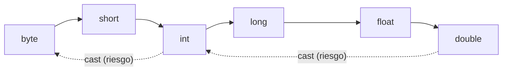

# 💡 Ejemplo 09 — Conversiones explícitas

## 🌍 Contexto

Cuando quieres ir en el sentido contrario a la escalera de tipos (de `double` a `int`, de `int` a
`byte`...), tienes que pedirlo con un **`cast`**: escribes el tipo destino entre paréntesis antes del
valor.

```text
(tipoDestino) valor
```

Esta conversión tiene riesgos, porque puede perder información:

- **Corte de decimales**: `(int) 3.9` da `3`, no `4`. No redondea, simplemente descarta la parte
  decimal.
- **Desbordamiento**: si el valor no cabe en el tipo destino, el resultado "da la vuelta" sin avisar
  (ya lo viste con `(byte) 130` en el Módulo 2, ahora como parte de las conversiones explícitas).
- **Pérdida de precisión**: un número muy grande puede no representarse exactamente al pasar a
  `double` o `float`.

**Qué busca demostrar este ejemplo**: cómo escribir un `cast`, y sus tres riesgos.

## 📚 Caso de estudio

La **Biblioteca Universitaria** calcula cuántos cupos reales caben en una sala, a partir de un cálculo
que da un número con decimales.

## 🌳 Árbol de archivos (como se vería en VS Code)

Agrega la clase `CuposDeSala.java` al paquete `com.biblioteca`:

```text
Modulo04CadenasConversiones
└── src
    └── com
        ├── biblioteca
        │   ├── ConteoDeLetras.java
        │   ├── CuposDeSala.java   ← nuevo en este ejemplo
        │   ├── LongitudDelTitulo.java
        │   └── PromedioDePrestamos.java
        └── medisalud
            └── (...)
```

## 💻 Archivo: CuposDeSala.java

```java
package com.biblioteca;

public class CuposDeSala {

    public static void main(String[] args) {
        // Datos de entrada
        double cuposCalculados = 29.8;

        int cuposReales = (int) cuposCalculados;
        System.out.println("Cupos calculados: " + cuposCalculados + " -> cupos reales: " + cuposReales);

        double cuposExactos = 29.0;
        System.out.println("Cupos exactos: " + (int) cuposExactos);

        // Desbordamiento: un valor que no cabe en el tipo destino
        int valorGrande = 130;
        byte valorEnByte = (byte) valorGrande;
        System.out.println("130 como byte: " + valorEnByte);
    }
}
```

## 🗺️ Diagrama

La escalera de tamaños de los tipos numéricos: subir (conversión implícita) nunca pierde datos; bajar
(conversión explícita, con `cast`) puede perderlos:



## 🧭 Explicación paso a paso

1. `(int) cuposCalculados` con `29.8` da `29`: descarta el `.8`, no redondea a `30`.
2. Con `29.0` (sin parte decimal) el `cast` a `int` da `29` sin ninguna sorpresa.
3. `(byte) valorGrande` con `130`: como `byte` solo llega hasta `127`, el valor "da la vuelta" y queda
   en `-126`, sin ningún error ni aviso.

## ✅ Resultado esperado

```text
Cupos calculados: 29.8 -> cupos reales: 29
Cupos exactos: 29
130 como byte: -126
```

## 🧪 Casos de prueba

| Valor calculado | (int) resultado |
|---|---|
| `29.0` | `29` |
| `29.8` | `29` |
| `29.99` | `29` |

## 🔍 Análisis: errores frecuentes

**Error 1 — Esperar que el `cast` redondee (error lógico).** `(int) 29.8` da `29`, no `30`: quien
espere un redondeo se lleva una sorpresa. El panel Problems no marca ningún problema, porque el `cast`
es exactamente lo que se pidió.

**Error 2 — Desbordamiento silencioso (error lógico).** `(byte) 130` da `-126`. El panel Problems no
marca ningún problema: el `cast` es válido en Java, aunque el resultado no sea el esperado si no se
conoce el rango del tipo destino.

## ❓ Preguntas de repaso

**1. [Selección]** **Pregunta:** ¿cuánto vale `(int) 7.9`?

- **A.** `8`
- **B.** `7`
- **C.** `0`
- **D.** Da un error de compilación.

<details>
<summary>🔑 Ver respuesta</summary>

**Respuesta correcta: B.** El `cast` a `int` corta la parte decimal; no redondea.

</details>

**2. [Selección múltiple]** **Pregunta:** ¿cuáles afirmaciones sobre las conversiones explícitas son
verdaderas?

- **A.** Se escriben como `(tipoDestino) valor`.
- **B.** Pueden perder información.
- **C.** Java las hace automáticamente cuando hace falta.
- **D.** Un valor que no cabe en el tipo destino puede desbordarse sin error.

<details>
<summary>🔑 Ver respuesta</summary>

**Respuestas correctas: A, B y D.** C es falsa: las explícitas siempre las pide el programador con un
`cast`; las que Java hace solo son las implícitas.

</details>

**3. [Abierta]** ¿Por qué `(int) 130` (guardado antes en un `byte`) da un resultado negativo?

<details>
<summary>🔑 Ver respuesta modelo</summary>

Porque `byte` solo puede representar valores de -128 a 127. El valor 130 no cabe, así que al forzar la
conversión con `cast`, el valor "da la vuelta" dentro de ese rango (desbordamiento) y termina siendo
negativo (-126), sin que Java muestre ningún error o aviso.

</details>
