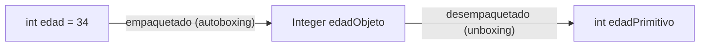

# 💡 Ejemplo 10 — Clases Wrappers

## 🌍 Contexto

Cada tipo primitivo tiene una **clase envolvente** (wrapper) que lo representa como objeto:

| Primitivo | Envolvente |
|---|---|
| `int` | `Integer` |
| `double` | `Double` |
| `boolean` | `Boolean` |
| `char` | `Character` |
| `long` | `Long` |

Java convierte entre un primitivo y su envolvente **automáticamente**: guardar un `int` en un
`Integer` se llama **empaquetado** (autoboxing); sacar el valor de vuelta se llama **desempaquetado**
(unboxing). Las envolventes también traen métodos útiles:

- `Integer.parseInt(texto)` y `Double.parseDouble(texto)`: convierten texto a número. Si el texto no es
  un número válido, el programa se detiene.
- `Character.isDigit(caracter)`: dice si un carácter es un dígito, útil para **validar antes de
  convertir**.

**Qué busca demostrar este ejemplo**: cómo pasar de texto a número (y de vuelta) de forma segura, y
por qué comparar dos envolventes con `==` no siempre funciona como con los primitivos.

## 🏥 Caso de estudio

**MediSalud** recibe el importe de una consulta como texto (por ejemplo, desde un dato externo) y
necesita convertirlo a número para aplicar un descuento.

## 🌳 Árbol de archivos (como se vería en VS Code)

Agrega la clase `ImporteComoTexto.java` al paquete `com.medisalud`:

```text
Modulo04CadenasConversiones
└── src
    └── com
        ├── biblioteca
        │   └── (...)
        └── medisalud
            ├── ImporteComoTexto.java   ← nuevo en este ejemplo
            └── (...)
```

## 💻 Archivo: ImporteComoTexto.java

```java
package com.medisalud;

public class ImporteComoTexto {

    public static void main(String[] args) {
        // Datos de entrada
        String importeTexto = "85000";
        double porcentajeDescuento = 0.10;

        // Empaquetado y desempaquetado automáticos
        int edad = 34;
        Integer edadObjeto = edad;
        int edadPrimitivo = edadObjeto;
        System.out.println("Edad como objeto: " + edadObjeto + " | como primitivo: " + edadPrimitivo);

        // Validar antes de convertir
        boolean esValido = !importeTexto.isEmpty();
        for (int i = 0; i < importeTexto.length() && esValido; i++) {
            if (!Character.isDigit(importeTexto.charAt(i))) {
                esValido = false;
            }
        }

        if (esValido) {
            int importe = Integer.parseInt(importeTexto);
            double totalConDescuento = importe - (importe * porcentajeDescuento);
            System.out.println("Importe: " + importe + " | Total con descuento: " + totalConDescuento);
            System.out.println("Total como texto: " + String.valueOf(totalConDescuento));
        } else {
            System.out.println("El importe '" + importeTexto + "' no es válido");
        }
    }
}
```

## 🗺️ Diagrama

Empaquetado y desempaquetado automáticos entre `int` e `Integer`:



## 🧭 Explicación paso a paso

1. `Integer edadObjeto = edad;` empaqueta el `int` en un objeto `Integer`, sin código extra.
2. `int edadPrimitivo = edadObjeto;` lo desempaqueta de vuelta a `int`.
3. El bucle recorre `importeTexto` carácter por carácter con `Character.isDigit`, para saber si **todos**
   sus caracteres son dígitos antes de intentar convertir.
4. Solo si `esValido` es `true` se llama a `Integer.parseInt(importeTexto)`. Así se evita el error que
   verás más abajo.
5. `String.valueOf(totalConDescuento)` convierte el resultado de vuelta a texto.

## ✅ Resultado esperado

```text
Edad como objeto: 34 | como primitivo: 34
Importe: 85000 | Total con descuento: 76500.0
Total como texto: 76500.0
```

## 🧪 Casos de prueba

| Texto | ¿Es válido? |
|---|---|
| [] | `false` |
| [85000] | `true` |
| [85000 pesos] | `false` |

## 🔍 Análisis: errores frecuentes

**Error 1 — Convertir texto no numérico sin validar (falla en ejecución).**

> ⚠️ **Este programa se detiene con un error.** Es intencional: sirve para mostrar el mensaje real.

```java falla-en-ejecucion
package com.medisalud;

public class ImporteComoTexto {

    public static void main(String[] args) {
        String importeTexto = "85000 pesos";
        int importe = Integer.parseInt(importeTexto);
        System.out.println("Importe: " + importe);
    }
}
```

```text
Exception in thread "main" java.lang.NumberFormatException: For input string: "85000 pesos"
```

El panel Problems no marca ningún problema: el texto es una variable, no un valor fijo que el
compilador pueda revisar. La defensa es validar cada carácter con `Character.isDigit` antes de llamar
a `Integer.parseInt`, como hace el ejemplo principal.

**Error 2 — Comparar dos `Integer` con `==` (error lógico).**

```java error-logico
package com.medisalud;

public class ImporteComoTexto {

    public static void main(String[] args) {
        Integer descuentoA = 200;
        Integer descuentoB = 200;
        System.out.println("¿Son el mismo objeto? " + (descuentoA == descuentoB));
        System.out.println("¿Tienen el mismo valor? " + descuentoA.equals(descuentoB));
    }
}
```

```text
¿Son el mismo objeto? false
¿Tienen el mismo valor? true
```

Java reutiliza los objetos `Integer` para los valores de -128 a 127 (por eso `100 == 100` da `true`),
pero **no** para valores más grandes: dos `Integer` de `200` son objetos distintos, así que `==` da
`false`. El panel Problems no marca ningún problema. Igual que con `String`, las envolventes se
comparan con `.equals(...)`, nunca con `==`.

## ❓ Preguntas de repaso

**1. [Selección]** **Pregunta:** ¿qué hace `Integer.parseInt("85000 pesos")`?

- **A.** Devuelve `85000` e ignora el resto.
- **B.** Devuelve `0`.
- **C.** Detiene el programa con una excepción.
- **D.** Da un error de compilación.

<details>
<summary>🔑 Ver respuesta</summary>

**Respuesta correcta: C.** El texto no es un número válido: Java lanza `NumberFormatException` en
tiempo de ejecución.

</details>

**2. [Selección múltiple]** **Pregunta:** ¿cuáles afirmaciones sobre las clases envolventes son
verdaderas?

- **A.** `Integer` es la envolvente de `int`.
- **B.** El empaquetado y el desempaquetado ocurren automáticamente.
- **C.** Dos `Integer` de 300 siempre son el mismo objeto con `==`.
- **D.** Las envolventes se comparan con `.equals(...)`, igual que `String`.

<details>
<summary>🔑 Ver respuesta</summary>

**Respuestas correctas: A, B y D.** C es falsa: fuera del rango -128 a 127, dos `Integer` de igual
valor pueden ser objetos distintos.

</details>

**3. [Abierta]** ¿Por qué conviene usar `Character.isDigit` antes de llamar a `Integer.parseInt` sobre
un dato que "llega de afuera"?

<details>
<summary>🔑 Ver respuesta modelo</summary>

Porque si el texto no representa un número válido, `Integer.parseInt` detiene el programa con una
excepción, y el panel Problems no puede avisar de eso porque el contenido del texto no se conoce hasta
que el programa se ejecuta. Validar cada carácter antes evita ese error y permite responder con un
mensaje en vez de que el programa se detenga.

</details>
