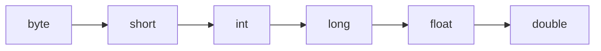
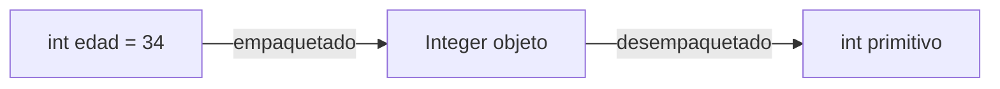

# 📘 Módulo 4 — Cadenas y Conversiones

Curso de Java

---

## 🎯 Objetivos del módulo

- Crear, unir, medir y recortar cadenas.
- Comparar y transformar texto correctamente.
- Distinguir conversiones implícitas de explícitas.
- Convertir entre texto y números con las clases envolventes.
- Explicar la inmutabilidad y usar `StringBuilder`.

---

## 🗺️ Ruta de la sesión

1. Cadenas: creación, concatenación, longitud, extracción, comparación, conversión, subcadenas
2. Conversiones: implícitas y explícitas
3. Clases Wrappers
4. Mutabilidad

---

## 🧠 Objetos y referencias (lo mínimo)

- Un objeto vive en la memoria.
- Una variable de `String` guarda una **referencia**, no el texto en sí.
- `==` compara referencias; `.equals()` compara contenido.

---

## 🧠 El "pool" de cadenas

```mermaid
flowchart LR
    subgraph Pool["Pool de cadenas"]
        obj["\"Java\""]
    end
    a["a"] --> obj
    b["b (otro literal \"Java\")"] --> obj
    c["c = new String(\"Java\")"] --> obj2["\"Java\" (objeto aparte)"]
```

`a == b` es `true`; `a == c` es `false`.

---

## 🧠 Cuatro formas de tener una cadena

| Forma | Ejemplo |
|---|---|
| Literal | `"texto"` |
| `new String(...)` | `new String("texto")` |
| Vacía | `""` |
| Nula | `null` |

---

## 🧠 Concatenar: tres formas

```java
texto1 + texto2
texto += " más"
texto1.concat(texto2)
```

---

## 🧠 El orden de `+` importa

| Expresión | Resultado |
|---|---|
| `"Cita " + 1 + 2` | `Cita 12` |
| `1 + 2 + " citas"` | `3 citas` |

---

## 🧠 Longitud y recorrido

```java
for (int i = 0; i < texto.length(); i++) {
    char c = texto.charAt(i);
}
```

`length() - 1` es siempre el último índice válido.

---

## 🧠 Índices de una cadena

`"Ana"` tiene 3 caracteres, en los índices 0 a 2:

| Índice | 0 | 1 | 2 |
|---|---|---|---|
| Carácter | A | n | a |

Pedir el índice 3 (o más) detiene el programa.

---

## 🧠 Extraer un carácter

```java
cadena.charAt(0)                  // primero
cadena.charAt(cadena.length()-1)  // último
```

---

## 🧠 ¿Cómo comparo?

| Método | Para qué |
|---|---|
| `equals` | igualdad exacta |
| `equalsIgnoreCase` | ignora mayúsculas |
| `compareTo` | orden (solo el signo) |
| `contains` / `startsWith` / `endsWith` | búsqueda |

---

## 🧠 `==` nunca compara contenido

```java
String a = "Plan";
String b = new String("Plan");
a == b        // false
a.equals(b)   // true
```

---

## 🧠 Transformar una cadena

```java
texto.trim()
texto.toUpperCase()
texto.toLowerCase()
texto.replace(viejo, nuevo)
```

Todos devuelven una cadena **nueva**.

---

## 🧠 Ignorar el valor devuelto (error típico)

```java
nombre.toUpperCase();   // no cambia nombre
nombre = nombre.toUpperCase();  // sí
```

---

## 🧠 Subcadenas

```java
cadena.substring(inicio)
cadena.substring(inicio, fin)  // fin EXCLUIDO
```

---

## 🗺️ Índices de un código

```text
"HC-2026-000123"
substring(0,2) → "HC"
substring(3,7) → "2026"
substring(8)   → "000123"
```

---

## 🧠 `indexOf` y el -1

```java
int pos = texto.indexOf(" ");
if (pos == -1) { /* no se encontró */ }
```

Usar el `-1` sin comprobar puede detener el programa.

---

## 🧠 Conversiones implícitas



Java las hace solo, sin pedirlas: siempre "hacia arriba".

---

## 🧠 Mezclar int y double

```java
int a = 5; double b = 2.0;
a / b   // double: 2.5
```

---

## 🧠 Conversiones explícitas (cast)

```java
(tipoDestino) valor
```

Van "hacia abajo": pueden perder información.

---

## 🧠 Tres riesgos del cast

| Riesgo | Ejemplo |
|---|---|
| Corte de decimales | `(int) 3.9` → `3` |
| Desbordamiento | `(byte) 130` → `-126` |
| Pérdida de precisión | un `long` muy grande a `double` |

---

## 🧠 Clases Wrappers

| Primitivo | Envolvente |
|---|---|
| `int` | `Integer` |
| `double` | `Double` |
| `boolean` | `Boolean` |
| `char` | `Character` |

---

## 🧠 Empaquetado y desempaquetado



---

## 🧠 Integer y ==

```java
Integer x = 100, y = 100;  // ==  true (caché)
Integer m = 300, n = 300;  // ==  false
```

Con envolventes también se compara con `.equals()`.

---

## 🧠 Texto a número, con validación

```java
if (Character.isDigit(c)) { ... }
int valor = Integer.parseInt(texto);
```

Sin validar, un texto no numérico detiene el programa.

---

## 🧠 Mutabilidad: String

```java
"hola".toUpperCase();  // no cambia "hola"
```

`String` es **inmutable**.

---

## 🧠 Mutabilidad: StringBuilder

```java
StringBuilder sb = new StringBuilder();
sb.append("Hola").append(" mundo");
```

`StringBuilder` es **mutable**: el mismo objeto cambia.

---

## 🧠 Cuándo usar StringBuilder

- Texto que se arma por partes.
- Dentro de un bucle que se repite muchas veces.
- `String` alcanza para el resto.

---

## 🧠 equals en StringBuilder

```java
StringBuilder a = new StringBuilder("Java");
StringBuilder b = new StringBuilder("Java");
a.equals(b)              // false
a.toString().equals(b.toString())  // true
```

---

## 🧠 Errores frecuentes

| Error | Tipo |
|---|---|
| Índice fuera de rango | Falla en ejecución |
| Texto no numérico a número | Falla en ejecución |
| `==` con texto o envolventes | Lógico |
| Ignorar el valor devuelto | Lógico |
| Tipo incompatible | Compilación |

---

## 🛠️ Actividad práctica: el taller

**Ficha de registro completa** (MediSalud)

- Normalizar nombre
- Obtener iniciales
- Armar código de cita
- Validar y convertir importe
- Construir con StringBuilder

---

## 🧭 Un vistazo completo

Cadenas → Conversiones → Wrappers → Mutabilidad: cuatro piezas que se usan juntas en casi todo
programa que procese datos de negocio como texto.

---

## 📌 Resumen

- Las cadenas son inmutables; `StringBuilder` es mutable.
- `equals` compara contenido; `==` compara objetos.
- Las conversiones implícitas no pierden datos; las explícitas sí pueden.
- Validar antes de convertir texto a número evita que el programa se detenga.

---

## 📝 Evaluación

Quiz de 15 preguntas (formato entrevista técnica) y los ejercicios del módulo.
