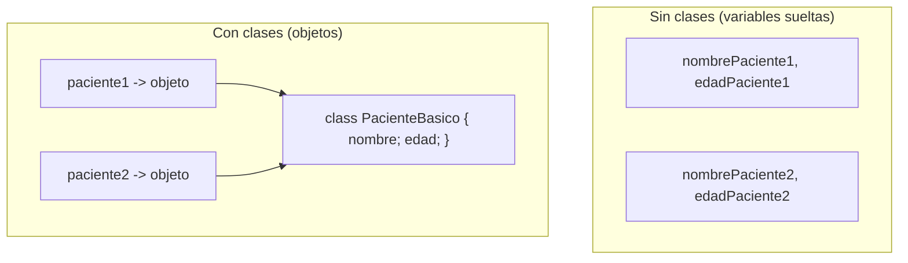

# 💡 Ejemplo 01 — Qué es y por qué la programación orientada a objetos

## 🌍 Contexto

Hasta el Módulo 4 escribiste todo dentro de `main`, con variables sueltas. Eso funciona bien mientras
el programa maneja un solo paciente o un solo libro. Pero apenas necesitas manejar **dos**, el código se
repite: una variable para cada dato de cada paciente, y el mismo bloque de instrucciones copiado para
el segundo. La **programación orientada a objetos (POO)** propone otra forma de organizar el programa:
en vez de variables sueltas, se define una **clase** (un diseño con los datos y el comportamiento de un
concepto) y se crean **objetos** (instancias concretas de esa clase) cada vez que se necesita uno nuevo.

**Por qué conviene**: agrupar los datos de un mismo concepto (un paciente, un libro) en una sola unidad
evita la duplicación, hace que agregar un tercer paciente sea crear un tercer objeto (no declarar cuatro
variables más) y acerca el código a como se piensa el negocio en la vida real.

**Qué busca demostrar este ejemplo**: dos programas que hacen exactamente lo mismo (mostrar los datos de
dos pacientes), uno sin clases y otro con una clase mínima, para comparar la organización del código, no
el resultado (que es idéntico).

## 🏥 Caso de estudio

**MediSalud** necesita mostrar el nombre y la edad de dos pacientes. `SinClases` lo hace con variables
sueltas, repitiendo la misma idea dos veces. `ConClases` agrupa cada paciente en un objeto de una clase
mínima, `PacienteBasico`.

## 🌳 Árbol de archivos (como se vería en VS Code)

Crea un proyecto llamado `Modulo05ObjetosYClases` (**Java: Create Java Project... → No build tools**) y
ve agregando en él una clase por cada ejemplo. En este ejemplo agregas tres archivos dentro de
`src/com/medisalud`:

```text
Modulo05ObjetosYClases
└── src
    └── com
        └── medisalud
            ├── SinClases.java        ← nuevo en este ejemplo
            ├── PacienteBasico.java   ← nuevo en este ejemplo
            └── ConClases.java        ← nuevo en este ejemplo
```

## 💻 Archivo: SinClases.java

```java
package com.medisalud;

public class SinClases {

    public static void main(String[] args) {
        // Datos de entrada
        String nombrePaciente1 = "Ana Torres";
        int edadPaciente1 = 34;
        String nombrePaciente2 = "Luis Gomez";
        int edadPaciente2 = 28;

        System.out.println("Paciente: " + nombrePaciente1 + ", edad: " + edadPaciente1);
        System.out.println("Paciente: " + nombrePaciente2 + ", edad: " + edadPaciente2);
    }
}
```

## 💻 Archivo: PacienteBasico.java

```java
package com.medisalud;

public class PacienteBasico {
    public String nombre;
    public int edad;
}
```

## 💻 Archivo: ConClases.java

```java
package com.medisalud;

public class ConClases {

    public static void main(String[] args) {
        // Datos de entrada
        PacienteBasico paciente1 = new PacienteBasico();
        paciente1.nombre = "Ana Torres";
        paciente1.edad = 34;

        PacienteBasico paciente2 = new PacienteBasico();
        paciente2.nombre = "Luis Gomez";
        paciente2.edad = 28;

        System.out.println("Paciente: " + paciente1.nombre + ", edad: " + paciente1.edad);
        System.out.println("Paciente: " + paciente2.nombre + ", edad: " + paciente2.edad);
    }
}
```

## 🗺️ Diagrama



## 🧭 Explicación paso a paso

1. `SinClases` declara cuatro variables (dos por paciente) y repite casi la misma línea de impresión
   dos veces.
2. `PacienteBasico` declara una clase con dos atributos públicos, `nombre` y `edad`: es el **diseño**
   común a cualquier paciente básico.
3. `ConClases` crea dos **objetos** con `new PacienteBasico()` y asigna sus atributos por punto
   (`paciente1.nombre = "Ana Torres";`): cada objeto es una **instancia** distinta de la misma clase.
4. Las dos versiones imprimen exactamente lo mismo: la POO no cambia el resultado, cambia cómo se
   organiza el código para llegar a él.
5. Agregar un tercer paciente en `SinClases` exige declarar dos variables más y repetir el bloque de
   impresión; en `ConClases` exige solo crear un tercer objeto.

## ✅ Resultado esperado

`SinClases`:

```text
Paciente: Ana Torres, edad: 34
Paciente: Luis Gomez, edad: 28
```

`ConClases` (idéntico, con otra organización del código):

```text
Paciente: Ana Torres, edad: 34
Paciente: Luis Gomez, edad: 28
```

## 🧪 Casos de prueba

| Para agregar un tercer paciente... | `SinClases` | `ConClases` |
|---|---|---|
| Líneas nuevas de datos | 2 variables más | 1 objeto más |
| Líneas nuevas de impresión | 1 línea repetida | 1 línea repetida (misma que ya existe) |
| ¿Hay que tocar la clase `PacienteBasico`? | No aplica | No |

## 🔍 Análisis: errores frecuentes

Los errores propios de crear objetos (olvidar `new`, confundir la clase con el objeto) se demuestran
con código real más adelante, cuando el constructor entra en juego (Ejemplo 07 y Básico 01): en este
ejemplo, ambos programas compilan y terminan sin ningún error, porque todavía no hay nada que inicializar
más allá de una asignación directa.

## ❓ Preguntas de repaso

**1. [Selección]** **Pregunta:** ¿qué diferencia hay entre el resultado de `SinClases` y el de
`ConClases`?

- **A.** `ConClases` imprime más líneas.
- **B.** `SinClases` imprime más líneas.
- **C.** Los dos imprimen exactamente lo mismo.
- **D.** `ConClases` no compila.

<details>
<summary>🔑 Ver respuesta</summary>

**Respuesta correcta: C.** La POO cambia cómo se organiza el código, no lo que el programa muestra en
este caso.

</details>

**2. [Selección múltiple]** **Pregunta:** ¿cuáles afirmaciones sobre `PacienteBasico` son verdaderas?

- **A.** Es una clase: un diseño, no un paciente concreto.
- **B.** `paciente1` y `paciente2` son dos objetos distintos de esa clase.
- **C.** Cambiar `paciente1.nombre` cambia también `paciente2.nombre`.
- **D.** `PacienteBasico` se declara una sola vez, aunque se creen varios objetos.

<details>
<summary>🔑 Ver respuesta</summary>

**Respuestas correctas: A, B y D.** C es falsa: cada objeto tiene su propia copia de los atributos.

</details>

**3. [Abierta]** Explica con tus palabras una ventaja de usar una clase con objetos en vez de variables
sueltas cuando el programa maneja varios pacientes.

<details>
<summary>🔑 Ver respuesta modelo</summary>

Agrupar los datos de un paciente en una clase evita repetir las mismas variables para cada uno: agregar
un paciente nuevo es crear un objeto más, no declarar más variables ni repetir el código que las usa. El
programa también se parece más a como se piensa el negocio: "un paciente" en vez de "un conjunto de
variables sueltas que representan a un paciente".

</details>
