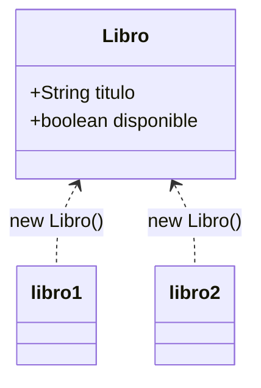

# 💡 Ejemplo 02 — Clases y objetos

## 🌍 Contexto

Una **clase** es un diseño: describe qué atributos y qué métodos tendrá cualquier cosa creada a partir
de ella, pero no es, por sí misma, ninguna cosa concreta. Un **objeto** es una instancia real de esa
clase, creada con `new`, con sus propios valores. La misma clase puede dar lugar a muchos objetos
distintos, cada uno independiente de los demás.

**Qué busca demostrar este ejemplo**: una clase mínima (`Libro`) y dos objetos creados a partir de ella,
cada uno con sus propios valores de atributos.

## 📚 Caso de estudio

**Biblioteca Universitaria** quiere representar sus libros como objetos: cada libro tiene un título y
si está disponible o no.

## 🌳 Árbol de archivos (como se vería en VS Code)

```text
Modulo05ObjetosYClases
└── src
    └── com
        └── biblioteca
            ├── Libro.java       ← nuevo en este ejemplo
            └── DemoLibro.java   ← nuevo en este ejemplo
```

## 💻 Archivo: Libro.java

```java
package com.biblioteca;

public class Libro {
    public String titulo;
    public boolean disponible;
}
```

## 💻 Archivo: DemoLibro.java

```java
package com.biblioteca;

public class DemoLibro {

    public static void main(String[] args) {
        Libro libro1 = new Libro();
        libro1.titulo = "Cien años de soledad";
        libro1.disponible = true;

        Libro libro2 = new Libro();
        libro2.titulo = "El principito";
        libro2.disponible = false;

        System.out.println(libro1.titulo + " - disponible: " + libro1.disponible);
        System.out.println(libro2.titulo + " - disponible: " + libro2.disponible);
    }
}
```

## 🗺️ Diagrama



## 🧭 Explicación paso a paso

1. `Libro` es la **clase**: declara que todo libro tendrá un `titulo` y un `disponible`, pero no fija
   ningún valor.
2. `new Libro()` crea un **objeto**: reserva memoria para un libro concreto y lo asigna a `libro1`.
3. `libro1.titulo = "..."` y `libro1.disponible = ...` asignan los atributos de **ese** objeto, con la
   notación de punto.
4. `libro2` es otro objeto de la **misma clase**, con sus propios valores, independientes de `libro1`.
5. `Libro` se declaró una sola vez; se crearon dos objetos a partir de ella.

## ✅ Resultado esperado

```text
Cien años de soledad - disponible: true
El principito - disponible: false
```

## 🧪 Casos de prueba

| Objeto | `titulo` | `disponible` |
|---|---|---|
| `libro1` | `"Cien años de soledad"` | `true` |
| `libro2` | `"El principito"` | `false` |

## 🔍 Análisis: errores frecuentes

Confundir la clase con el objeto es el error conceptual más frecuente de este punto: `Libro` no es
"un libro", es el diseño de cualquier libro. Decir "el objeto `Libro`" en vez de "un objeto de la clase
`Libro`" es una confusión de vocabulario común al empezar; no produce ningún error de compilación ni de
ejecución, pero conviene corregirla pronto porque el resto del módulo se apoya en la distinción.

## ❓ Preguntas de repaso

**1. [Selección]** **Pregunta:** ¿qué es `Libro` en este ejemplo?

- **A.** Un objeto.
- **B.** Una clase.
- **C.** Un atributo.
- **D.** Un método.

<details>
<summary>🔑 Ver respuesta</summary>

**Respuesta correcta: B.** `Libro` es la clase: el diseño común a todos los libros.

</details>

**2. [Selección múltiple]** **Pregunta:** ¿cuáles afirmaciones sobre `libro1` y `libro2` son verdaderas?

- **A.** Son dos objetos de la misma clase.
- **B.** Comparten el mismo valor de `titulo`.
- **C.** Cada uno se creó con su propio `new Libro()`.
- **D.** Son independientes: cambiar uno no afecta al otro.

<details>
<summary>🔑 Ver respuesta</summary>

**Respuestas correctas: A, C y D.** B es falsa: cada uno tiene su propio título.

</details>

**3. [Abierta]** Explica con tus palabras la diferencia entre `Libro` y `libro1` en este ejemplo.

<details>
<summary>🔑 Ver respuesta modelo</summary>

`Libro` es la clase: el diseño que dice que todo libro tiene un título y un estado de disponibilidad,
sin fijar ningún valor. `libro1` es un objeto: una instancia concreta creada con `new Libro()`, con
valores reales asignados a esos atributos.

</details>
