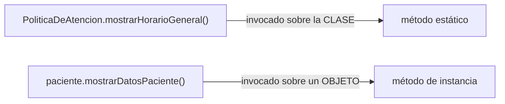

# 💡 Ejemplo 05 — Métodos estáticos

## 🌍 Contexto

Un método **estático** (`static`) pertenece a la clase, no a ningún objeto en particular: se invoca con
`Clase.metodo(...)`, sin crear ningún objeto antes. Un método **de instancia** pertenece a cada objeto:
se invoca con `objeto.metodo(...)` y puede usar los atributos de ese objeto. `main` es estático desde el
Módulo 1 precisamente por esto: Java necesita ejecutarlo sin haber creado antes ningún objeto de la
clase.

**Qué busca demostrar este ejemplo**: un método estático que no depende de ningún objeto, junto a un
método de instancia que sí, en la misma clase.

## 🏥 Caso de estudio

**MediSalud** tiene un horario general de atención (igual para todos los pacientes, no cambia según el
objeto) y también muestra los datos de cada paciente (que sí dependen del objeto).

## 🌳 Árbol de archivos (como se vería en VS Code)

```text
Modulo05ObjetosYClases
└── src
    └── com
        └── medisalud
            └── PoliticaDeAtencion.java   ← nuevo en este ejemplo
```

## 💻 Archivo: PoliticaDeAtencion.java

```java
package com.medisalud;

public class PoliticaDeAtencion {
    public String nombreCompletoPaciente;

    public static void mostrarHorarioGeneral() {
        System.out.println("Horario: 8am a 6pm, de lunes a sábado");
    }

    public void mostrarDatosPaciente() {
        System.out.println("Paciente: " + nombreCompletoPaciente);
    }

    public static void main(String[] args) {
        PoliticaDeAtencion.mostrarHorarioGeneral();

        PoliticaDeAtencion paciente = new PoliticaDeAtencion();
        paciente.nombreCompletoPaciente = "Ana Torres";
        paciente.mostrarDatosPaciente();
    }
}
```

## 🗺️ Diagrama



## 🧭 Explicación paso a paso

1. `mostrarHorarioGeneral()` es `static`: no usa ningún atributo del objeto, es igual para todos los
   pacientes. Se invoca como `PoliticaDeAtencion.mostrarHorarioGeneral()`, sin crear ningún objeto.
2. `mostrarDatosPaciente()` no es estático: usa el atributo `nombreCompletoPaciente` del objeto que lo
   invoca. Se invoca como `paciente.mostrarDatosPaciente()`, sobre un objeto ya creado.
3. `main` es estático por la misma razón: Java lo ejecuta sin haber creado antes ningún objeto de la
   clase que lo contiene.

## ✅ Resultado esperado

```text
Horario: 8am a 6pm, de lunes a sábado
Paciente: Ana Torres
```

## 🧪 Casos de prueba

| Invocación | Válida | Forma correcta |
|---|---|---|
| `PoliticaDeAtencion.mostrarHorarioGeneral();` | Sí | Método estático sobre la clase |
| `paciente.mostrarDatosPaciente();` | Sí | Método de instancia sobre un objeto |

## 🔍 Análisis: errores frecuentes

**Error — Invocar un método estático sobre un objeto en vez de sobre la clase (error lógico, mala
práctica).**

```java error-logico
package com.medisalud;

public class PoliticaDeAtencion {
    public String nombreCompletoPaciente;

    public static void mostrarHorarioGeneral() {
        System.out.println("Horario: 8am a 6pm, de lunes a sábado");
    }

    public static void main(String[] args) {
        PoliticaDeAtencion paciente = new PoliticaDeAtencion();
        paciente.mostrarHorarioGeneral();
    }
}
```

```text
Horario: 8am a 6pm, de lunes a sábado
```

El programa compila y produce **exactamente el mismo resultado** que invocarlo sobre la clase: Java lo
permite. Pero es una mala práctica, porque da a entender que `mostrarHorarioGeneral()` depende del
objeto `paciente`, cuando en realidad es igual para todos. A diferencia de otros errores lógicos de este
módulo, este sí lo marca el panel Problems, con una **advertencia** (no un error, así que el programa
compila igual):

```text
⚠ The static method mostrarHorarioGeneral() from the type PoliticaDeAtencion should be accessed in a static way Java(603979893) [Ln 12, Col 9]
```

## ❓ Preguntas de repaso

**1. [Selección]** **Pregunta:** ¿cómo se invoca correctamente un método estático llamado
`mostrarHorarioGeneral()` de la clase `PoliticaDeAtencion`?

- **A.** `paciente.mostrarHorarioGeneral();`
- **B.** `PoliticaDeAtencion.mostrarHorarioGeneral();`
- **C.** `new PoliticaDeAtencion().mostrarHorarioGeneral();`
- **D.** `mostrarHorarioGeneral(PoliticaDeAtencion);`

<details>
<summary>🔑 Ver respuesta</summary>

**Respuesta correcta: B.** Un método estático se invoca sobre la clase, sin crear ningún objeto.

</details>

**2. [Selección múltiple]** **Pregunta:** ¿cuáles afirmaciones sobre `main` y los métodos estáticos son
verdaderas?

- **A.** `main` es estático porque Java lo ejecuta sin crear antes ningún objeto.
- **B.** Un método estático puede usar libremente los atributos de cualquier objeto de la clase.
- **C.** Invocar un método estático sobre un objeto compila, aunque sea mala práctica.
- **D.** Un método de instancia no puede ser invocado sobre la clase directamente.

<details>
<summary>🔑 Ver respuesta</summary>

**Respuestas correctas: A, C y D.** B es falsa: un método estático no tiene acceso directo a los
atributos de un objeto en particular.

</details>

**3. [Abierta]** ¿Por qué `main` se declara `static` desde el primer programa del curso?

<details>
<summary>🔑 Ver respuesta modelo</summary>

Porque Java necesita ejecutar `main` sin haber creado antes ningún objeto de la clase que lo contiene:
si `main` no fuera estático, Java tendría que crear un objeto primero para poder invocarlo, y no hay
ningún código anterior que lo haga.

</details>
