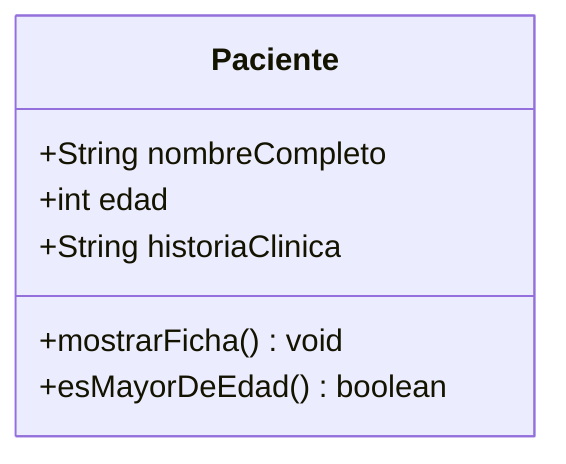

# 💡 Ejemplo 06 — Ejemplo de clase en Java

## 🌍 Contexto

Ya viste atributos (Ejemplo 02), métodos de instancia (Ejemplo 03), invocación (Ejemplo 04) y métodos
estáticos (Ejemplo 05) por separado. Este ejemplo los junta en una clase completa: `Paciente`, con tres
atributos y dos métodos de instancia. Todavía **no tiene constructor propio**: los objetos se crean con
el constructor por defecto y sus atributos se asignan por punto, uno por uno. El constructor llega en el
Ejemplo 07, sobre esta **misma clase**.

**Qué busca demostrar este ejemplo**: cómo se ve una clase completa, con varios atributos y varios
métodos trabajando juntos.

## 🏥 Caso de estudio

**MediSalud** representa a un paciente con nombre completo, edad e historia clínica, y necesita mostrar
su ficha completa y saber si es mayor de edad.

## 🌳 Árbol de archivos (como se vería en VS Code)

```text
Modulo05ObjetosYClases
└── src
    └── com
        └── medisalud
            ├── Paciente.java       ← nuevo en este ejemplo (se retoma en el Ejemplo 07)
            └── DemoPaciente.java   ← nuevo en este ejemplo
```

## 💻 Archivo: Paciente.java

```java
package com.medisalud;

public class Paciente {
    public String nombreCompleto;
    public int edad;
    public String historiaClinica;

    public void mostrarFicha() {
        System.out.println("Paciente: " + nombreCompleto);
        System.out.println("Edad: " + edad);
        System.out.println("Historia clínica: " + historiaClinica);
    }

    public boolean esMayorDeEdad() {
        return edad >= 18;
    }
}
```

## 💻 Archivo: DemoPaciente.java

```java
package com.medisalud;

public class DemoPaciente {

    public static void main(String[] args) {
        Paciente paciente = new Paciente();
        paciente.nombreCompleto = "Ana Torres";
        paciente.edad = 34;
        paciente.historiaClinica = "HC-2026-000123";

        paciente.mostrarFicha();
        System.out.println("Es mayor de edad: " + paciente.esMayorDeEdad());
    }
}
```

## 🗺️ Diagrama



## 🧭 Explicación paso a paso

1. `Paciente` declara tres atributos públicos: `nombreCompleto`, `edad` e `historiaClinica`.
2. `mostrarFicha()` es un método de instancia `void`: imprime los tres atributos del objeto.
3. `esMayorDeEdad()` es otro método de instancia, con retorno `boolean`.
4. Como la clase no declara ningún constructor, `new Paciente()` usa el que Java agrega
   automáticamente: crea el objeto con sus atributos en blanco (`null`, `0`).
5. Los tres atributos se asignan después, por punto, antes de invocar los métodos.

## ✅ Resultado esperado

```text
Paciente: Ana Torres
Edad: 34
Historia clínica: HC-2026-000123
Es mayor de edad: true
```

## 🧪 Casos de prueba

| Método | Resultado con `edad = 34` |
|---|---|
| `mostrarFicha()` | Imprime las tres líneas de la ficha |
| `esMayorDeEdad()` | `true` |

## 🔍 Análisis: errores frecuentes

Olvidar asignar un atributo antes de usarlo (por ejemplo, invocar `mostrarFicha()` sin haber asignado
`historiaClinica`) no es un error de compilación: el atributo simplemente queda con su valor por
defecto (`null` para `String`) y `mostrarFicha()` imprime `"Historia clínica: null"`, sin ningún aviso
del panel. Se demuestra con código real en el Ejemplo 07, donde el constructor evita este problema al
exigir los tres valores desde el momento en que se crea el objeto.

## ❓ Preguntas de repaso

**1. [Selección]** **Pregunta:** ¿cuántos métodos de instancia declara la clase `Paciente` de este
ejemplo?

- **A.** Uno.
- **B.** Dos.
- **C.** Tres.
- **D.** Ninguno.

<details>
<summary>🔑 Ver respuesta</summary>

**Respuesta correcta: B.** `mostrarFicha()` y `esMayorDeEdad()`.

</details>

**2. [Selección múltiple]** **Pregunta:** ¿cuáles afirmaciones sobre esta versión de `Paciente` son
verdaderas?

- **A.** Tiene tres atributos públicos.
- **B.** Declara un constructor propio.
- **C.** `new Paciente()` crea un objeto con los atributos en blanco.
- **D.** `mostrarFicha()` devuelve un `String`.

<details>
<summary>🔑 Ver respuesta</summary>

**Respuestas correctas: A y C.** B es falsa (todavía no hay constructor propio); D es falsa
(`mostrarFicha()` es `void`).

</details>

**3. [Abierta]** ¿Qué valor tiene `historiaClinica` justo después de `new Paciente()`, antes de
asignarle nada?

<details>
<summary>🔑 Ver respuesta modelo</summary>

`null`, porque `historiaClinica` es de tipo `String` y la clase no declara ningún constructor: Java usa
el que agrega automáticamente, que deja los atributos de tipo objeto en `null` y los numéricos en `0`.

</details>
