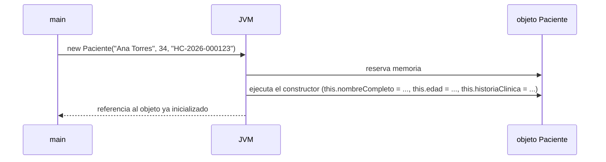

# 💡 Ejemplo 07 — Constructor y objetos

## 🌍 Contexto

`new NombreDeClase(argumentos)` reserva memoria para un objeto nuevo y ejecuta su **constructor**: un
método especial con el mismo nombre que la clase, sin tipo de retorno, que inicializa los atributos del
objeto. Cuando el nombre del parámetro coincide con el del atributo, `this.atributo = parametro;`
distingue uno del otro (`this` se refiere al objeto que se está creando). Si una clase no declara ningún
constructor, Java agrega uno automáticamente, sin parámetros, que deja los atributos en su valor por
defecto.

**Qué busca demostrar este ejemplo**: la **misma** clase `Paciente` del Ejemplo 06, ahora con un
constructor, creando varios objetos independientes entre sí.

## 🏥 Caso de estudio

**MediSalud** crea varios pacientes de una vez, cada uno con sus propios datos desde el momento en que
se crea el objeto, sin asignarlos uno por uno después.

## 🌳 Árbol de archivos (como se vería en VS Code)

```text
Modulo05ObjetosYClases
└── src
    └── com
        └── medisalud
            ├── Paciente.java         ← se retoma del Ejemplo 06, se le agrega el constructor
            ├── DemoPaciente.java     ← nuevo en este ejemplo
            └── BuscarPaciente.java   ← nuevo en este ejemplo
```

## 💻 Archivo: Paciente.java

```java
package com.medisalud;

public class Paciente {
    public String nombreCompleto;
    public int edad;
    public String historiaClinica;

    public Paciente(String nombreCompleto, int edad, String historiaClinica) {
        this.nombreCompleto = nombreCompleto;
        this.edad = edad;
        this.historiaClinica = historiaClinica;
    }

    public void mostrarFicha() {
        System.out.println("Paciente: " + nombreCompleto);
        System.out.println("Edad: " + edad);
        System.out.println("Historia clínica: " + historiaClinica);
    }

    public boolean esMayorDeEdad() {
        return edad >= 18;
    }

    public void cumplirAnios() {
        edad = edad + 1;
    }
}
```

## 💻 Archivo: DemoPaciente.java

```java
package com.medisalud;

public class DemoPaciente {

    public static void main(String[] args) {
        Paciente paciente1 = new Paciente("Ana Torres", 34, "HC-2026-000123");
        Paciente paciente2 = new Paciente("Luis Gómez", 34, "HC-2026-000456");

        paciente1.mostrarFicha();
        paciente2.mostrarFicha();

        paciente1.cumplirAnios();
        System.out.println("Edad de paciente1 después de cumplir años: " + paciente1.edad);
        System.out.println("Edad de paciente2 (no debería cambiar): " + paciente2.edad);
    }
}
```

## 💻 Archivo: BuscarPaciente.java

```java
package com.medisalud;

public class BuscarPaciente {

    static Paciente buscarPacientePorHistoria(String historiaBuscada) {
        Paciente paciente1 = new Paciente("Ana Torres", 34, "HC-2026-000123");
        if (paciente1.historiaClinica.equals(historiaBuscada)) {
            return paciente1;
        }
        return null;
    }

    public static void main(String[] args) {
        Paciente encontrado = buscarPacientePorHistoria("HC-2026-000123");
        encontrado.mostrarFicha();
    }
}
```

## 🗺️ Diagrama



## 🧭 Explicación paso a paso

1. El constructor `Paciente(nombreCompleto, edad, historiaClinica)` tiene el mismo nombre que la clase y
   ningún tipo de retorno.
2. `this.nombreCompleto = nombreCompleto;` distingue el atributo del objeto (`this.nombreCompleto`) del
   parámetro recibido (`nombreCompleto`), porque comparten nombre.
3. `new Paciente("Ana Torres", 34, "HC-2026-000123")` crea un objeto ya inicializado, sin asignar nada
   después.
4. `paciente1` y `paciente2` son objetos independientes: `paciente1.cumplirAnios()` cambia la `edad` de
   `paciente1`, pero `paciente2.edad` no cambia.
5. `BuscarPaciente` muestra que también se puede tener una clase sin constructor propio: Java le agrega
   uno automáticamente, sin parámetros.

## ✅ Resultado esperado

`DemoPaciente`:

```text
Paciente: Ana Torres
Edad: 34
Historia clínica: HC-2026-000123
Paciente: Luis Gómez
Edad: 34
Historia clínica: HC-2026-000456
Edad de paciente1 después de cumplir años: 35
Edad de paciente2 (no debería cambiar): 34
```

`BuscarPaciente`:

```text
Paciente: Ana Torres
Edad: 34
Historia clínica: HC-2026-000123
```

## 🧪 Casos de prueba

| Objeto | `nombreCompleto` | `edad` inicial | `edad` tras `cumplirAnios()` |
|---|---|---|---|
| `paciente1` | `"Ana Torres"` | `34` | `35` |
| `paciente2` (mismos valores iniciales, no debe cambiar) | `"Luis Gómez"` | `34` | `34` |

## 🔍 Análisis: errores frecuentes

**Error — Invocar un método sobre un objeto obtenido de una búsqueda que puede devolver `null` (falla
en ejecución).**

> ⚠️ **Este programa se detiene con un error.** Es intencional: sirve para mostrar el mensaje real.

```java falla-en-ejecucion
package com.medisalud;

public class Paciente {
    public String nombreCompleto;
    public int edad;
    public String historiaClinica;

    public Paciente(String nombreCompleto, int edad, String historiaClinica) {
        this.nombreCompleto = nombreCompleto;
        this.edad = edad;
        this.historiaClinica = historiaClinica;
    }

    public void mostrarFicha() {
        System.out.println("Paciente: " + nombreCompleto);
        System.out.println("Edad: " + edad);
        System.out.println("Historia clínica: " + historiaClinica);
    }

    static Paciente buscarPacientePorHistoria(String historiaBuscada) {
        Paciente paciente1 = new Paciente("Ana Torres", 34, "HC-2026-000123");
        if (paciente1.historiaClinica.equals(historiaBuscada)) {
            return paciente1;
        }
        return null;
    }

    public static void main(String[] args) {
        Paciente noEncontrado = buscarPacientePorHistoria("HC-2026-999999");
        noEncontrado.mostrarFicha();
    }
}
```

```text
Exception in thread "main" java.lang.NullPointerException: Cannot invoke "com.medisalud.Paciente.mostrarFicha()" because "<local1>" is null
```

`buscarPacientePorHistoria(...)` devuelve `null` cuando no encuentra la historia clínica pedida. El
mensaje real de `NullPointerException` no siempre puede nombrar la variable exacta: cuando el programa
se compila sin la información de depuración completa, muestra un rótulo genérico como `"<local1>"` en
vez del nombre real (`noEncontrado`). El panel Problems no marca ningún problema aquí, porque el `null`
llega de una búsqueda (una fuente indirecta), no de una asignación obvia en la misma línea.

## ❓ Preguntas de repaso

**1. [Selección]** **Pregunta:** ¿qué hace `new Paciente("Ana Torres", 34, "HC-2026-000123")`?

- **A.** Solo reserva memoria, sin inicializar nada.
- **B.** Reserva memoria y ejecuta el constructor, que inicializa los atributos.
- **C.** Invoca un método estático de la clase `Paciente`.
- **D.** Modifica un objeto que ya existía.

<details>
<summary>🔑 Ver respuesta</summary>

**Respuesta correcta: B.** `new` reserva memoria para un objeto nuevo y ejecuta su constructor, que
inicializa sus atributos.

</details>

**2. [Selección múltiple]** **Pregunta:** ¿cuáles afirmaciones sobre `paciente1` y `paciente2` son
verdaderas?

- **A.** Son dos objetos distintos, aunque tengan el mismo tipo.
- **B.** Modificar la edad de uno cambia también la del otro.
- **C.** Cada uno mantiene su propio valor de `edad` de forma independiente.
- **D.** Se crearon con el mismo constructor, pero con argumentos distintos.

<details>
<summary>🔑 Ver respuesta</summary>

**Respuestas correctas: A, C y D.** B es falsa: cada objeto tiene su propia copia de los atributos.

</details>

**3. [Abierta]** ¿Qué hace `this` dentro del constructor de `Paciente`, y por qué hace falta cuando el
parámetro se llama igual que el atributo?

<details>
<summary>🔑 Ver respuesta modelo</summary>

`this` se refiere al objeto que se está creando. Cuando el parámetro del constructor tiene el mismo
nombre que el atributo (por ejemplo, `edad`), escribir solo `edad = edad;` sería ambiguo; `this.edad =
edad;` deja claro que el de la izquierda es el atributo del objeto y el de la derecha es el valor
recibido como parámetro.

</details>
