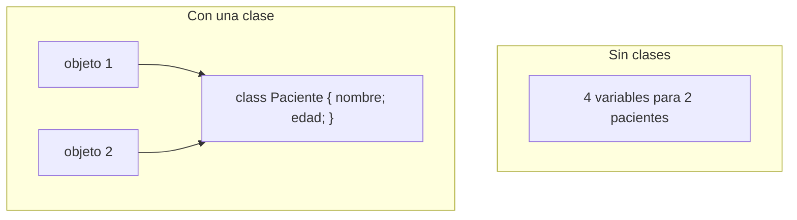
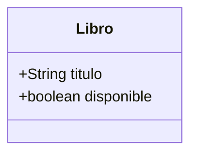
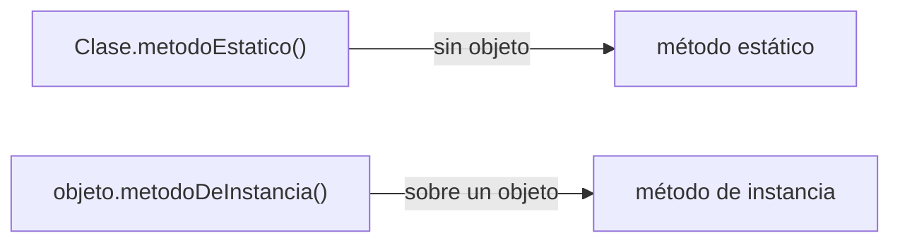
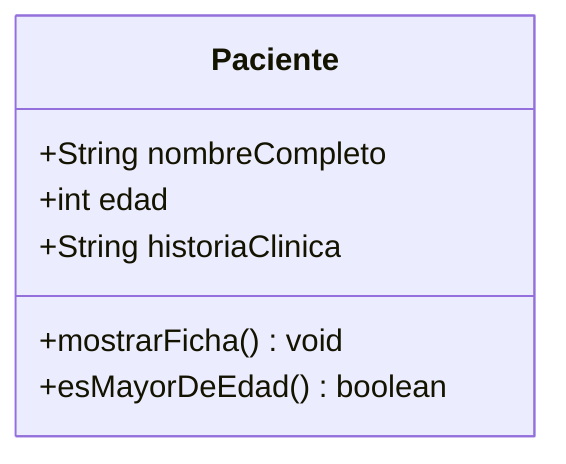
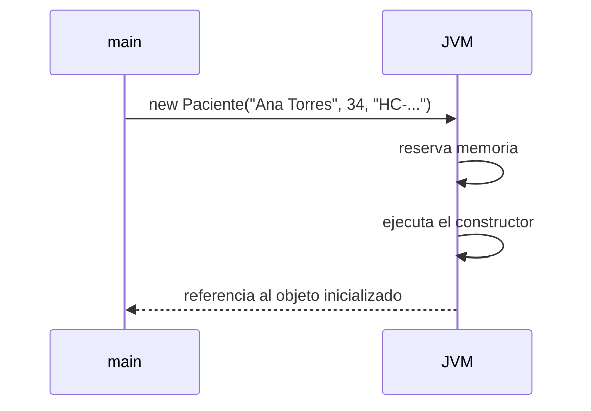

# 📘 Módulo 5 — Programación Orientada a Objetos

Curso de Java

---

## 🎯 Objetivos del módulo

- Explicar qué es y por qué conviene la programación orientada a objetos.
- Distinguir una clase de un objeto.
- Declarar una clase con atributos y métodos, e invocar sus métodos.
- Distinguir un método estático de uno de instancia.
- Crear objetos con el constructor y usar varios de forma independiente.

---

## 🗺️ Ruta de la sesión

1. ¿Qué es y por qué la programación orientada a objetos? Clases y objetos.
2. Clases en Java: atributos, métodos, invocación, estáticos, ejemplo completo.
3. Objetos en Java: creación con `new` y el constructor.

---

## 🧠 El problema: variables sueltas

```java
String nombrePaciente1 = "Ana Torres";
int edadPaciente1 = 34;
String nombrePaciente2 = "Luis Gómez";
int edadPaciente2 = 28;
```

Cada paciente nuevo exige más variables y más código repetido.

---

## 🧠 La solución: agrupar en una clase



Mismo resultado, otra organización del código.

---

## 🧠 Clase y objeto

| | Clase | Objeto |
|---|---|---|
| Qué es | El diseño | Una instancia concreta |
| Cuántos hay | Uno (`class Paciente`) | Tantos como se creen con `new` |
| Ejemplo | `Paciente` | `paciente1`, `paciente2` |

---

## 🧠 Crear un objeto

```java
Libro libro1 = new Libro();
libro1.titulo = "Cien años de soledad";
libro1.disponible = true;
```

`new` crea el objeto; la notación de punto asigna sus atributos.

---

## 🧠 Diagrama de una clase



---

## 🧠 Atributos

- Variables declaradas dentro de la clase.
- Describen una característica de cada objeto.
- En este módulo, siempre públicos (sin `private`).

---

## 🧠 Declarar un método de instancia

```java
public boolean esMayorDeEdad() {
    return edad >= 18;
}
```

Nombre, tipo de retorno (o `void`), parámetros, cuerpo.

---

## 🧠 Un método lee los atributos del objeto

```java
paciente1.esMayorDeEdad();  // usa paciente1.edad
paciente2.esMayorDeEdad();  // usa paciente2.edad
```

El mismo método, resultados distintos según el objeto.

---

## 🧠 Invocar un método

```java
objeto.metodo(argumentos)
```

Los argumentos deben coincidir en cantidad y tipo con los parámetros.

---

## 🧠 Ignorar el valor devuelto

```java
paciente.calcularCopago(80000.0, 0.20);  // se pierde
```

Compila y se ejecuta. El resultado calculado no se guarda en ningún lado.

---

## 🧠 Método estático frente a de instancia



---

## 🧠 ¿Por qué `main` es estático?

Java lo ejecuta sin haber creado antes ningún objeto de la clase que lo contiene.

---

## 🧠 Invocar un estático mal (funciona, pero...)

```java
paciente.mostrarHorarioGeneral();  // compila igual, mala práctica
```

El panel Problems **sí** marca una advertencia aquí.

---

## 🧠 Una clase completa



---

## 🧠 Sin constructor propio

```java
Paciente p = new Paciente();
p.nombreCompleto = "Ana Torres";
```

Java agrega un constructor por defecto: los atributos quedan en blanco (`null`, `0`, `false`).

---

## 🧠 Objetos en Java

`new NombreDeClase(argumentos)` reserva memoria y ejecuta el constructor.

---

## 🧠 El constructor

```java
public Paciente(String nombreCompleto, int edad, String historiaClinica) {
    this.nombreCompleto = nombreCompleto;
    this.edad = edad;
    this.historiaClinica = historiaClinica;
}
```

Mismo nombre que la clase, sin tipo de retorno.

---

## 🧠 Orden de ejecución de un `new`



---

## 🧠 `this`

Se refiere al objeto que se está creando; distingue el atributo del parámetro cuando comparten nombre.

---

## 🧠 Varios objetos, independencia

```java
Paciente p1 = new Paciente("Ana Torres", 34, "HC-001");
Paciente p2 = new Paciente("Luis Gómez", 34, "HC-002");
p1.cumplirAnios();  // solo cambia p1
```

Cada objeto tiene su propia copia de los atributos.

---

## 🧠 El constructor por defecto

Si una clase no declara ningún constructor, Java agrega uno sin parámetros.

---

## 🧠 Errores frecuentes: de compilación

| Error | Mensaje real |
|---|---|
| Método de instancia invocado como estático | `non-static method ... cannot be referenced from a static context` |
| Constructor mal nombrado | `invalid method declaration; return type required` |
| Objeto sin inicializar | `variable ... might not have been initialized` |

---

## 🧠 Errores frecuentes: en ejecución y lógicos

| Error | Tipo |
|---|---|
| Objeto `null` por fuente indirecta | Falla en ejecución |
| Estático invocado sobre un objeto | Lógico (con advertencia del panel) |
| Copiar una referencia en vez de crear un objeto | Lógico (sin advertencia) |

---

## 🧠 Copiar una referencia

```java
Paciente p2 = p1;  // p2 NO es un objeto nuevo
p2.edad = 40;       // también cambia p1.edad
```

Las dos variables apuntan al mismo objeto.

---

## 🧠 Convenciones de nombres

| Elemento | Convención | Ejemplo |
|---|---|---|
| Clase | `PascalCase` | `Paciente`, `Libro` |
| Atributo, método, parámetro | `camelCase` | `nombreCompleto`, `mostrarFicha` |
| Archivo | Igual que la clase | `Paciente.java` |

---

## 🛠️ Actividad práctica: el taller

**Ficha ampliada de un paciente** (MediSalud)

- Clase con cuatro atributos y un constructor
- Tres métodos de instancia
- Tres objetos independientes

---

## 🧭 Un vistazo completo

Clase → Objeto → Atributo → Método → Invocación → Estático → Constructor: las siete piezas que se usan
juntas en cualquier programa orientado a objetos, por simple que sea.

---

## 📌 Resumen

- Una clase es el diseño; un objeto es una instancia creada con `new`.
- Los métodos de instancia usan los atributos del objeto que los invoca; los estáticos, no.
- El constructor inicializa los atributos de cada objeto con `this`.
- Cada objeto mantiene su propio estado, independiente de los demás.

---

## 📝 Evaluación

Quiz de 12 preguntas (formato entrevista técnica) y los ejercicios del módulo.
