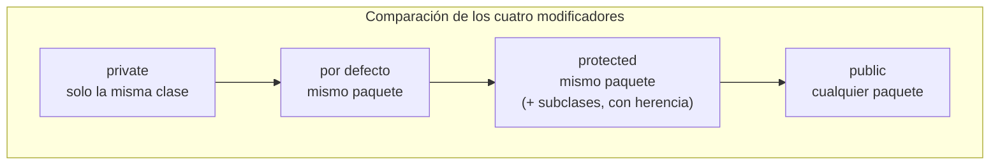

# 💡 Ejemplo 05 — Modificador de acceso public

## 🌍 Contexto

`public` es el modificador menos restrictivo: un miembro `public` es accesible desde **cualquier
clase, de cualquier paquete**. Es el único de los cuatro modificadores de este módulo cuyo atributo
público no es un error de alcance (FR-025 lo exime, porque es el propio tema de este ejemplo).

**Qué busca demostrar este ejemplo**: el mismo atributo `totalConsultas` de los Ejemplos 03 y 04, ahora
`public`, accedido sin problema desde otro paquete.

## 🏥📚 Caso de estudio

**MediSalud** lleva el mismo registro de consultas de los ejemplos anteriores. Esta vez, una clase de
**Biblioteca Universitaria** accede a él sin ningún problema.

## 🌳 Árbol de archivos (como se vería en VS Code)

```text
Modulo06Encapsulamiento
└── src
    └── com
        ├── medisalud
        │   └── RegistroMedico.java        ← nuevo en este ejemplo
        └── biblioteca
            └── AccesoRegistroMedico.java  ← nuevo en este ejemplo
```

## 💻 Archivo: RegistroMedico.java

```java
package com.medisalud;

public class RegistroMedico {
    public int totalConsultas;
}
```

## 💻 Archivo: AccesoRegistroMedico.java

```java
package com.biblioteca;
import com.medisalud.RegistroMedico;

public class AccesoRegistroMedico {
    public static void main(String[] args) {
        RegistroMedico registro = new RegistroMedico();
        registro.totalConsultas = 12;

        System.out.println("Total de consultas: " + registro.totalConsultas);
    }
}
```

## 🗺️ Diagrama



## 🧭 Explicación paso a paso

1. `totalConsultas` ahora es `public`: el modificador menos restrictivo de los cuatro.
2. `AccesoRegistroMedico`, en `com.biblioteca`, accede a `registro.totalConsultas` directamente: esta
   vez **sí compila**, a diferencia de los Ejemplos 03 y 04.
3. Con esto se completa la comparación de los cuatro modificadores: `private` (solo la clase), por
   defecto y `protected` sin herencia (el mismo paquete), `public` (cualquier paquete).

## ✅ Resultado esperado

```text
Total de consultas: 12
```

## 🧪 Casos de prueba

| Modificador | Mismo paquete | Otro paquete (sin herencia) |
|---|---|---|
| `private` | No (solo la misma clase) | No |
| Por defecto | Sí | No |
| `protected` | Sí | No |
| `public` | Sí | Sí |

## 🔍 Análisis: errores frecuentes

Declarar todo como `public` "para no tener problemas de acceso" es el error de diseño más frecuente al
empezar: vuelve a exponer el estado interno de un objeto, exactamente lo que el encapsulamiento busca
evitar (Ejemplo 01). `public` tiene su lugar (sobre todo en métodos `get`/`set`), pero un atributo
`public` renuncia a cualquier control sobre él.

## ❓ Preguntas de repaso

**1. [Selección]** **Pregunta:** ¿desde dónde se puede acceder a un miembro `public`?

- **A.** Solo desde la misma clase.
- **B.** Solo desde el mismo paquete.
- **C.** Desde cualquier clase, de cualquier paquete.
- **D.** Solo desde subclases.

<details>
<summary>🔑 Ver respuesta</summary>

**Respuesta correcta: C.** `public` es el modificador menos restrictivo: accesible desde cualquier
parte.

</details>

**2. [Selección múltiple]** **Pregunta:** ordenando los cuatro modificadores de más a menos
restrictivo, ¿cuál es el orden correcto?

- **A.** `private`, por defecto, `protected`, `public`.
- **B.** `public`, `protected`, por defecto, `private`.
- **C.** Los cuatro son igual de restrictivos.
- **D.** `protected` es más restrictivo que `private`.

<details>
<summary>🔑 Ver respuesta</summary>

**Respuesta correcta: A.** De más a menos restrictivo: `private` → por defecto → `protected` (sin
herencia, igual que por defecto) → `public`.

</details>

**3. [Abierta]** ¿Por qué declarar todos los atributos como `public` "para evitar errores de acceso" no
es una buena práctica, aunque compile sin problemas?

<details>
<summary>🔑 Ver respuesta modelo</summary>

Porque vuelve a exponer el estado interno del objeto sin ningún control, exactamente lo que el
encapsulamiento busca evitar: cualquier código podría asignarle un valor inválido, sin que ningún `set`
pueda impedirlo. `public` es útil para los métodos `get`/`set` (que sí deben ser accesibles desde
cualquier parte), pero no para los atributos que protegen.

</details>
