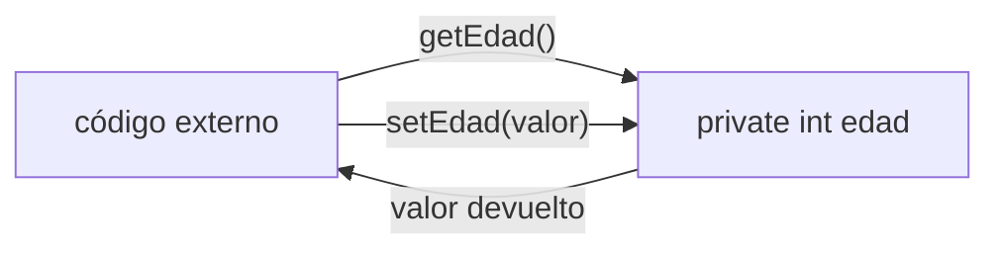

# 💡 Ejemplo 06 — Métodos get y set

## 🌍 Contexto

Un método **get** (accesor) es un método público que devuelve el valor de un atributo `private`, sin
permitir modificarlo directamente. Un método **set** (mutador) recibe un valor, lo valida y lo asigna al
atributo solo si es válido. Juntos son la forma normal de exponer un atributo `private` al resto del
programa.

**Qué busca demostrar este ejemplo**: una clase `Paciente` con atributos `private`, sus métodos `get` y
un `set` que valida, y un constructor que usa ese `set` para inicializar el atributo validado.

## 🏥 Caso de estudio

**MediSalud** representa a un paciente con nombre y edad, protegiendo la edad de valores inválidos
desde el momento en que se crea el objeto.

## 🌳 Árbol de archivos (como se vería en VS Code)

```text
Modulo06Encapsulamiento
└── src
    └── com
        └── medisalud
            ├── Paciente.java       ← nuevo en este ejemplo (se retoma en el Ejemplo 07)
            └── DemoPaciente.java   ← nuevo en este ejemplo
```

## 💻 Archivo: Paciente.java

```java
package com.medisalud;

public class Paciente {
    private String nombreCompleto;
    private int edad;

    public Paciente(String nombreCompleto, int edad) {
        this.nombreCompleto = nombreCompleto;
        setEdad(edad);
    }

    public String getNombreCompleto() {
        return nombreCompleto;
    }

    public int getEdad() {
        return edad;
    }

    public void setEdad(int edad) {
        if (edad < 0) {
            System.out.println("Edad inválida (" + edad + "): se conserva la edad actual (" + this.edad + ")");
            return;
        }
        this.edad = edad;
    }
}
```

## 💻 Archivo: DemoPaciente.java

```java
package com.medisalud;

public class DemoPaciente {

    public static void main(String[] args) {
        Paciente paciente = new Paciente("Ana Torres", -5);
        System.out.println(paciente.getNombreCompleto() + " - edad inicial: " + paciente.getEdad());

        paciente.setEdad(34);
        System.out.println("Edad tras set válido: " + paciente.getEdad());
    }
}
```

## 🗺️ Diagrama



## 🧭 Explicación paso a paso

1. `nombreCompleto` y `edad` son `private`: no se pueden asignar ni leer con la notación de punto desde
   fuera de la clase.
2. `getNombreCompleto()` y `getEdad()` son accesores: devuelven el valor del atributo, sin modificarlo.
3. `setEdad(edad)` es un mutador que valida: solo asigna si `edad >= 0`.
4. El constructor llama a `setEdad(edad)` en vez de asignar `this.edad = edad;` directamente, para que
   la validación se aplique también al crear el objeto (como en el Ejemplo 01).
5. `paciente.setEdad(34)` sobre un objeto ya creado también pasa por la misma validación.

## ✅ Resultado esperado

```text
Edad inválida (-5): se conserva la edad actual (0)
Ana Torres - edad inicial: 0
Edad tras set válido: 34
```

## 🧪 Casos de prueba

| Acción | `edad` resultante |
|---|---|
| `new Paciente("Ana Torres", -5)` | `0` (rechazada) |
| `paciente.setEdad(34)` | `34` |
| `paciente.setEdad(0)` | `0` (límite, válida) |

## 🔍 Análisis: errores frecuentes

Declarar un `set` sin ninguna validación (que asigne siempre, sin comprobar nada) no es un error de
compilación ni de ejecución: compila y funciona, pero pierde la ventaja de encapsular. Se demuestra con
código real en el Ejemplo 07, donde se compara un `set` validado con uno que no lo es.

## ❓ Preguntas de repaso

**1. [Selección]** **Pregunta:** ¿qué hace `getEdad()` en esta clase?

- **A.** Modifica el atributo `edad`.
- **B.** Devuelve el valor del atributo `edad`, sin modificarlo.
- **C.** Valida que `edad` sea positiva.
- **D.** Crea un nuevo objeto `Paciente`.

<details>
<summary>🔑 Ver respuesta</summary>

**Respuesta correcta: B.** Un método `get` (accesor) solo devuelve el valor del atributo.

</details>

**2. [Selección múltiple]** **Pregunta:** ¿cuáles afirmaciones sobre `setEdad(int edad)` son
verdaderas?

- **A.** Valida que el valor recibido no sea negativo.
- **B.** Asigna el valor sin ninguna comprobación.
- **C.** Se invoca también desde el constructor.
- **D.** Es un método público, aunque el atributo que modifica es privado.

<details>
<summary>🔑 Ver respuesta</summary>

**Respuestas correctas: A, C y D.** B es falsa: `setEdad` sí valida antes de asignar.

</details>

**3. [Abierta]** ¿Por qué `getNombreCompleto()` y `getEdad()` son `public`, si los atributos que
devuelven son `private`?

<details>
<summary>🔑 Ver respuesta modelo</summary>

Porque el objetivo del encapsulamiento no es que nadie pueda acceder al dato, sino controlar **cómo** se
accede. Los métodos `get`/`set` son la puerta pública y controlada hacia un atributo privado: cualquier
código puede leerlo o intentar modificarlo, pero siempre pasando por el método, que puede validar,
transformar o simplemente devolver el valor.

</details>
