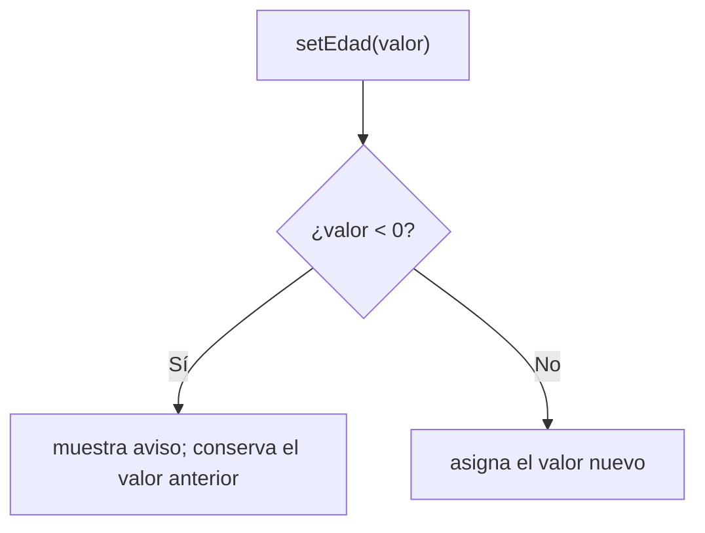

# 💡 Ejemplo 07 — Validación en el set

## 🌍 Contexto

Ya viste que un `set` puede rechazar un valor inválido (Ejemplos 01 y 06). Este ejemplo retoma la misma
clase `Paciente` para mostrarlo con más detalle, y agrega un atributo `boolean`: cuando un atributo es
`boolean`, la convención de Java nombra su `get` como `isNombre()`, no `getNombre()`.

**Qué busca demostrar este ejemplo**: la **misma** clase `Paciente` del Ejemplo 06, con un atributo
`boolean` y la convención `isNombre()`, y qué pasa exactamente cuando un `set` ya usado antes recibe un
valor inválido.

## 🏥 Caso de estudio

**MediSalud** marca si un paciente está activo en el sistema, además de su nombre y edad.

## 🌳 Árbol de archivos (como se vería en VS Code)

```text
Modulo06Encapsulamiento
└── src
    └── com
        └── medisalud
            ├── Paciente.java       ← se retoma del Ejemplo 06, se le agrega "activo"
            └── DemoPaciente.java   ← nuevo en este ejemplo
```

## 💻 Archivo: Paciente.java

```java
package com.medisalud;

public class Paciente {
    private String nombreCompleto;
    private int edad;
    private boolean activo;

    public Paciente(String nombreCompleto, int edad) {
        this.nombreCompleto = nombreCompleto;
        setEdad(edad);
        this.activo = true;
    }

    public String getNombreCompleto() {
        return nombreCompleto;
    }

    public int getEdad() {
        return edad;
    }

    public void setEdad(int edad) {
        if (edad < 0) {
            System.out.println("Edad inválida (" + edad + "): se conserva la edad actual (" + this.edad + ")");
            return;
        }
        this.edad = edad;
    }

    public boolean isActivo() {
        return activo;
    }

    public void setActivo(boolean activo) {
        this.activo = activo;
    }
}
```

## 💻 Archivo: DemoPaciente.java

```java
package com.medisalud;

public class DemoPaciente {

    public static void main(String[] args) {
        Paciente paciente = new Paciente("Ana Torres", 34);
        System.out.println(paciente.getNombreCompleto() + " - activo: " + paciente.isActivo());

        paciente.setActivo(false);
        System.out.println("Activo tras setActivo(false): " + paciente.isActivo());
    }
}
```

## 🗺️ Diagrama



## 🧭 Explicación paso a paso

1. `activo` es `private boolean`; su `get` se llama `isActivo()`, no `getActivo()`.
2. `setActivo(activo)` no necesita validar: cualquier `boolean` (`true` o `false`) es un valor válido.
3. `setEdad(-10)`, invocado sobre un paciente que ya tenía `edad = 34`, no lo cambia: muestra el aviso y
   conserva `34`.
4. El programa nunca se detiene: el `set` rechaza el valor sin lanzar ninguna excepción.

## ✅ Resultado esperado

```text
Ana Torres - activo: true
Activo tras setActivo(false): false
```

## 🧪 Casos de prueba

| Acción | Resultado |
|---|---|
| `paciente.isActivo()` (recién creado) | `true` |
| `paciente.setActivo(false)` | `isActivo()` pasa a `false` |
| `paciente.setEdad(-10)` (con `edad = 34`) | `edad` sigue en `34` |

## 🔍 Análisis: errores frecuentes

**Caso — Un set validado rechaza un valor inválido (comportamiento correcto por diseño).**

```java error-logico
package com.medisalud;

public class DemoPaciente {

    public static void main(String[] args) {
        Paciente paciente = new Paciente("Ana Torres", 34);
        System.out.println("Edad inicial: " + paciente.getEdad());

        paciente.setEdad(-10);
        System.out.println("Edad tras setEdad(-10): " + paciente.getEdad());
    }
}
```

```text
Edad inicial: 34
Edad inválida (-10): se conserva la edad actual (34)
Edad tras setEdad(-10): 34
```

Esto **no es un error del código**: es exactamente lo que `setEdad` debe hacer. Se marca como
`error-logico` en el sentido técnico (compila, se ejecuta, y el resultado hay que compararlo con lo
esperado para entenderlo), no porque el programa esté mal escrito. El panel Problems no marca nada
aquí, porque el código es perfectamente válido.

## ❓ Preguntas de repaso

**1. [Selección]** **Pregunta:** ¿cómo se llama el método `get` de un atributo `private boolean
activo`?

- **A.** `getActivo()`
- **B.** `activoGet()`
- **C.** `isActivo()`
- **D.** `obtenerActivo()`

<details>
<summary>🔑 Ver respuesta</summary>

**Respuesta correcta: C.** La convención de Java usa `isNombre()` para el `get` de un atributo
`boolean`.

</details>

**2. [Selección múltiple]** **Pregunta:** ¿cuáles afirmaciones sobre `setEdad(-10)` en este ejemplo son
verdaderas?

- **A.** El programa se detiene con una excepción.
- **B.** `edad` conserva su valor anterior.
- **C.** Se imprime un aviso explicando el rechazo.
- **D.** El panel Problems marca un error.

<details>
<summary>🔑 Ver respuesta</summary>

**Respuestas correctas: B y C.** A y D son falsas: el programa no se detiene, y el panel no marca nada.

</details>

**3. [Abierta]** ¿Por qué el bloque de `setEdad(-10)` se marca como `error-logico` si el comportamiento
es el correcto?

<details>
<summary>🔑 Ver respuesta modelo</summary>

Porque la categoría `error-logico` describe, en este curso, cualquier bloque que compila, se ejecuta y
produce un resultado que hay que comparar con lo esperado para entenderlo (no basta con leer el código
superficialmente). No significa que el código tenga un error: en este caso, el resultado mostrado es
exactamente el correcto, porque el `set` está funcionando como debe.

</details>
