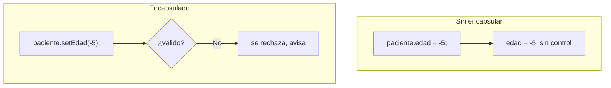
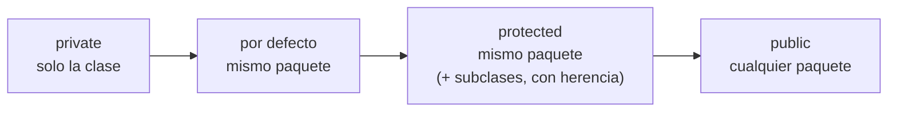
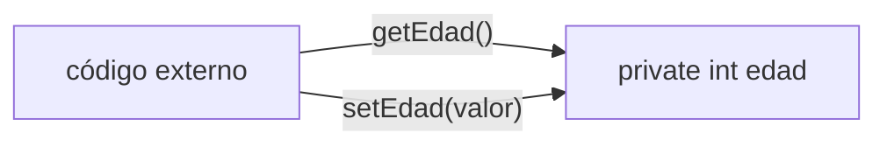
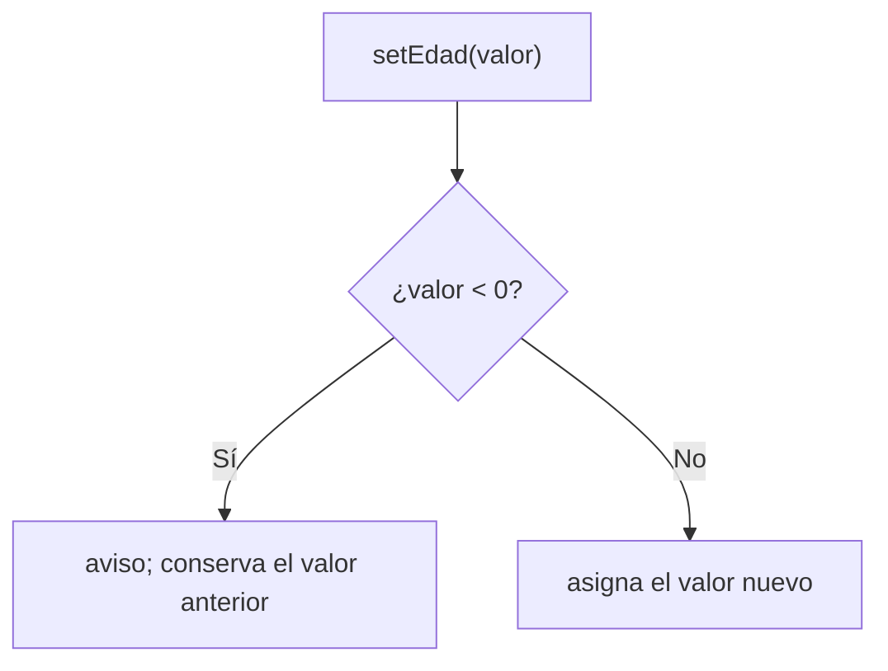

# 📘 Módulo 6 — Encapsulamiento

Curso de Java

---

## 🎯 Objetivos del módulo

- Explicar qué es el encapsulamiento.
- Distinguir los cuatro modificadores de acceso: `private`, por defecto, `protected` y `public`.
- Elegir el modificador adecuado según quién debe usar cada miembro.
- Declarar métodos `get` y `set`, validando en el `set`.

---

## 🗺️ Ruta de la sesión

1. ¿Qué es encapsulamiento?
2. Modificadores de acceso: `private`, por defecto, `protected`, `public`.
3. Métodos get y set.

---

## 🧠 El problema: atributos públicos

```java
paciente.edad = -5;  // nada lo impide
```

En el Módulo 5, cualquier código podía asignar cualquier valor a un atributo público.

---

## 🧠 ¿Qué es el encapsulamiento?

Ocultar el estado interno de un objeto y controlar cómo se accede a él y se modifica.

---

## 🧠 Antes y después



---

## 🧠 No es "esconder", es "controlar"

Los datos siguen siendo accesibles, a través de métodos que pueden validar antes de actuar.

---

## 🧠 Los cuatro modificadores

| Modificador | Alcance |
|---|---|
| `private` | Solo la misma clase |
| Por defecto | El mismo paquete |
| `protected` | El mismo paquete (sin herencia) |
| `public` | Cualquier paquete |

---

## 🧠 private

```java
private String diagnostico;
```

Ni siquiera otra clase del mismo paquete puede acceder directamente.

---

## 🧠 El error de un private

```text
The field FichaClinica.diagnostico is not visible
```

Se corrige accediendo a través de `get`/`set`.

---

## 🧠 Por defecto (sin modificador)

```java
int totalConsultas;
```

Accesible desde cualquier clase del mismo paquete; no desde otro.

---

## 🧠 protected

Sin herencia, se comporta **exactamente igual** que el acceso por defecto.

---

## 🧠 protected y la herencia

Su verdadera ventaja (acceso desde una subclase de otro paquete) se estudia en un módulo posterior.

---

## 🧠 Dos mensajes, un mismo alcance

| | Mensaje de `javac` | Mensaje del panel |
|---|---|---|
| Por defecto | `is not public in ...` | `is not visible` |
| `protected` | `has protected access` | `is not visible` (igual) |

---

## 🧠 public

```java
public int totalConsultas;
```

Accesible desde cualquier clase, de cualquier paquete.

---

## 🧠 Comparación completa



---

## 🧠 ¿Cuál elijo?

- ¿Solo esta clase debe usarlo? → `private`
- ¿Solo este paquete? → por defecto
- ¿Cualquier parte del sistema? → `public`

---

## 🧠 Métodos get y set

Un `get` devuelve el valor de un atributo `private`. Un `set` lo recibe, lo valida y lo asigna.

---

## 🧠 Acceso a través de get/set



---

## 🧠 Un set que valida

```java
public void setEdad(int edad) {
    if (edad < 0) {
        System.out.println("Edad inválida");
        return;
    }
    this.edad = edad;
}
```

---

## 🧠 El constructor también valida

```java
public Paciente(String nombre, int edad) {
    this.nombreCompleto = nombre;
    setEdad(edad);  // no: this.edad = edad;
}
```

---

## 🧠 Flujo de validación



---

## 🧠 Sin excepciones, todavía

Un `set` inválido no lanza ninguna excepción: avisa y sigue. El manejo de excepciones es un tema
posterior.

---

## 🧠 La convención isNombre()

```java
private boolean activo;
public boolean isActivo() { return activo; }
```

Para atributos `boolean`, el `get` se llama `isNombre()`, no `getNombre()`.

---

## 🧠 Errores frecuentes: de compilación

| Error | Mensaje real |
|---|---|
| Acceder a un `private` desde otra clase | `has private access` / `is not visible` |
| Acceder a un por defecto/`protected` desde otro paquete | `is not public` / `has protected access` |

---

## 🧠 Errores frecuentes: lógicos

| Error | Se detecta con |
|---|---|
| Asignar un atributo directamente, saltándose el `set` | comparando la salida con la esperada |
| Usar `getNombre()` en vez de `isNombre()` para un boolean | revisión de convenciones |

---

## 🧠 Convenciones de nombres

| Elemento | Convención | Ejemplo |
|---|---|---|
| Get de un atributo | `getNombre()` | `getEdad()` |
| Get de un boolean | `isNombre()` | `isActivo()` |
| Set | `setNombre(valor)` | `setEdad(edad)` |

---

## 🧠 Encapsular paso a paso

1. Declara el atributo `private`.
2. Agrega su `get`.
3. Agrega su `set`, con validación si hace falta.
4. Usa el `set` también desde el constructor.

---

## 🛠️ Actividad práctica: el taller

**Ficha encapsulada de un paciente** (MediSalud)

- Atributos privados, con get/set
- Un set validado
- Constructor que usa el set

---

## 🧭 Un vistazo completo

Qué es encapsular → los cuatro modificadores → get y set → validación: la base de todo el diseño
orientado a objetos que protege sus datos.

---

## 📌 Resumen

- Encapsular es ocultar el estado y controlar el acceso, no solo "esconder" datos.
- `private` < por defecto = `protected` (sin herencia) < `public`, de más a menos restrictivo.
- Un `set` puede validar antes de asignar; un atributo público nunca.
- Para un `boolean`, el `get` se llama `isNombre()`.

---

## 📝 Evaluación

Quiz de 12 preguntas (formato entrevista técnica) y los ejercicios del módulo.
