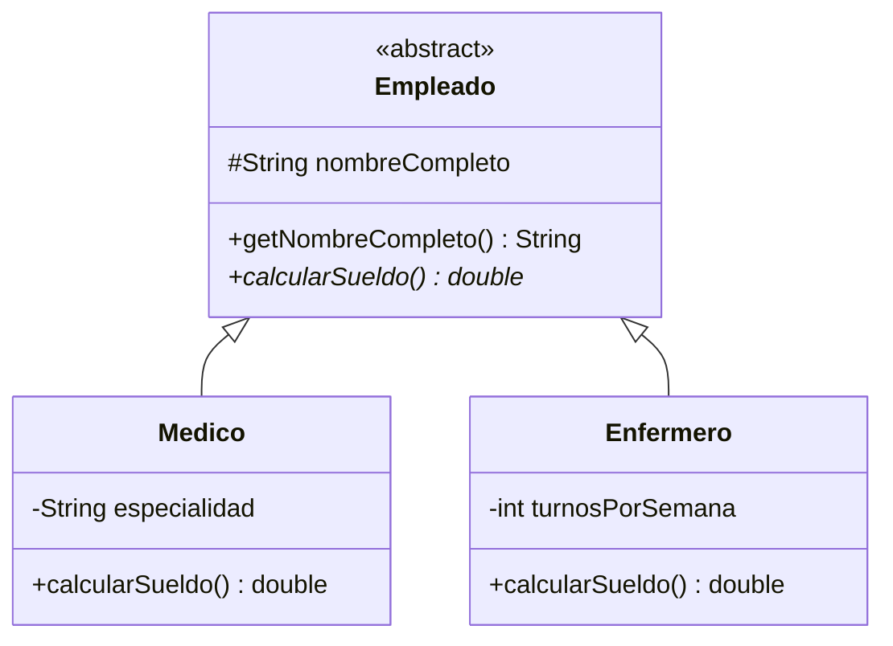

# 🛠️ Taller 01 — Jerarquía encapsulada de empleados

## 🎯 Objetivo (RA-3, RA-4, RA-7, RA-9, RA-11)

Diseñar, desde cero en Visual Studio Code, una jerarquía de empleados de MediSalud con una superclase
abstracta y dos subclases concretas, demostrando herencia, sobre-escritura y polimorfismo.

## 🌍 Contexto

**MediSalud** paga a sus empleados según su tipo: un `Medico` cobra un sueldo fijo por su
especialidad; un `Enfermero` cobra un sueldo base más un variable según sus turnos semanales. Ningún
empleado es "genérico": todo empleado real es un `Medico`, un `Enfermero` u otro tipo concreto.

## 🗺️ Diagrama de clases



## 🪜 Pasos

1. Crea el proyecto `JerarquiaDeEmpleados` en Visual Studio Code (**Java: Create Java Project... → No
   build tools**) y la clase abstracta `Empleado.java`, con el atributo `protected String
   nombreCompleto`, su constructor, `getNombreCompleto()` y el método abstracto
   `abstract double calcularSueldo();`.
2. Declara `Medico.java` (`extends Empleado`), con el atributo `private String especialidad` y un
   constructor que invoque `super(nombreCompleto)`.
3. Declara `Enfermero.java` (`extends Empleado`), con el atributo `private int turnosPorSemana` y un
   constructor que invoque `super(nombreCompleto)`.
4. Sobreescribe `calcularSueldo()` en `Medico` (con `@Override`, un sueldo fijo) y en `Enfermero` (con
   `@Override`, un sueldo base más un variable según `turnosPorSemana`).
5. Declara los datos de entrada de un `Medico` y un `Enfermero` al inicio de `main`.
6. Crea los objetos con una variable de tipo `Empleado` para cada uno, e invoca `calcularSueldo()`
   sobre cada una, comprobando que cada una ejecuta su propia versión (polimorfismo).
7. Ejecuta con los casos de prueba, cambiando solo los datos de entrada.
8. Provoca un error a propósito: intenta `new Empleado(...)` directamente en `main`. Mira el panel
   **Problems** (`Ctrl+Shift+M`), anota qué dice, y quita esa línea.

## 💡 Ejemplo resuelto (parcial)

```java
public abstract class Empleado {
    protected String nombreCompleto;

    public Empleado(String nombreCompleto) {
        this.nombreCompleto = nombreCompleto;
    }

    public String getNombreCompleto() {
        return nombreCompleto;
    }

    public abstract double calcularSueldo();
}
```

Completa `Medico.java` y `Enfermero.java` siguiendo el mismo patrón que los Ejemplos 07 y 08.

## 📦 Entregable

```text
JerarquiaDeEmpleados
└── src
    └── com
        └── medisalud
            ├── Empleado.java
            ├── Medico.java
            ├── Enfermero.java
            └── Demo.java
```

## 🧪 Casos de prueba

```text
Laura Gómez: 1500.0
Pedro Salas: 1250.0
```

Para el paso 8, este es el mensaje que muestra el panel Problems al instanciar `Empleado` directamente:

```text
✖ Cannot instantiate the type Empleado Java(16777373) [Ln 5, Col 33]
```

## 📏 Criterios de evaluación

- `Empleado` es `abstract`, con `calcularSueldo()` abstracto.
- `Medico` y `Enfermero` sobreescriben `calcularSueldo()` con `@Override`.
- La demostración de polimorfismo usa variables de tipo `Empleado` para cada subclase.
- El panel Problems confirma el error real de instanciar `Empleado` directamente.
