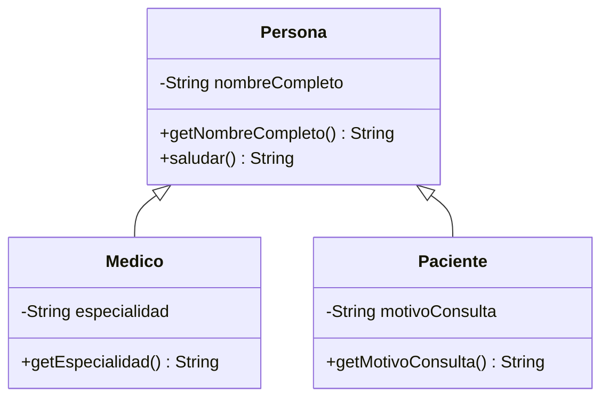

# 💡 Ejemplo 01 — Diagrama de clases

## 🌍 Contexto

Antes de escribir código, es útil poder **dibujar y leer** cómo se relacionan varias clases entre sí.
Un diagrama de clases muestra, de un vistazo, qué atributos y métodos tiene cada clase y qué clases
heredan de cuáles. En este curso los diagramas se representan con la notación `classDiagram` de
Mermaid, que Visual Studio Code y GitHub renderizan de forma nativa dentro de un archivo Markdown.

**Qué busca demostrar este ejemplo**: cómo un diagrama de clases simple —una superclase `Persona` y dos
subclases, `Medico` y `Paciente`— se traduce directamente en código Java, y cómo leer la flecha de
herencia.

## 🏥 Caso de estudio

**MediSalud** modela dos tipos de persona que atiende una clínica: el `Medico` que atiende y el
`Paciente` que es atendido. Ambos comparten un dato en común (su nombre completo), pero cada uno tiene
información propia.

## 🗺️ Diagrama de clases



## 🌳 Árbol de archivos (como se vería en VS Code)

Crea un proyecto llamado `Modulo07HerenciaYPolimorfismo` (**Java: Create Java Project... → No build
tools**) y ve agregando en él una clase por cada ejemplo. En este ejemplo agregas cuatro archivos
dentro de `src/com/medisalud`:

```text
Modulo07HerenciaYPolimorfismo
└── src
    └── com
        └── medisalud
            ├── Persona.java    ← nuevo en este ejemplo
            ├── Medico.java     ← nuevo en este ejemplo
            ├── Paciente.java   ← nuevo en este ejemplo
            └── Demo.java       ← nuevo en este ejemplo
```

## 💻 Archivo: Persona.java

```java
package com.medisalud;

public class Persona {
    private String nombreCompleto;

    public Persona(String nombreCompleto) {
        this.nombreCompleto = nombreCompleto;
    }

    public String getNombreCompleto() {
        return nombreCompleto;
    }

    public String saludar() {
        return "Hola, soy " + nombreCompleto;
    }
}
```

## 💻 Archivo: Medico.java

```java
package com.medisalud;

public class Medico extends Persona {
    private String especialidad;

    public Medico(String nombreCompleto, String especialidad) {
        super(nombreCompleto);
        this.especialidad = especialidad;
    }

    public String getEspecialidad() {
        return especialidad;
    }
}
```

## 💻 Archivo: Paciente.java

```java
package com.medisalud;

public class Paciente extends Persona {
    private String motivoConsulta;

    public Paciente(String nombreCompleto, String motivoConsulta) {
        super(nombreCompleto);
        this.motivoConsulta = motivoConsulta;
    }

    public String getMotivoConsulta() {
        return motivoConsulta;
    }
}
```

## 💻 Archivo: Demo.java

```java
package com.medisalud;

public class Demo {
    public static void main(String[] args) {
        Medico medico = new Medico("Laura Gómez", "Cardiología");
        Paciente paciente = new Paciente("Ana Torres", "Control anual");

        System.out.println(medico.getNombreCompleto());
        System.out.println(medico.getEspecialidad());
        System.out.println(medico.saludar());

        System.out.println(paciente.getNombreCompleto());
        System.out.println(paciente.getMotivoConsulta());
        System.out.println(paciente.saludar());
    }
}
```

## 🧭 Explicación paso a paso

1. En el diagrama, cada caja es una clase; el signo `-` marca un miembro `private` y el `+` uno
   `public` (la misma notación de modificadores que ya conoces del Módulo 6).
2. La flecha `Persona <|-- Medico` se lee "`Medico` hereda de `Persona`": la punta hueca del triángulo
   siempre apunta hacia la **superclase**, nunca hacia la subclase.
3. `Medico` y `Paciente` no repiten `nombreCompleto`, `getNombreCompleto()` ni `saludar()` en el
   diagrama: los heredan de `Persona`, por eso el diagrama no los vuelve a dibujar en las cajas hijas.
4. En el código, esa misma relación se escribe con `extends`: `public class Medico extends Persona`.
5. `Demo` crea un `Medico` y un `Paciente`, y ambos pueden invocar `getNombreCompleto()` y `saludar()`
   sin que esos métodos estén declarados en su propia clase.

## ✅ Resultado esperado

```text
Laura Gómez
Cardiología
Hola, soy Laura Gómez
Ana Torres
Control anual
Hola, soy Ana Torres
```

## 🧪 Casos de prueba

| Objeto | Método invocado | Resultado |
|---|---|---|
| `medico` | `getNombreCompleto()` | `"Laura Gómez"` |
| `medico` | `getEspecialidad()` | `"Cardiología"` |
| `medico` | `saludar()` | `"Hola, soy Laura Gómez"` |
| `paciente` | `getMotivoConsulta()` | `"Control anual"` |

## 🔍 Análisis: errores frecuentes

**Error — Confundir la dirección de la flecha de herencia (lectura del diagrama).** Es común leer
`Persona <|-- Medico` como "`Persona` hereda de `Medico`". La punta del triángulo siempre señala a la
superclase: se lee desde la subclase (la de abajo o la derecha) hacia la superclase.

**Error — Redeclarar en la subclase un miembro que ya está en la superclase.** Si `Medico` volviera a
declarar `nombreCompleto`, tendría dos atributos con el mismo nombre en la práctica (uno heredado y uno
propio) — el compilador lo permite, pero es un indicio de que el diagrama no se leyó bien: el objetivo
de la herencia es **no** repetir lo que ya está en la superclase (Ejemplo 02).

## ❓ Preguntas de repaso

**1. [Selección]** **Pregunta:** en el diagrama `Persona <|-- Medico`, ¿cuál es la superclase?

- **A.** `Medico`.
- **B.** `Persona`.
- **C.** Ninguna: son independientes.
- **D.** Depende del orden en que se declaren en el código.

<details>
<summary>🔑 Ver respuesta</summary>

**Respuesta correcta: B.** La punta del triángulo de la flecha de herencia siempre apunta hacia la
superclase; en `Persona <|-- Medico`, `Persona` es la superclase y `Medico` la subclase.

</details>

**2. [Selección múltiple]** **Pregunta:** ¿cuáles afirmaciones sobre el diagrama de `Persona`, `Medico`
y `Paciente` son verdaderas?

- **A.** `Medico` y `Paciente` heredan `getNombreCompleto()` de `Persona`.
- **B.** `Medico` declara su propio atributo `especialidad`, que `Paciente` no tiene.
- **C.** El diagrama repite `nombreCompleto` dentro de la caja de `Medico`.
- **D.** `saludar()` está disponible tanto para `Medico` como para `Paciente`.

<details>
<summary>🔑 Ver respuesta</summary>

**Respuestas correctas: A, B y D.** C es falsa: un miembro heredado no se vuelve a dibujar en la caja de
la subclase.

</details>

**3. [Abierta]** ¿Por qué el diagrama de clases no dibuja `getNombreCompleto()` ni `saludar()` dentro de
la caja de `Medico`, si `Medico` sí puede invocarlos?

<details>
<summary>🔑 Ver respuesta modelo</summary>

Porque esos métodos pertenecen a `Persona` y `Medico` los hereda por la relación `extends`: el diagrama
solo dibuja, dentro de cada caja, los miembros que esa clase declara por sí misma. Los heredados se
representan con la flecha hacia la superclase, no repitiéndolos en cada subclase.

</details>
