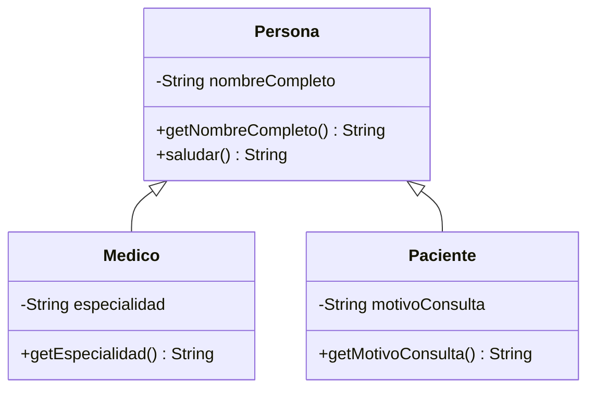

# 💡 Ejemplo 02 — Herencia

## 🌍 Contexto

La **herencia** permite que una clase (la subclase) reutilice los atributos y métodos de otra (la
superclase), en vez de repetirlos. Se declara con la palabra clave `extends`: `Medico` "es un tipo de"
`Persona`, así que `class Medico extends Persona` reutiliza todo lo que `Persona` ya declara.

**Qué busca demostrar este ejemplo**: qué miembros hereda exactamente una subclase (todo lo que no es
`private`) y cuáles no hereda nunca (los constructores), con el error real que produce olvidar que el
constructor de la superclase no se hereda.

## 🏥 Caso de estudio

**MediSalud** ya modeló, en el Ejemplo 01, que `Medico` y `Paciente` son un tipo de `Persona`. Este
ejemplo explica qué le da exactamente esa relación a cada subclase.

## 🗺️ Diagrama de clases



## 🌳 Árbol de archivos (como se vería en VS Code)

```text
Modulo07HerenciaYPolimorfismo
└── src
    └── com
        └── medisalud
            ├── Persona.java    ← igual que en el Ejemplo 01
            ├── Medico.java     ← igual que en el Ejemplo 01
            ├── Paciente.java   ← igual que en el Ejemplo 01
            └── Demo.java       ← igual que en el Ejemplo 01
```

## 💻 Archivo: Persona.java

```java
package com.medisalud;

public class Persona {
    private String nombreCompleto;

    public Persona(String nombreCompleto) {
        this.nombreCompleto = nombreCompleto;
    }

    public String getNombreCompleto() {
        return nombreCompleto;
    }

    public String saludar() {
        return "Hola, soy " + nombreCompleto;
    }
}
```

## 💻 Archivo: Medico.java

```java
package com.medisalud;

public class Medico extends Persona {
    private String especialidad;

    public Medico(String nombreCompleto, String especialidad) {
        super(nombreCompleto);
        this.especialidad = especialidad;
    }

    public String getEspecialidad() {
        return especialidad;
    }
}
```

## 💻 Archivo: Paciente.java

```java
package com.medisalud;

public class Paciente extends Persona {
    private String motivoConsulta;

    public Paciente(String nombreCompleto, String motivoConsulta) {
        super(nombreCompleto);
        this.motivoConsulta = motivoConsulta;
    }

    public String getMotivoConsulta() {
        return motivoConsulta;
    }
}
```

## 💻 Archivo: Demo.java

```java
package com.medisalud;

public class Demo {
    public static void main(String[] args) {
        Medico medico = new Medico("Laura Gómez", "Cardiología");
        Paciente paciente = new Paciente("Ana Torres", "Control anual");

        System.out.println(medico.getNombreCompleto());
        System.out.println(medico.getEspecialidad());
        System.out.println(medico.saludar());

        System.out.println(paciente.getNombreCompleto());
        System.out.println(paciente.getMotivoConsulta());
        System.out.println(paciente.saludar());
    }
}
```

## 🧭 Explicación paso a paso

1. `Medico extends Persona` hereda **todo lo que no es `private`** de `Persona`: en este caso,
   `getNombreCompleto()` y `saludar()` (ambos `public`).
2. `Medico` **no** hereda el atributo `nombreCompleto` para acceso directo (sigue siendo `private` de
   `Persona`); solo puede leerlo a través de `getNombreCompleto()`, heredado.
3. `Medico` **no** hereda el constructor de `Persona`: cada subclase declara el suyo propio, y ese
   constructor debe invocar `super(...)` para inicializar lo que `Persona` necesita.
4. `Medico(String nombreCompleto, String especialidad)` invoca `super(nombreCompleto)` como primera
   línea, delegando en `Persona` la inicialización de `nombreCompleto`.
5. Si el constructor de `Medico` **no** invocara `super(...)` y `Persona` no tuviera un constructor sin
   parámetros, el compilador rechazaría el programa (ver Análisis: errores frecuentes).

## ✅ Resultado esperado

```text
Laura Gómez
Cardiología
Hola, soy Laura Gómez
Ana Torres
Control anual
Hola, soy Ana Torres
```

## 🧪 Casos de prueba

| Miembro de `Persona` | ¿Lo hereda `Medico`? |
|---|---|
| `getNombreCompleto()` (`public`) | Sí |
| `saludar()` (`public`) | Sí |
| `nombreCompleto` (acceso directo, `private`) | No |
| El constructor `Persona(String)` | No (nunca se heredan los constructores) |

## 🔍 Análisis: errores frecuentes

**Error — Olvidar `super(...)` cuando la superclase no tiene un constructor sin parámetros
(compilación).**

```java no-compila
package com.medisalud;

public class Medico extends Persona {
    private String especialidad;

    public Medico(String nombreCompleto, String especialidad) {
        this.especialidad = especialidad;
    }
}
```

```text
⚠ The value of the field Medico.especialidad is not used Java(570425421) [Ln 4, Col 20]
✖ Implicit super constructor Persona() is undefined. Must explicitly invoke another constructor Java(134217871) [Ln 6, Col 12]
```

El mensaje de `javac` en la terminal dice `constructor Persona in class Persona cannot be applied to
given types; required: String; found: no arguments`: Java intenta invocar, de forma implícita,
`super()` (sin argumentos) al principio de todo constructor que no lo haga explícitamente, y `Persona`
no tiene un constructor así.

## ❓ Preguntas de repaso

**1. [Selección]** **Pregunta:** ¿qué le pasa al atributo `nombreCompleto` de `Persona` cuando `Medico`
hereda de ella?

- **A.** `Medico` puede acceder a él directamente con `this.nombreCompleto`.
- **B.** `Medico` no puede acceder a él directamente; sigue siendo `private` de `Persona`.
- **C.** `Medico` lo hereda como `public`.
- **D.** `nombreCompleto` desaparece en `Medico`.

<details>
<summary>🔑 Ver respuesta</summary>

**Respuesta correcta: B.** `private` nunca se hereda para acceso directo, ni siquiera desde una
subclase: `Medico` solo puede leerlo a través de `getNombreCompleto()`, heredado.

</details>

**2. [Selección múltiple]** **Pregunta:** ¿cuáles afirmaciones sobre la herencia de `Medico` y
`Persona` son verdaderas?

- **A.** `Medico` hereda `getNombreCompleto()` y `saludar()`.
- **B.** `Medico` hereda el constructor `Persona(String)`.
- **C.** El constructor de `Medico` debe invocar `super(...)` porque `Persona` no tiene un constructor
  sin parámetros.
- **D.** Si `Medico` no invoca `super(...)`, el programa compila igual.

<details>
<summary>🔑 Ver respuesta</summary>

**Respuestas correctas: A y C.** B es falsa: los constructores nunca se heredan. D es falsa: sin
`super(...)` explícito, el compilador lo rechaza (ver Análisis: errores frecuentes).

</details>

**3. [Abierta]** ¿Por qué Java exige que un constructor de subclase invoque `super(...)` cuando la
superclase no tiene un constructor sin parámetros?

<details>
<summary>🔑 Ver respuesta modelo</summary>

Porque antes de que el constructor de la subclase pueda usar cualquier miembro heredado, la parte de
`Persona` del objeto debe quedar inicializada. Si `Persona` solo sabe inicializarse con un
`nombreCompleto` (no tiene un constructor sin parámetros), la subclase tiene que decirle explícitamente
qué `nombreCompleto` usar, invocando `super(nombreCompleto)`.

</details>
