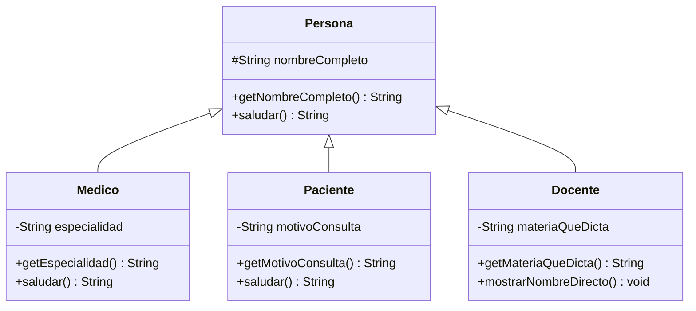

# 💡 Ejemplo 03 — this y super

## 🌍 Contexto

`super` permite que una subclase invoque el constructor o los métodos de su superclase; `this` permite
que un constructor invoque **otro constructor de la misma clase**. Juntos, sirven para reutilizar
comportamiento sin repetirlo.

**Qué busca demostrar este ejemplo**: cómo `super.metodo()` reutiliza el comportamiento heredado dentro
de un método sobreescrito, cómo `this(...)` encadena dos constructores de la misma clase, y —cerrando lo
que el Módulo 6 dejó pendiente— cómo un miembro `protected` sí es accesible desde una subclase de otro
paquete.

## 🏥📚 Caso de estudio

**MediSalud** amplía `Medico` y `Paciente` para que cada uno salude con su propio dato, reutilizando el
saludo genérico de `Persona`. Además, un `Docente` de **Biblioteca Universitaria** hereda de `Persona`
(de MediSalud) para demostrar el acceso `protected` entre paquetes con herencia real.

## 🗺️ Diagrama de clases



## 🌳 Árbol de archivos (como se vería en VS Code)

```text
Modulo07HerenciaYPolimorfismo
└── src
    └── com
        ├── medisalud
        │   ├── Persona.java    ← nombreCompleto pasa a protected
        │   ├── Medico.java     ← this(...) y @Override de saludar()
        │   ├── Paciente.java   ← @Override de saludar()
        │   └── Demo.java
        └── biblioteca
            └── Docente.java    ← nuevo en este ejemplo, otro paquete
```

## 💻 Archivo: Persona.java

```java
package com.medisalud;

public class Persona {
    protected String nombreCompleto;

    public Persona(String nombreCompleto) {
        this.nombreCompleto = nombreCompleto;
    }

    public String getNombreCompleto() {
        return nombreCompleto;
    }

    public String saludar() {
        return "Hola, soy " + nombreCompleto;
    }
}
```

## 💻 Archivo: Medico.java

```java
package com.medisalud;

public class Medico extends Persona {
    private String especialidad;

    public Medico(String nombreCompleto, String especialidad) {
        super(nombreCompleto);
        this.especialidad = especialidad;
    }

    public Medico(String nombreCompleto) {
        this(nombreCompleto, "General");
    }

    public String getEspecialidad() {
        return especialidad;
    }

    @Override
    public String saludar() {
        return super.saludar() + ", especialista en " + especialidad;
    }
}
```

## 💻 Archivo: Paciente.java

```java
package com.medisalud;

public class Paciente extends Persona {
    private String motivoConsulta;

    public Paciente(String nombreCompleto, String motivoConsulta) {
        super(nombreCompleto);
        this.motivoConsulta = motivoConsulta;
    }

    public String getMotivoConsulta() {
        return motivoConsulta;
    }

    @Override
    public String saludar() {
        return super.saludar() + ", consulto por " + motivoConsulta;
    }
}
```

## 💻 Archivo: Demo.java

```java
package com.medisalud;

public class Demo {
    public static void main(String[] args) {
        Medico medico = new Medico("Laura Gómez", "Cardiología");
        Medico medicoGeneral = new Medico("Carlos Ramírez");
        Paciente paciente = new Paciente("Ana Torres", "Control anual");

        System.out.println(medico.saludar());
        System.out.println(medicoGeneral.saludar());
        System.out.println(paciente.saludar());
    }
}
```

## 💻 Archivo: Docente.java

```java
package com.biblioteca;

import com.medisalud.Persona;

public class Docente extends Persona {
    private String materiaQueDicta;

    public Docente(String nombreCompleto, String materiaQueDicta) {
        super(nombreCompleto);
        this.materiaQueDicta = materiaQueDicta;
    }

    public String getMateriaQueDicta() {
        return materiaQueDicta;
    }

    public void mostrarNombreDirecto() {
        System.out.println(nombreCompleto);
    }

    public static void main(String[] args) {
        Docente docente = new Docente("Marta Salinas", "Anatomía");
        docente.mostrarNombreDirecto();
        System.out.println(docente.getMateriaQueDicta());
    }
}
```

## 🗺️ Diagrama

```mermaid
flowchart LR
    A["new Medico(\"Carlos Ramírez\")"] -->|"this(nombreCompleto, \"General\")"| B["Medico(nombreCompleto, especialidad)"]
    B -->|"super(nombreCompleto)"| C["Persona(nombreCompleto)"]
```

## 🧭 Explicación paso a paso

1. `Persona.nombreCompleto` pasa de `private` (Ejemplos 01–02) a **`protected`**: sigue sin ser
   accesible desde una clase no emparentada, pero ahora una subclase, incluso de otro paquete, puede
   usarlo directamente.
2. `Medico(String nombreCompleto, String especialidad)` invoca `super(nombreCompleto)` para
   inicializar la parte heredada, igual que en el Ejemplo 02.
3. `Medico(String nombreCompleto)`, el constructor con un solo parámetro, invoca `this(nombreCompleto,
   "General")`: delega en el **otro constructor de la misma clase** en vez de repetir la lógica de
   inicialización.
4. `Medico.saludar()` y `Paciente.saludar()` sobreescriben `saludar()` con `@Override`, pero cada uno
   invoca primero `super.saludar()` para reutilizar el saludo genérico de `Persona` y le agrega su
   propio dato.
5. `Docente`, en el paquete `com.biblioteca`, hereda de `Persona` (`com.medisalud`) y accede a
   `nombreCompleto` **directamente**, sin `get`, dentro de `mostrarNombreDirecto()`: esto compila
   porque `nombreCompleto` es `protected` y `Docente` es una subclase, aunque esté en otro paquete —lo
   que el Módulo 6 remitió explícitamente a este módulo.

## ✅ Resultado esperado

`Demo` (MediSalud):

```text
Hola, soy Laura Gómez, especialista en Cardiología
Hola, soy Carlos Ramírez, especialista en General
Hola, soy Ana Torres, consulto por Control anual
```

`Docente` (Biblioteca Universitaria):

```text
Marta Salinas
Anatomía
```

## 🧪 Casos de prueba

| Acceso | ¿Compila? |
|---|---|
| `Docente` (otro paquete, subclase) accede a su propio `nombreCompleto` heredado | Sí |
| `Medico`/`Paciente` (mismo paquete, subclases) acceden a `nombreCompleto` heredado | Sí |
| `new Medico("Carlos Ramírez")` invoca el constructor con `this(...)` | Sí, delega en el otro constructor |

## 🔍 Análisis: errores frecuentes

**Error conceptual — Confundir `protected` con herencia con `protected` sin herencia (Módulo 6).** Sin
una relación `extends`, `protected` se comporta igual que el acceso por defecto (Módulo 6, Ejemplo 04):
compila desde el mismo paquete, no desde otro. Con herencia, una subclase de **otro** paquete sí puede
acceder a su propio miembro `protected` heredado, como hace `Docente` en este ejemplo. Una clase de otro
paquete que **no** sea subclase sigue sin poder acceder, exactamente igual que en el Módulo 6.

## ❓ Preguntas de repaso

**1. [Selección]** **Pregunta:** ¿qué hace `this(nombreCompleto, "General")` dentro de un constructor de
`Medico`?

- **A.** Invoca el constructor de `Persona`.
- **B.** Invoca otro constructor de la propia clase `Medico`.
- **C.** Crea un nuevo objeto `Medico` distinto.
- **D.** No compila: `this(...)` no existe en Java.

<details>
<summary>🔑 Ver respuesta</summary>

**Respuesta correcta: B.** `this(...)` invoca otro constructor de la **misma** clase, encadenando la
inicialización sin repetir código.

</details>

**2. [Selección múltiple]** **Pregunta:** ¿cuáles afirmaciones sobre `Docente` (en `com.biblioteca`,
subclase de `Persona` de `com.medisalud`) son verdaderas?

- **A.** `Docente` puede acceder a `nombreCompleto` directamente porque es `protected` y `Docente` es
  una subclase.
- **B.** `Docente` podría acceder a `nombreCompleto` aunque no fuera subclase de `Persona`.
- **C.** El constructor de `Docente` invoca `super(nombreCompleto)`.
- **D.** Si `nombreCompleto` siguiera siendo `private`, `Docente` podría acceder igual.

<details>
<summary>🔑 Ver respuesta</summary>

**Respuestas correctas: A y C.** B es falsa: sin la relación de herencia, `protected` entre paquetes se
rechaza (Módulo 6). D es falsa: `private` nunca es accesible desde una subclase.

</details>

**3. [Abierta]** ¿Por qué `Medico.saludar()` invoca `super.saludar()` en vez de escribir de nuevo
`"Hola, soy " + nombreCompleto`?

<details>
<summary>🔑 Ver respuesta modelo</summary>

Para reutilizar el comportamiento que `Persona` ya implementa, en vez de duplicarlo. `super.saludar()`
ejecuta la versión de `Persona` y `Medico` solo agrega la parte que le es propia (la especialidad),
evitando repetir la lógica del saludo genérico.

</details>
