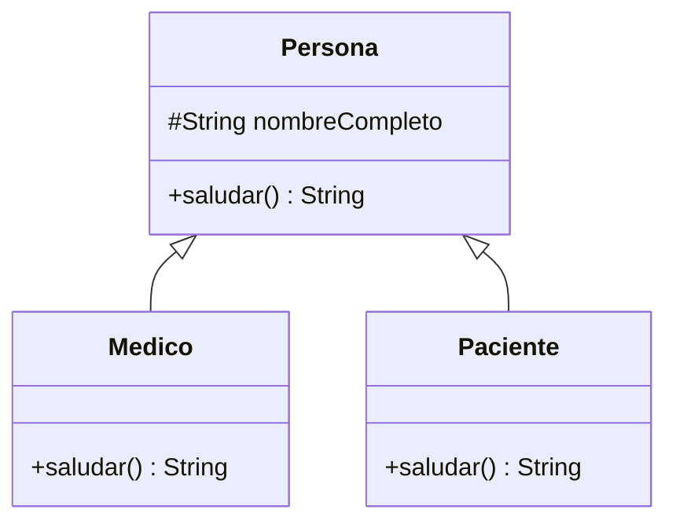
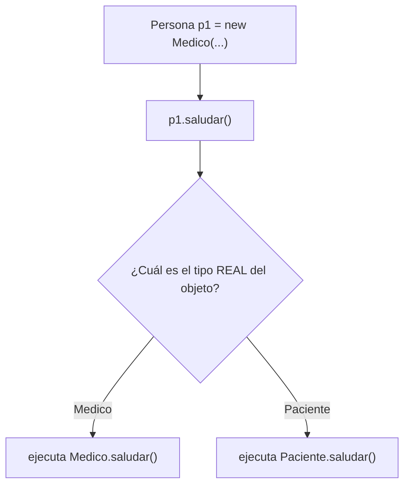

# 💡 Ejemplo 04 — Polimorfismo

## 🌍 Contexto

El **polimorfismo** es la capacidad de que una misma llamada a un método produzca comportamientos
distintos según el objeto real que la recibe. Una variable declarada con el tipo de la superclase puede
referenciar un objeto de cualquier subclase, y el método que se ejecuta se decide **en tiempo de
ejecución**, según el tipo real del objeto, no según el tipo declarado de la variable.

**Qué busca demostrar este ejemplo**: dos variables del mismo tipo declarado (`Persona`), cada una
referenciando una subclase distinta, ejecutando cada una su propia versión de `saludar()`.

## 🏥 Caso de estudio

**MediSalud** ya tiene `Medico` y `Paciente`, cada uno con su propia versión de `saludar()` (Ejemplo
03). Este ejemplo muestra qué pasa cuando se los trata de forma uniforme, como si ambos fueran solo
`Persona`.

## 🗺️ Diagrama de clases



## 🌳 Árbol de archivos (como se vería en VS Code)

```text
Modulo07HerenciaYPolimorfismo
└── src
    └── com
        └── medisalud
            ├── Persona.java    ← igual que en el Ejemplo 03
            ├── Medico.java     ← igual que en el Ejemplo 03
            ├── Paciente.java   ← igual que en el Ejemplo 03
            └── Demo.java       ← nuevo en este ejemplo
```

## 💻 Archivo: Persona.java

```java
package com.medisalud;

public class Persona {
    protected String nombreCompleto;

    public Persona(String nombreCompleto) {
        this.nombreCompleto = nombreCompleto;
    }

    public String getNombreCompleto() {
        return nombreCompleto;
    }

    public String saludar() {
        return "Hola, soy " + nombreCompleto;
    }
}
```

## 💻 Archivo: Medico.java

```java
package com.medisalud;

public class Medico extends Persona {
    private String especialidad;

    public Medico(String nombreCompleto, String especialidad) {
        super(nombreCompleto);
        this.especialidad = especialidad;
    }

    public Medico(String nombreCompleto) {
        this(nombreCompleto, "General");
    }

    public String getEspecialidad() {
        return especialidad;
    }

    @Override
    public String saludar() {
        return super.saludar() + ", especialista en " + especialidad;
    }
}
```

## 💻 Archivo: Paciente.java

```java
package com.medisalud;

public class Paciente extends Persona {
    private String motivoConsulta;

    public Paciente(String nombreCompleto, String motivoConsulta) {
        super(nombreCompleto);
        this.motivoConsulta = motivoConsulta;
    }

    public String getMotivoConsulta() {
        return motivoConsulta;
    }

    @Override
    public String saludar() {
        return super.saludar() + ", consulto por " + motivoConsulta;
    }
}
```

## 💻 Archivo: Demo.java

```java
package com.medisalud;

public class Demo {
    public static void main(String[] args) {
        Persona p1 = new Medico("Laura Gómez", "Cardiología");
        Persona p2 = new Paciente("Ana Torres", "Control anual");

        System.out.println(p1.saludar());
        System.out.println(p2.saludar());
    }
}
```

## 🗺️ Diagrama



## 🧭 Explicación paso a paso

1. `Persona p1 = new Medico(...)` declara `p1` con el **tipo `Persona`**, pero el objeto real que
   contiene es un `Medico`.
2. `p1.saludar()` no ejecuta `Persona.saludar()`: el compilador y la JVM buscan, en tiempo de
   ejecución, la versión de `saludar()` del **tipo real** del objeto (`Medico`), no del tipo declarado
   de la variable.
3. Lo mismo ocurre con `p2`, declarada `Persona` pero conteniendo un `Paciente`: `p2.saludar()`
   ejecuta `Paciente.saludar()`.
4. Esto es el enlace dinámico (*dynamic dispatch*): la decisión de qué método ejecutar se toma según el
   objeto real, no según el tipo con el que se declaró la variable.
5. Sin sobreescritura (`@Override`), este ejemplo no tendría nada que demostrar: sería siempre la misma
   versión de `Persona.saludar()`. El polimorfismo depende de que exista una sobre-escritura real
   (Ejemplo 06).

## ✅ Resultado esperado

```text
Hola, soy Laura Gómez, especialista en Cardiología
Hola, soy Ana Torres, consulto por Control anual
```

## 🧪 Casos de prueba

| Variable | Tipo declarado | Tipo real | `saludar()` ejecuta la versión de |
|---|---|---|---|
| `p1` | `Persona` | `Medico` | `Medico` |
| `p2` | `Persona` | `Paciente` | `Paciente` |

## 🔍 Análisis: errores frecuentes

**Error conceptual — Pensar que `p1.saludar()` ejecuta `Persona.saludar()` porque `p1` se declaró como
`Persona`.** El tipo **declarado** de la variable (`Persona`) solo determina qué métodos se pueden
invocar sobre ella (los que `Persona` declara o hereda); **cuál versión se ejecuta** lo decide el tipo
**real** del objeto en tiempo de ejecución.

## ❓ Preguntas de repaso

**1. [Selección]** **Pregunta:** dado `Persona p = new Medico(...)`, ¿qué versión de `saludar()`
ejecuta `p.saludar()`?

- **A.** La de `Persona`, porque `p` se declaró como `Persona`.
- **B.** La de `Medico`, porque ese es el tipo real del objeto.
- **C.** Ninguna: no compila.
- **D.** Ambas, una después de la otra.

<details>
<summary>🔑 Ver respuesta</summary>

**Respuesta correcta: B.** El enlace dinámico decide qué versión ejecutar según el tipo real del
objeto, no según el tipo declarado de la variable.

</details>

**2. [Selección múltiple]** **Pregunta:** ¿cuáles afirmaciones sobre el polimorfismo son verdaderas?

- **A.** Una variable de tipo superclase puede referenciar un objeto de cualquier subclase.
- **B.** La decisión de qué método se ejecuta se toma en tiempo de compilación.
- **C.** El polimorfismo depende de que exista una sobre-escritura real del método.
- **D.** Sin herencia, no hay polimorfismo de este tipo.

<details>
<summary>🔑 Ver respuesta</summary>

**Respuestas correctas: A, C y D.** B es falsa: el enlace dinámico se decide en tiempo de **ejecución**,
no de compilación.

</details>

**3. [Abierta]** ¿Por qué se dice que el polimorfismo se resuelve "en tiempo de ejecución" y no "en
tiempo de compilación"?

<details>
<summary>🔑 Ver respuesta modelo</summary>

Porque el compilador solo verifica que el método exista en el tipo declarado de la variable (`Persona`
declara `saludar()`), pero no sabe de antemano qué objeto concreto va a contener esa variable cuando el
programa corra. La JVM decide, en el momento de ejecutar `p.saludar()`, cuál versión invocar según el
tipo real del objeto al que `p` apunta en ese instante.

</details>
