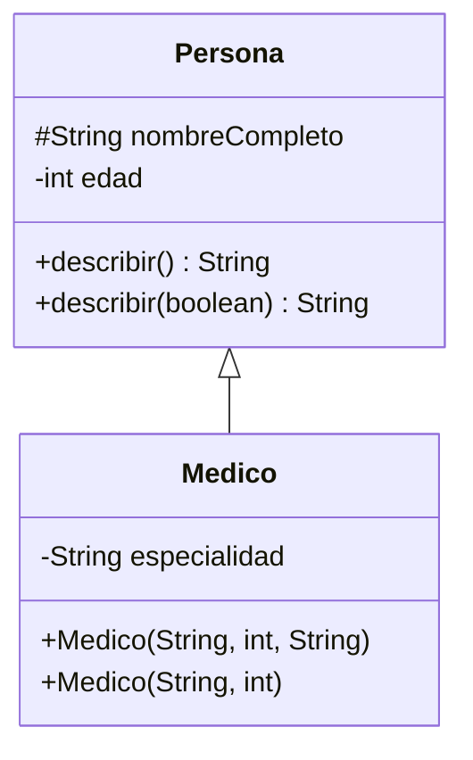

# 💡 Ejemplo 05 — Sobrecarga

## 🌍 Contexto

La **sobrecarga** (*overloading*) permite declarar varios métodos, o varios constructores, con el
**mismo nombre** pero **distinta lista de parámetros**, en la misma clase. El compilador decide cuál
invocar según el número y el tipo de los argumentos que se le pasan.

**Qué busca demostrar este ejemplo**: un método sobrecargado (`describir()`/`describir(boolean)`) y un
constructor sobrecargado (`Medico` con y sin especialidad), y cómo el compilador elige la versión
correcta.

## 🏥 Caso de estudio

**MediSalud** quiere describir a una persona de dos formas: con o sin su edad. También quiere poder
crear un `Medico` sin especificar su especialidad, asumiendo `"General"` por defecto.

## 🗺️ Diagrama de clases



## 🌳 Árbol de archivos (como se vería en VS Code)

```text
Modulo07HerenciaYPolimorfismo
└── src
    └── com
        └── medisalud
            ├── Persona.java    ← agrega edad y describir() sobrecargado
            ├── Medico.java     ← agrega el constructor sobrecargado sin especialidad
            ├── Paciente.java
            └── Demo.java       ← nuevo en este ejemplo
```

## 💻 Archivo: Persona.java

```java
package com.medisalud;

public class Persona {
    protected String nombreCompleto;
    private int edad;

    public Persona(String nombreCompleto, int edad) {
        this.nombreCompleto = nombreCompleto;
        this.edad = edad;
    }

    public String getNombreCompleto() {
        return nombreCompleto;
    }

    public int getEdad() {
        return edad;
    }

    public String saludar() {
        return "Hola, soy " + nombreCompleto;
    }

    public String describir() {
        return nombreCompleto;
    }

    public String describir(boolean incluirEdad) {
        if (incluirEdad) {
            return nombreCompleto + " (" + edad + " años)";
        }
        return nombreCompleto;
    }
}
```

## 💻 Archivo: Medico.java

```java
package com.medisalud;

public class Medico extends Persona {
    private String especialidad;

    public Medico(String nombreCompleto, int edad, String especialidad) {
        super(nombreCompleto, edad);
        this.especialidad = especialidad;
    }

    public Medico(String nombreCompleto, int edad) {
        this(nombreCompleto, edad, "General");
    }

    public String getEspecialidad() {
        return especialidad;
    }

    @Override
    public String saludar() {
        return super.saludar() + ", especialista en " + especialidad;
    }
}
```

## 💻 Archivo: Paciente.java

```java
package com.medisalud;

public class Paciente extends Persona {
    private String motivoConsulta;

    public Paciente(String nombreCompleto, int edad, String motivoConsulta) {
        super(nombreCompleto, edad);
        this.motivoConsulta = motivoConsulta;
    }

    public String getMotivoConsulta() {
        return motivoConsulta;
    }

    @Override
    public String saludar() {
        return super.saludar() + ", consulto por " + motivoConsulta;
    }
}
```

## 💻 Archivo: Demo.java

```java
package com.medisalud;

public class Demo {
    public static void main(String[] args) {
        Persona persona = new Persona("Ana Torres", 34);
        Medico medicoConEspecialidad = new Medico("Laura Gómez", 41, "Cardiología");
        Medico medicoSinEspecialidad = new Medico("Carlos Ramírez", 29);

        System.out.println(persona.describir());
        System.out.println(persona.describir(true));

        System.out.println(medicoConEspecialidad.getEspecialidad());
        System.out.println(medicoSinEspecialidad.getEspecialidad());
    }
}
```

## 🧭 Explicación paso a paso

1. `Persona` declara **dos** métodos llamados `describir`: uno sin parámetros y otro con un
   `boolean incluirEdad`. Tienen el mismo nombre pero distinta lista de parámetros: están
   **sobrecargados**.
2. `persona.describir()` invoca la versión sin parámetros; `persona.describir(true)` invoca la que
   recibe el `boolean`. El compilador elige cuál según los argumentos que se le pasan, sin ambigüedad.
3. `Medico` también tiene dos constructores: `Medico(String, int, String)` y `Medico(String, int)`. El
   segundo delega en el primero con `this(nombreCompleto, edad, "General")` (Ejemplo 03).
4. `new Medico("Carlos Ramírez", 29)` invoca el constructor de dos parámetros, que a su vez asigna
   `"General"` como especialidad por defecto.
5. La sobrecarga se resuelve **en tiempo de compilación**: el compilador ya sabe, mirando los tipos de
   los argumentos, cuál versión generar en el bytecode — a diferencia de la sobre-escritura (Ejemplo
   06), que se resuelve en tiempo de ejecución.

## ✅ Resultado esperado

```text
Ana Torres
Ana Torres (34 años)
Cardiología
General
```

## 🧪 Casos de prueba

| Llamada | Versión invocada | Resultado |
|---|---|---|
| `persona.describir()` | Sin parámetros | `"Ana Torres"` |
| `persona.describir(true)` | Con `boolean` | `"Ana Torres (34 años)"` |
| `new Medico("Laura Gómez", 41, "Cardiología")` | Constructor de 3 parámetros | especialidad `"Cardiología"` |
| `new Medico("Carlos Ramírez", 29)` | Constructor de 2 parámetros (delega con `this(...)`) | especialidad `"General"` |

## 🔍 Análisis: errores frecuentes

**Error conceptual — Confundir sobrecarga con sobre-escritura.** Sobrecargar `describir()` y
`describir(boolean)` ocurre dentro de la **misma clase** (`Persona`), con firmas **distintas**
(distinta lista de parámetros); no tiene que ver con la herencia. Sobreescribir `saludar()` en `Medico`
(Ejemplo 03) ocurre entre una **subclase y su superclase**, con la **misma** firma. El Ejemplo 06
profundiza en esta distinción.

## ❓ Preguntas de repaso

**1. [Selección]** **Pregunta:** ¿qué determina cuál versión sobrecargada de un método se invoca?

- **A.** El tipo real del objeto, en tiempo de ejecución.
- **B.** El número y el tipo de los argumentos, en tiempo de compilación.
- **C.** El orden en que se declararon los métodos.
- **D.** Un sorteo aleatorio del compilador.

<details>
<summary>🔑 Ver respuesta</summary>

**Respuesta correcta: B.** La sobrecarga se resuelve en tiempo de compilación, según el número y el
tipo de los argumentos que recibe la llamada.

</details>

**2. [Selección múltiple]** **Pregunta:** ¿cuáles afirmaciones sobre `describir()`/`describir(boolean)`
son verdaderas?

- **A.** Tienen el mismo nombre pero distinta lista de parámetros.
- **B.** Están declarados en la misma clase.
- **C.** Uno sobreescribe al otro.
- **D.** El compilador elige cuál invocar según los argumentos de la llamada.

<details>
<summary>🔑 Ver respuesta</summary>

**Respuestas correctas: A, B y D.** C es falsa: sobreescribir requiere una relación de herencia y la
misma firma; esto es sobrecarga, dentro de la misma clase.

</details>

**3. [Abierta]** ¿Puede sobrecargarse un constructor igual que un método? Explica con el ejemplo de
`Medico`.

<details>
<summary>🔑 Ver respuesta modelo</summary>

Sí. `Medico` declara dos constructores con el mismo nombre de clase pero distinta lista de parámetros:
`Medico(String, int, String)` y `Medico(String, int)`. El compilador elige cuál invocar según los
argumentos de `new Medico(...)`, igual que con cualquier método sobrecargado.

</details>
