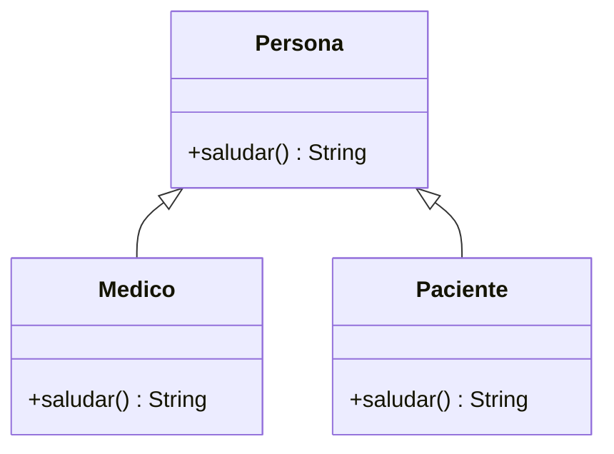

# 💡 Ejemplo 06 — Sobre-escritura

## 🌍 Contexto

La **sobre-escritura** (*overriding*) redefine, en una subclase, un método heredado con la **misma
firma** exacta. Se marca con `@Override` (una anotación que no es obligatoria para que el programa
funcione, pero que hace que el compilador verifique que realmente se está sobreescribiendo algo). La
subclase no puede volver más restrictivo el modificador de acceso del método sobreescrito.

**Qué busca demostrar este ejemplo**: las dos reglas que `@Override` hace cumplir, con el error real que
produce violar cada una.

## 🏥 Caso de estudio

**MediSalud** ya sobreescribe `saludar()` en `Medico` y `Paciente` desde el Ejemplo 03. Este ejemplo
profundiza en las reglas que esa sobre-escritura debe respetar.

## 🗺️ Diagrama de clases



## 🌳 Árbol de archivos (como se vería en VS Code)

```text
Modulo07HerenciaYPolimorfismo
└── src
    └── com
        └── medisalud
            ├── Persona.java
            ├── Medico.java
            ├── Paciente.java
            └── Demo.java
```

## 💻 Archivo: Persona.java

```java
package com.medisalud;

public class Persona {
    protected String nombreCompleto;
    private int edad;

    public Persona(String nombreCompleto, int edad) {
        this.nombreCompleto = nombreCompleto;
        this.edad = edad;
    }

    public String getNombreCompleto() {
        return nombreCompleto;
    }

    public int getEdad() {
        return edad;
    }

    public String saludar() {
        return "Hola, soy " + nombreCompleto;
    }

    public String describir() {
        return nombreCompleto;
    }

    public String describir(boolean incluirEdad) {
        if (incluirEdad) {
            return nombreCompleto + " (" + edad + " años)";
        }
        return nombreCompleto;
    }
}
```

## 💻 Archivo: Medico.java

```java
package com.medisalud;

public class Medico extends Persona {
    private String especialidad;

    public Medico(String nombreCompleto, int edad, String especialidad) {
        super(nombreCompleto, edad);
        this.especialidad = especialidad;
    }

    public Medico(String nombreCompleto, int edad) {
        this(nombreCompleto, edad, "General");
    }

    public String getEspecialidad() {
        return especialidad;
    }

    @Override
    public String saludar() {
        return super.saludar() + ", especialista en " + especialidad;
    }
}
```

## 💻 Archivo: Paciente.java

```java
package com.medisalud;

public class Paciente extends Persona {
    private String motivoConsulta;

    public Paciente(String nombreCompleto, int edad, String motivoConsulta) {
        super(nombreCompleto, edad);
        this.motivoConsulta = motivoConsulta;
    }

    public String getMotivoConsulta() {
        return motivoConsulta;
    }

    @Override
    public String saludar() {
        return super.saludar() + ", consulto por " + motivoConsulta;
    }
}
```

## 💻 Archivo: Demo.java

```java
package com.medisalud;

public class Demo {
    public static void main(String[] args) {
        Persona p1 = new Medico("Laura Gómez", 41, "Cardiología");
        Persona p2 = new Paciente("Ana Torres", 34, "Control anual");

        System.out.println(p1.saludar());
        System.out.println(p2.saludar());
    }
}
```

## 🧭 Explicación paso a paso

1. `Medico.saludar()` y `Paciente.saludar()` sobreescriben `Persona.saludar()`: **misma firma**
   (mismo nombre, mismos parámetros, mismo tipo de retorno), marcada con `@Override`.
2. `@Override` no cambia el comportamiento del programa: es una verificación del compilador. Si el
   método anotado no sobreescribe realmente nada (por ejemplo, por una firma distinta), el compilador
   lo rechaza (ver Análisis: errores frecuentes).
3. El modificador de acceso de un método sobreescrito **no puede ser más restrictivo** que el de la
   superclase: `Persona.saludar()` es `public`, así que ninguna sobre-escritura puede declararlo
   `protected` o `private`.
4. Sí puede ser **igual o menos restrictivo** (por ejemplo, de `protected` a `public`), pero eso no se
   demuestra aquí porque `saludar()` ya es `public`, el máximo posible.

## ✅ Resultado esperado

```text
Hola, soy Laura Gómez, especialista en Cardiología
Hola, soy Ana Torres, consulto por Control anual
```

## 🧪 Casos de prueba

| Sobre-escritura propuesta | ¿Compila? |
|---|---|
| `saludar()` con la misma firma, `public` (la real, arriba) | Sí |
| `saludar()` con acceso `protected` (más restrictivo que `public`) | No |
| `saludar(String saludoPersonalizado)` con `@Override` (firma distinta) | No |

## 🔍 Análisis: errores frecuentes

**Error — Sobreescribir con un modificador de acceso más restrictivo (compilación).**

```java no-compila
package com.medisalud;

public class Medico extends Persona {
    private String especialidad;

    public Medico(String nombreCompleto, int edad, String especialidad) {
        super(nombreCompleto, edad);
        this.especialidad = especialidad;
    }

    @Override
    protected String saludar() {
        return super.saludar() + ", especialista en " + especialidad;
    }
}
```

```text
✖ Cannot reduce the visibility of the inherited method from Persona Java(67109273) [Ln 12, Col 22]
```

El mensaje de `javac` dice `attempting to assign weaker access privileges; was public`: no se puede
sobreescribir un método `public` con una versión `protected` o `private`.

**Error — `@Override` sobre una firma que no coincide con ninguna de la superclase (compilación).**

```java no-compila
package com.medisalud;

public class Medico extends Persona {
    private String especialidad;

    public Medico(String nombreCompleto, int edad, String especialidad) {
        super(nombreCompleto, edad);
        this.especialidad = especialidad;
    }

    @Override
    public String saludar(String saludoPersonalizado) {
        return saludoPersonalizado + ", soy " + especialidad;
    }
}
```

```text
✖ The method saludar(String) of type Medico must override or implement a supertype method Java(67109498) [Ln 12, Col 19]
```

El mensaje de `javac` dice `method does not override or implement a method from a supertype`:
`saludar(String)` no es la misma firma que `saludar()` de `Persona`, así que no es una sobre-escritura,
sino un método nuevo — y `@Override` lo detecta.

## ❓ Preguntas de repaso

**1. [Selección]** **Pregunta:** ¿qué verifica la anotación `@Override`?

- **A.** Que el método sea `public`.
- **B.** Que el método realmente sobreescriba uno de la superclase, con la misma firma.
- **C.** Que el método no reciba parámetros.
- **D.** Nada: es solo un comentario decorativo.

<details>
<summary>🔑 Ver respuesta</summary>

**Respuesta correcta: B.** `@Override` hace que el compilador verifique que el método realmente
sobreescribe uno de la superclase; si no, lo rechaza.

</details>

**2. [Selección múltiple]** **Pregunta:** ¿cuáles afirmaciones sobre sobreescribir `Persona.saludar()`
(`public`) son verdaderas?

- **A.** La subclase puede declararlo `public` (igual acceso).
- **B.** La subclase puede declararlo `protected` (más restrictivo).
- **C.** La subclase debe usar exactamente la misma firma.
- **D.** `@Override` es obligatorio para que el programa compile.

<details>
<summary>🔑 Ver respuesta</summary>

**Respuestas correctas: A y C.** B es falsa: no se puede reducir la visibilidad al sobreescribir. D es
falsa: `@Override` es una buena práctica, pero el programa compila sin ella si la firma coincide.

</details>

**3. [Abierta]** ¿Por qué Java no permite que una sobre-escritura reduzca la visibilidad del método
original?

<details>
<summary>🔑 Ver respuesta modelo</summary>

Porque cualquier código que ya podía invocar el método a través de una referencia de tipo superclase
(por ejemplo, `Persona p = new Medico(...); p.saludar();`) debe seguir pudiendo hacerlo. Si la subclase
pudiera ocultar el método volviéndolo más restrictivo, ese código dejaría de compilar dependiendo del
tipo real del objeto, rompiendo la garantía del polimorfismo.

</details>
