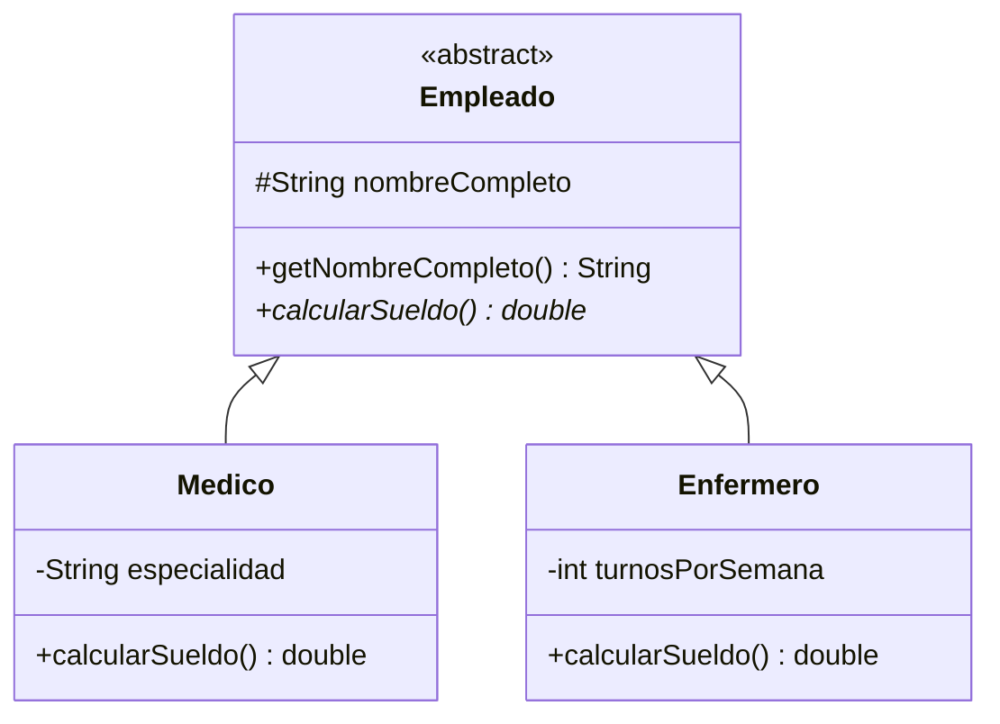

# 💡 Ejemplo 07 — Clases abstractas

## 🌍 Contexto

Una **clase abstracta** (`abstract class`) no puede instanciarse directamente: existe para ser
extendida. Puede declarar **métodos abstractos** (sin cuerpo, marcados `abstract`) que cada subclase
concreta está obligada a implementar, junto con métodos concretos que las subclases heredan tal cual.

**Qué busca demostrar este ejemplo**: una clase abstracta con un método abstracto, dos subclases que lo
implementan de forma distinta, y los dos errores reales que produce no respetar el contrato: instanciar
la clase abstracta directamente, o no implementar su método abstracto.

## 🏥 Caso de estudio

**MediSalud** tiene distintos tipos de empleados (`Medico`, `Enfermero`) que comparten datos comunes
pero calculan su sueldo de forma distinta. Ningún empleado es "genérico": todo empleado real es un
`Medico`, un `Enfermero`, u otro tipo concreto.

## 🗺️ Diagrama de clases



## 🌳 Árbol de archivos (como se vería en VS Code)

```text
Modulo07HerenciaYPolimorfismo
└── src
    └── com
        └── medisalud
            ├── Empleado.java    ← nuevo, abstract class
            ├── Medico.java      ← nuevo, jerarquía distinta a la de los Ejemplos 01-06
            ├── Enfermero.java   ← nuevo en este ejemplo
            └── Demo.java        ← nuevo en este ejemplo
```

## 💻 Archivo: Empleado.java

```java
package com.medisalud;

public abstract class Empleado {
    protected String nombreCompleto;

    public Empleado(String nombreCompleto) {
        this.nombreCompleto = nombreCompleto;
    }

    public String getNombreCompleto() {
        return nombreCompleto;
    }

    public abstract double calcularSueldo();
}
```

## 💻 Archivo: Medico.java

```java
package com.medisalud;

public class Medico extends Empleado {
    private String especialidad;

    public Medico(String nombreCompleto, String especialidad) {
        super(nombreCompleto);
        this.especialidad = especialidad;
    }

    public String getEspecialidad() {
        return especialidad;
    }

    @Override
    public double calcularSueldo() {
        return 1500.0;
    }
}
```

## 💻 Archivo: Enfermero.java

```java
package com.medisalud;

public class Enfermero extends Empleado {
    private int turnosPorSemana;

    public Enfermero(String nombreCompleto, int turnosPorSemana) {
        super(nombreCompleto);
        this.turnosPorSemana = turnosPorSemana;
    }

    public int getTurnosPorSemana() {
        return turnosPorSemana;
    }

    @Override
    public double calcularSueldo() {
        return 1000.0 + turnosPorSemana * 50.0;
    }
}
```

## 💻 Archivo: Demo.java

```java
package com.medisalud;

public class Demo {
    public static void main(String[] args) {
        Empleado medico = new Medico("Laura Gómez", "Cardiología");
        Empleado enfermero = new Enfermero("Pedro Salas", 5);

        System.out.println(medico.getNombreCompleto() + ": " + medico.calcularSueldo());
        System.out.println(enfermero.getNombreCompleto() + ": " + enfermero.calcularSueldo());
    }
}
```

## 🧭 Explicación paso a paso

1. `Empleado` se declara `abstract class`: no puede instanciarse con `new Empleado(...)`.
2. `calcularSueldo()` se declara `abstract double calcularSueldo();`, sin cuerpo: cada subclase
   concreta debe darle una implementación propia.
3. `Medico` y `Enfermero` extienden `Empleado` e implementan `calcularSueldo()`, cada uno con su propia
   fórmula.
4. `getNombreCompleto()` es un método **concreto** de `Empleado`: `Medico` y `Enfermero` lo heredan tal
   cual, sin tener que reimplementarlo.
5. Una variable `Empleado medico = new Medico(...)` demuestra, de nuevo, el polimorfismo: cada
   `calcularSueldo()` ejecuta la versión de su tipo real.

## ✅ Resultado esperado

```text
Laura Gómez: 1500.0
Pedro Salas: 1250.0
```

## 🧪 Casos de prueba

| Objeto | `calcularSueldo()` |
|---|---|
| `Medico` | `1500.0` |
| `Enfermero` (5 turnos) | `1250.0` |

## 🔍 Análisis: errores frecuentes

**Error — Instanciar una clase abstracta directamente (compilación).**

```java no-compila
package com.medisalud;

public class DemoInstanciarEmpleado {
    public static void main(String[] args) {
        Empleado empleado = new Empleado("Ana Gómez");
    }
}
```

```text
✖ Cannot instantiate the type Empleado Java(16777373) [Ln 5, Col 33]
```

El mensaje de `javac` dice `Empleado is abstract; cannot be instantiated`.

**Error — No implementar el método abstracto en una subclase concreta (compilación).**

```java no-compila
package com.medisalud;

public class MedicoIncompleto extends Empleado {
    public MedicoIncompleto(String nombreCompleto) {
        super(nombreCompleto);
    }
}
```

```text
✖ The type MedicoIncompleto must implement the inherited abstract method Empleado.calcularSueldo() Java(67109264) [Ln 3, Col 14]
```

El mensaje de `javac` dice `MedicoIncompleto is not abstract and does not override abstract method
calcularSueldo() in Empleado`: una clase concreta (no `abstract`) debe implementar todos los métodos
abstractos que hereda.

## ❓ Preguntas de repaso

**1. [Selección]** **Pregunta:** ¿qué ocurre al intentar `new Empleado(...)` si `Empleado` es
`abstract`?

- **A.** Compila, pero lanza una excepción al ejecutarse.
- **B.** El compilador lo rechaza: una clase abstracta no puede instanciarse.
- **C.** Compila y crea un objeto genérico.
- **D.** Solo falla si `Empleado` no tiene constructor.

<details>
<summary>🔑 Ver respuesta</summary>

**Respuesta correcta: B.** El compilador rechaza directamente instanciar una clase `abstract`, sin
necesidad de ejecutar nada.

</details>

**2. [Selección múltiple]** **Pregunta:** ¿cuáles afirmaciones sobre `Empleado` son verdaderas?

- **A.** `Medico` y `Enfermero` deben implementar `calcularSueldo()`.
- **B.** `Medico` y `Enfermero` heredan `getNombreCompleto()` sin reimplementarlo.
- **C.** `Empleado` puede tener métodos concretos además de abstractos.
- **D.** Una subclase de `Empleado` puede quedar sin implementar `calcularSueldo()` si es `abstract` también.

<details>
<summary>🔑 Ver respuesta</summary>

**Respuestas correctas: A, B, C y D.** Todas son verdaderas: A y B describen el contrato con
subclases concretas; C describe que una clase abstracta puede mezclar métodos abstractos y concretos; D
es una excepción válida (una subclase también abstracta no está obligada a implementarlo todavía).

</details>

**3. [Abierta]** ¿Por qué `Empleado` no declara ningún objeto directamente en `Demo`, sino que siempre
usa `Medico` o `Enfermero`?

<details>
<summary>🔑 Ver respuesta modelo</summary>

Porque `Empleado` es abstracta: representa el concepto común a todo tipo de empleado, pero no tiene
sentido de negocio un "empleado genérico" sin un tipo concreto. Cada objeto real siempre es de una
subclase concreta que sabe cómo calcular su propio sueldo.

</details>
