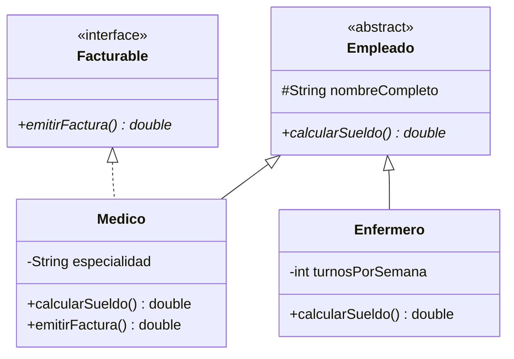

# 💡 Ejemplo 08 — Interfaces

## 🌍 Contexto

Una **interfaz** (`interface`) es un contrato de métodos sin cuerpo (ni estado) que una o más clases,
no necesariamente emparentadas entre sí, pueden implementar con `implements`. A diferencia de una clase
abstracta, una interfaz no comparte código ni atributos: solo compromete a implementar ciertos métodos.

**Qué busca demostrar este ejemplo**: una interfaz con un método, una clase que la implementa **a la
vez** que extiende una clase abstracta (dos contratos distintos), y el error real de instanciarla
directamente.

## 🏥 Caso de estudio

**MediSalud** necesita que algunos empleados, además de cobrar un sueldo (`Empleado`, Ejemplo 07),
puedan emitir una factura por sus servicios (`Facturable`). No todo `Empleado` es `Facturable` (un
`Enfermero`, en este ejemplo, no lo es), así que no tiene sentido ponerlo en la superclase `Empleado`.

## 🗺️ Diagrama de clases



## 🌳 Árbol de archivos (como se vería en VS Code)

```text
Modulo07HerenciaYPolimorfismo
└── src
    └── com
        └── medisalud
            ├── Empleado.java      ← igual que en el Ejemplo 07
            ├── Enfermero.java     ← igual que en el Ejemplo 07 (no implementa Facturable)
            ├── Facturable.java    ← nuevo, interface
            ├── Medico.java        ← ahora también implements Facturable
            └── Demo.java          ← nuevo en este ejemplo
```

## 💻 Archivo: Empleado.java

```java
package com.medisalud;

public abstract class Empleado {
    protected String nombreCompleto;

    public Empleado(String nombreCompleto) {
        this.nombreCompleto = nombreCompleto;
    }

    public String getNombreCompleto() {
        return nombreCompleto;
    }

    public abstract double calcularSueldo();
}
```

## 💻 Archivo: Facturable.java

```java
package com.medisalud;

public interface Facturable {
    double emitirFactura();
}
```

## 💻 Archivo: Medico.java

```java
package com.medisalud;

public class Medico extends Empleado implements Facturable {
    private String especialidad;

    public Medico(String nombreCompleto, String especialidad) {
        super(nombreCompleto);
        this.especialidad = especialidad;
    }

    public String getEspecialidad() {
        return especialidad;
    }

    @Override
    public double calcularSueldo() {
        return 1500.0;
    }

    @Override
    public double emitirFactura() {
        return 200.0;
    }
}
```

## 💻 Archivo: Enfermero.java

```java
package com.medisalud;

public class Enfermero extends Empleado {
    private int turnosPorSemana;

    public Enfermero(String nombreCompleto, int turnosPorSemana) {
        super(nombreCompleto);
        this.turnosPorSemana = turnosPorSemana;
    }

    public int getTurnosPorSemana() {
        return turnosPorSemana;
    }

    @Override
    public double calcularSueldo() {
        return 1000.0 + turnosPorSemana * 50.0;
    }
}
```

## 💻 Archivo: Demo.java

```java
package com.medisalud;

public class Demo {
    public static void main(String[] args) {
        Medico medico = new Medico("Laura Gómez", "Cardiología");

        System.out.println(medico.getNombreCompleto());
        System.out.println(medico.calcularSueldo());
        System.out.println(medico.emitirFactura());
    }
}
```

## 🧭 Explicación paso a paso

1. `Facturable` se declara con `interface`, no `class`; su método `emitirFactura()` no tiene cuerpo
   (termina en `;`) y es abstracto por naturaleza, sin necesidad de escribir `abstract`.
2. `Medico extends Empleado implements Facturable`: extiende una clase (herencia, un solo padre posible
   en Java) e implementa una interfaz (se pueden implementar varias a la vez, separadas por comas).
3. `Medico` debe implementar `emitirFactura()` (de `Facturable`) **y** `calcularSueldo()` (de
   `Empleado`, heredado como abstracto): dos contratos distintos, cumplidos por la misma clase.
4. `Enfermero` extiende `Empleado` pero **no** implementa `Facturable`: no tiene `emitirFactura()`, y
   no lo necesita para ser un `Empleado` válido.
5. Igual que una clase abstracta, una interfaz no puede instanciarse directamente con `new` (ver
   Análisis: errores frecuentes).

## ✅ Resultado esperado

```text
Laura Gómez
1500.0
200.0
```

## 🧪 Casos de prueba

| Expresión | ¿Compila? |
|---|---|
| `Medico extends Empleado implements Facturable` | Sí |
| `Facturable f = medico;` (una variable de tipo interfaz referenciando un `Medico`) | Sí |
| `new Facturable()` | No |

## 🔍 Análisis: errores frecuentes

**Error — Instanciar una interfaz directamente (compilación).**

```java no-compila
package com.medisalud;

public class DemoInstanciarFacturable {
    public static void main(String[] args) {
        Facturable facturable = new Facturable();
    }
}
```

```text
✖ Cannot instantiate the type Facturable Java(16777373) [Ln 5, Col 37]
```

El mensaje de `javac` dice `Facturable is abstract; cannot be instantiated` — **el mismo mensaje**, en
`javac` y en el panel, que instanciar directamente una clase abstracta (Ejemplo 07): Java trata ambos
casos, a efectos de este error, de la misma forma.

## ❓ Preguntas de repaso

**1. [Selección]** **Pregunta:** ¿qué diferencia principal hay entre una clase abstracta y una
interfaz?

- **A.** Una interfaz puede tener atributos de instancia y código compartido; una clase abstracta no.
- **B.** Una clase abstracta puede compartir código y estado entre subclases emparentadas; una interfaz
  solo declara un contrato de métodos, sin estado.
- **C.** No hay ninguna diferencia real.
- **D.** Una interfaz solo puede ser implementada por una clase a la vez.

<details>
<summary>🔑 Ver respuesta</summary>

**Respuesta correcta: B.** Una clase abstracta puede tener atributos y métodos concretos compartidos
por sus subclases; una interfaz es un contrato sin estado que clases no emparentadas pueden implementar.

</details>

**2. [Selección múltiple]** **Pregunta:** ¿cuáles afirmaciones sobre `Medico` en este ejemplo son
verdaderas?

- **A.** `Medico extends Empleado implements Facturable` combina herencia e implementación de interfaz.
- **B.** `Medico` debe implementar tanto `calcularSueldo()` como `emitirFactura()`.
- **C.** `Enfermero` también debe implementar `emitirFactura()` porque extiende `Empleado`.
- **D.** Una clase puede implementar más de una interfaz a la vez.

<details>
<summary>🔑 Ver respuesta</summary>

**Respuestas correctas: A, B y D.** C es falsa: `Enfermero` no implementa `Facturable`, así que no
tiene esa obligación.

</details>

**3. [Abierta]** ¿Por qué `emitirFactura()` se puso en una interfaz (`Facturable`) y no directamente en
`Empleado`?

<details>
<summary>🔑 Ver respuesta modelo</summary>

Porque no todo `Empleado` puede facturar (`Enfermero`, en este ejemplo, no lo hace), así que ponerlo en
`Empleado` obligaría a todas las subclases a implementarlo, aunque no tenga sentido para algunas. Una
interfaz separada permite que solo las clases que sí facturan (como `Medico`) la implementen, sin
afectar a las demás.

</details>
