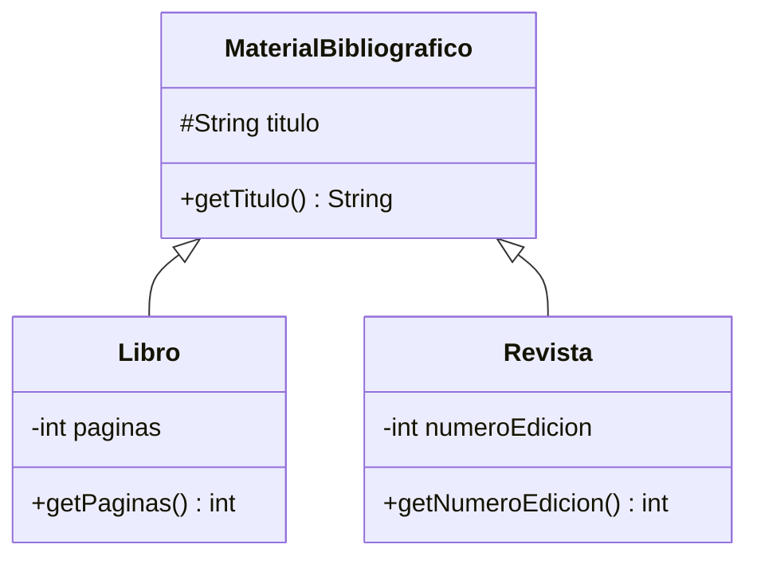

# 🟢 Básico 01 — Leer un diagrama de clases

## 🧩 Problema

La **Biblioteca Universitaria** modela su material con la siguiente jerarquía.

## 🗺️ Diagrama de clases

**Pregunta**: a partir del diagrama, sin ver el código, responde:

1. ¿Cuál es la superclase de esta jerarquía?
2. ¿Qué miembro tienen en común `Libro` y `Revista`, y de dónde lo heredan?
3. ¿Qué atributo tiene `Libro` que `Revista` no tiene, y viceversa?
4. El signo `#` de `titulo` marca un modificador distinto de `-` y `+`: ¿cuál es y qué significa?

## 📏 Criterios de evaluación de la solución

- Identifica correctamente `MaterialBibliografico` como la superclase.
- Explica que `getTitulo()` se hereda de `MaterialBibliografico`.
- Distingue `paginas` (`Libro`) de `numeroEdicion` (`Revista`).
- Reconoce `#` como `protected` (Módulo 6).

## 🚧 Restricciones

- No hace falta escribir código: es un ejercicio de lectura.

## 📊 Dificultad

Básico

## 🎓 Resultados de aprendizaje

- **RA-1**: leer un diagrama de clases simple (clases, atributos, métodos, flecha de herencia).
