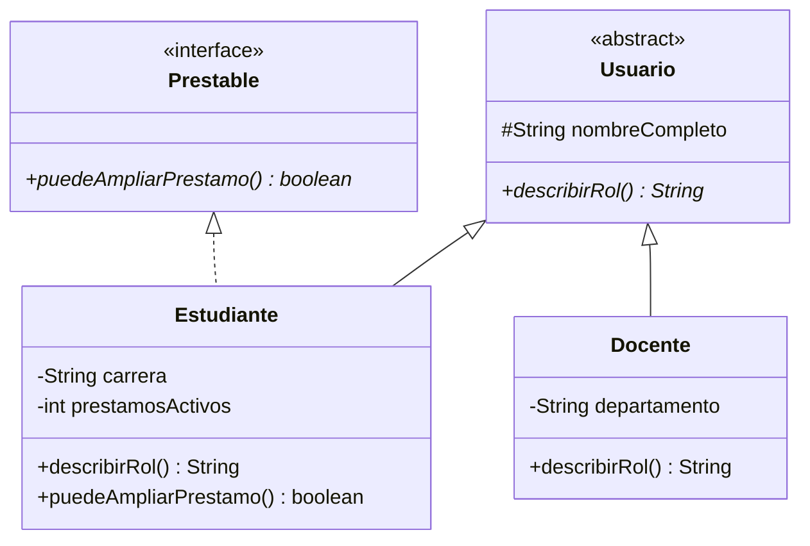

# 🏆 Desafío 01 — Diseñar una jerarquía nueva

## 🧩 Problema

**Biblioteca Universitaria** necesita modelar a sus usuarios: **estudiantes** y **docentes**, cada uno
con un rol distinto, y solo los estudiantes con un límite de préstamos activos.

Diseña una jerarquía completa (no usada en los ejemplos del módulo) que incluya:

1. Una superclase abstracta `Usuario` con un método abstracto `describirRol()`.
2. Dos subclases: `Estudiante` (con `carrera` y `prestamosActivos`) y `Docente` (con `departamento`),
   cada una implementando `describirRol()` a su manera.
3. Un constructor **sobrecargado** en `Estudiante`: uno que reciba `prestamosActivos` explícito, y otro
   que lo asuma en `0` por defecto (usando `this(...)`).
4. Una interfaz `Prestable` con `puedeAmpliarPrestamo()`, implementada solo por `Estudiante` (un
   docente no tiene límite de préstamos en este sistema).
5. Una demostración de polimorfismo: variables de tipo `Usuario` referenciando cada subclase,
   invocando `describirRol()`.

## 🗺️ Diagrama de clases



## ✅ Salida esperada al ejecutar

```text
Estudiante de Ingeniería
Estudiante de Biología
Docente del departamento de Literatura
false
true
```

(Con `Ana Torres` en `Ingeniería` con 3 préstamos activos, `Luis Peña` en `Biología` sin especificar
préstamos, y `Marta Salinas` como docente de `Literatura`.)

## 📏 Criterios de evaluación de la solución

- `Usuario` es `abstract`, con `describirRol()` abstracto.
- `Estudiante` y `Docente` extienden `Usuario` e implementan `describirRol()`.
- `Estudiante` tiene dos constructores (sobrecargados), uno delegando en el otro con `this(...)`.
- `Estudiante implements Prestable`; `Docente` no.
- La salida coincide exactamente con la esperada.

## 🚧 Restricciones

- No reutilices `Persona`/`Empleado` ni ninguna clase de los ejemplos: esta jerarquía es nueva.
- El límite de préstamos activos para `puedeAmpliarPrestamo()` es 3.

## 📊 Dificultad

Desafío

## 🎓 Resultados de aprendizaje

- **RA-2**: explicar qué es la herencia.
- **RA-8**: declarar métodos y constructores sobrecargados.
- **RA-9**: sobreescribir un método con `@Override`.
- **RA-12**: declarar una interfaz y una clase que la implemente.
