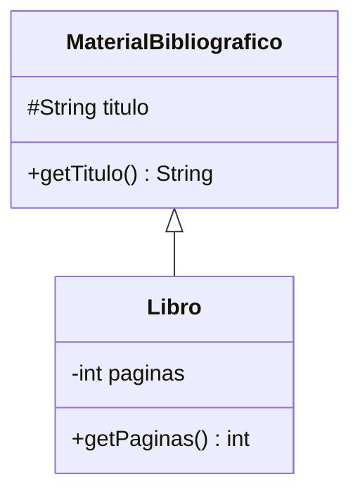

# 🟡 Intermedio 01 — Declarar una jerarquía de dos niveles

## 🧩 Problema

**Biblioteca Universitaria** tiene la clase `Libro`, que todavía no forma parte de ninguna jerarquía.

## 🗺️ Diagrama de clases



## 💻 Código o contexto de partida

```java
package com.biblioteca;

// TODO: esta clase todavía no hereda de MaterialBibliografico.
public class Libro {
    private String titulo;
    private int paginas;

    public Libro(String titulo, int paginas) {
        this.titulo = titulo;
        this.paginas = paginas;
    }

    public String getTitulo() {
        return titulo;
    }

    public int getPaginas() {
        return paginas;
    }

    public static void main(String[] args) {
        Libro libro = new Libro("El principito", 96);
        System.out.println(libro.getTitulo());
        System.out.println(libro.getPaginas());
    }
}
```

**Tarea**: crea la clase `MaterialBibliografico` (con `titulo` y `getTitulo()`) y modifica `Libro` para
que `extends MaterialBibliografico`, invocando `super(titulo)` en su constructor.

## 🧪 Casos de prueba

| Llamada | Resultado esperado |
|---|---|
| `libro.getTitulo()` (heredado) | `"El principito"` |
| `libro.getPaginas()` | `96` |

## 📏 Criterios de evaluación de la solución

- `MaterialBibliografico` declara `titulo` (`protected`) y `getTitulo()`.
- `Libro extends MaterialBibliografico`, con `super(titulo)` en su constructor.
- El programa compila y produce la misma salida que antes de la jerarquía.

## 🚧 Restricciones

- No cambies la salida del programa: la jerarquía es un cambio de estructura interna, no de
  comportamiento observable.

## 📊 Dificultad

Intermedio

## 🎓 Resultados de aprendizaje

- **RA-3**: declarar una subclase con `extends` e identificar qué hereda y qué no.
- **RA-4**: invocar `super(...)` en el constructor de una subclase.
- **RA-5**: usar `super`/`this` para encadenar constructores.
