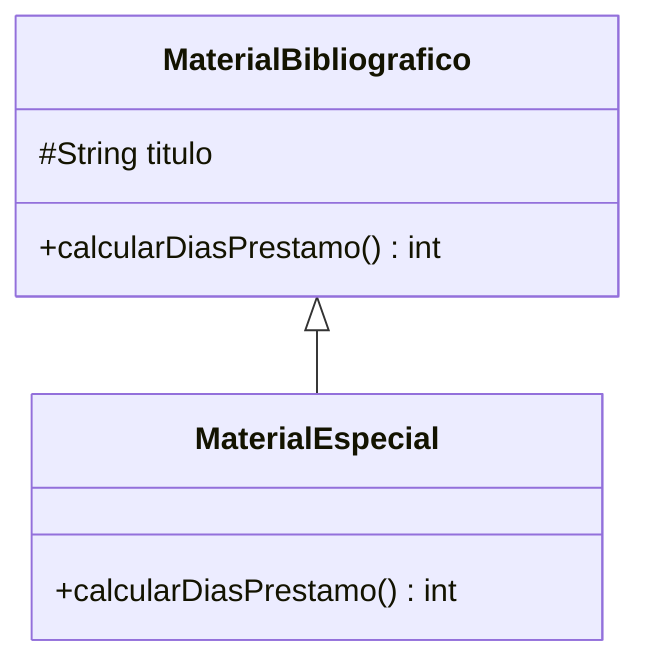

# 🟡 Intermedio 03 — Sobreescribir con @Override

## 🧩 Problema

**Biblioteca Universitaria** presta material especial (manuscritos, ediciones únicas) con **3 días
extra** sobre el plazo normal.

## 🗺️ Diagrama de clases



## 💻 Código o contexto de partida

```java
package com.biblioteca;

public class MaterialBibliografico {
    protected String titulo;

    public MaterialBibliografico(String titulo) {
        this.titulo = titulo;
    }

    public String getTitulo() {
        return titulo;
    }

    public int calcularDiasPrestamo() {
        return 10;
    }
}
```

**Tarea**: declara `MaterialEspecial extends MaterialBibliografico`, sobreescribiendo
`calcularDiasPrestamo()` con `@Override` para que devuelva el valor de la superclase **más 3**, usando
`super.calcularDiasPrestamo()` (sin repetir el número `10`).

## 🧪 Casos de prueba

| Objeto | `calcularDiasPrestamo()` |
|---|---|
| `MaterialBibliografico` | `10` |
| `MaterialEspecial` | `13` |

## 📏 Criterios de evaluación de la solución

- `MaterialEspecial` sobreescribe `calcularDiasPrestamo()` con `@Override`.
- Usa `super.calcularDiasPrestamo()` en vez de repetir el valor `10`.
- El programa produce `10` y `13`.

## 🚧 Restricciones

- No repitas el número `10` dentro de `MaterialEspecial`: reutiliza el de la superclase con `super`.

## 📊 Dificultad

Intermedio

## 🎓 Resultados de aprendizaje

- **RA-9**: sobreescribir un método con `@Override`, respetando su firma.
- **RA-5**: usar `super.metodo()` para reutilizar comportamiento heredado.
