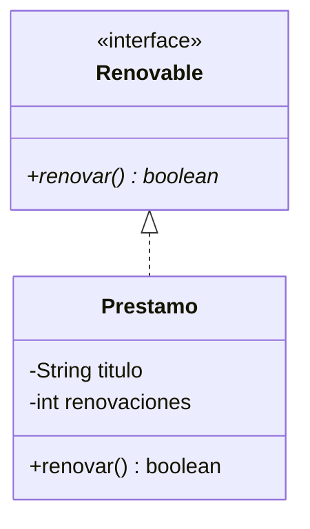

# 🟡 Intermedio 04 — Declarar una interfaz completa

## 🧩 Problema

**Biblioteca Universitaria** permite renovar un préstamo, hasta un máximo de **2 veces**.

## 🗺️ Diagrama de clases

## 💻 Código o contexto de partida

**Tarea**: declara la interfaz `Renovable` con el método `boolean renovar()`, y la clase `Prestamo` que
la implemente: `renovar()` debe devolver `true` y aumentar el contador de renovaciones si no se alcanzó
el máximo (2), o `false` si ya se alcanzó.

## 🧪 Casos de prueba

| Llamada | Resultado esperado |
|---|---|
| 1.ª `renovar()` | `true` |
| 2.ª `renovar()` | `true` |
| 3.ª `renovar()` | `false` (ya alcanzó el máximo) |
| `getRenovaciones()` después de las tres llamadas | `2` |

## 📏 Criterios de evaluación de la solución

- `Renovable` es una interfaz con `renovar()` sin cuerpo.
- `Prestamo implements Renovable`.
- El programa produce exactamente `true, true, false, 2`.

## 🚧 Restricciones

- El máximo de renovaciones es 2, fijo.

## 📊 Dificultad

Intermedio

## 🎓 Resultados de aprendizaje

- **RA-12**: declarar una interfaz y una clase que la implemente.
