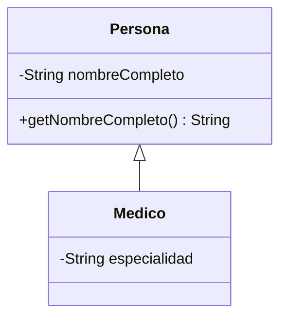
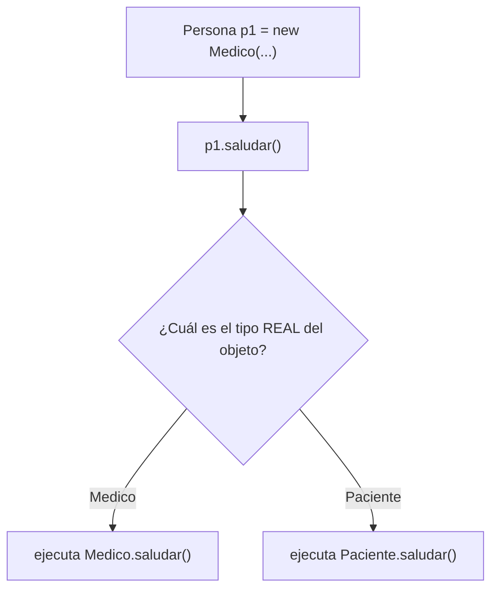

# 📘 Módulo 7 — Herencia y Polimorfismo

Curso de Java

---

## 🎯 Objetivos del módulo

- Leer e interpretar un diagrama de clases simple.
- Declarar una jerarquía de herencia con `extends`, `this` y `super`.
- Aplicar polimorfismo: sobrecargar y sobreescribir métodos.
- Diseñar con clases abstractas e interfaces.

---

## 🗺️ Ruta de la sesión

1. Diagrama de clases.
2. Herencia: `extends`, `this`, `super`.
3. Polimorfismo: sobrecarga y sobre-escritura.
4. Clases abstractas e interfaces.

---

## 🧠 ¿Por qué diagramar antes de programar?

Un diagrama de clases muestra, de un vistazo, cómo se relacionan varias clases, antes de escribir una
sola línea de código.

---

## 🧠 Notación classDiagram de Mermaid



---

## 🧠 Cómo leer la flecha

`Persona <|-- Medico` se lee "`Medico` hereda de `Persona`": la punta del triángulo siempre apunta a
la **superclase**.

---

## 🧠 Lo que no se repite

Un miembro heredado **no** se vuelve a dibujar en la caja de la subclase: el diagrama solo muestra lo
que cada clase declara por sí misma.

---

## 🧠 ¿Qué es la herencia?

Una relación "es un tipo de" entre una subclase y su superclase: `Medico extends Persona` reutiliza
todo lo que `Persona` ya declara.

---

## 🧠 Lo que se hereda

```java
public class Medico extends Persona {
    // hereda getNombreCompleto() y saludar()
}
```

Todo lo que **no** es `private`: atributos y métodos `public`, por defecto o `protected`.

---

## 🧠 Lo que NO se hereda

- Un atributo `private` sigue sin ser accesible directamente.
- Los **constructores nunca se heredan**: cada subclase declara el suyo propio.

---

## 🧠 super(...): inicializar la parte heredada

```java
public Medico(String nombreCompleto, String especialidad) {
    super(nombreCompleto);
    this.especialidad = especialidad;
}
```

---

## 🧠 El error de olvidar super()

```text
Implicit super constructor Persona() is undefined.
Must explicitly invoke another constructor
```

Ocurre cuando la superclase no tiene un constructor sin parámetros.

---

## 🧠 super.metodo(): reutilizar comportamiento

```java
@Override
public String saludar() {
    return super.saludar() + ", especialista en " + especialidad;
}
```

---

## 🧠 this(...): encadenar constructores

```java
public Medico(String nombreCompleto) {
    this(nombreCompleto, "General");
}
```

Invoca **otro constructor de la misma clase**, no el de la superclase.

---

## 🧠 protected con herencia: el hilo del Módulo 6

Sin herencia, `protected` se comporta igual que el acceso por defecto (Módulo 6). **Con herencia**, una
subclase de otro paquete sí accede a su propio miembro `protected` heredado.

---

## 🧠 Encadenamiento de constructores

```mermaid
flowchart LR
    A["new Medico(\"Carlos Ramírez\")"] -->|"this(...)"| B["Medico(nombre, especialidad)"]
    B -->|"super(...)"| C["Persona(nombre)"]
```

---

## 🧠 ¿Qué es el polimorfismo?

Una variable de tipo superclase puede referenciar un objeto de cualquier subclase; el método que se
ejecuta se decide **en tiempo de ejecución**, según el tipo real del objeto.

---

## 🧠 Enlace dinámico

```java
Persona p = new Medico(...);
p.saludar(); // ejecuta Medico.saludar(), no Persona.saludar()
```

---

## 🧠 Tipo declarado vs. tipo real



---

## 🧠 Sin sobre-escritura no hay polimorfismo

Si ninguna subclase sobreescribiera `saludar()`, siempre se ejecutaría la versión de `Persona`: el
polimorfismo depende de que exista una sobre-escritura real.

---

## 🧠 ¿Qué es la sobrecarga?

Varios métodos, o constructores, con el **mismo nombre** y **distinta lista de parámetros**, en la
misma clase.

---

## 🧠 Sobrecarga de un método

```java
public String describir() { ... }
public String describir(boolean incluirEdad) { ... }
```

---

## 🧠 ¿Cómo decide el compilador?

La sobrecarga se resuelve **en tiempo de compilación**, según el número y el tipo de los argumentos de
la llamada.

---

## 🧠 ¿Qué es la sobre-escritura?

Redefinir, en una subclase, un método heredado con la **misma firma** exacta, marcada con `@Override`.

---

## 🧠 Las reglas de @Override

- Misma firma exacta (nombre, parámetros, tipo de retorno).
- El acceso **no puede volverse más restrictivo** que el de la superclase.

---

## 🧠 Error: acceso más restrictivo

```text
attempting to assign weaker access privileges; was public
```

---

## 🧠 Error: @Override inválido

```text
method does not override or implement a method from a supertype
```

`@Override` detecta que la firma no coincide con ninguna de la superclase.

---

## 🧠 Sobrecarga frente a sobre-escritura

| | Sobrecarga | Sobre-escritura |
|---|---|---|
| ¿Dónde? | Misma clase | Subclase y superclase |
| ¿Firma? | Distinta | Idéntica |
| ¿Cuándo se resuelve? | En compilación | En ejecución |

---

## 🧠 ¿Qué es una clase abstracta?

Una clase (`abstract class`) que no puede instanciarse directamente: existe para ser extendida.

---

## 🧠 Métodos abstractos

```java
public abstract class Empleado {
    public abstract double calcularSueldo();
}
```

Sin cuerpo: cada subclase concreta debe implementarlo.

---

## 🧠 Error: instanciar una clase abstracta

```text
Empleado is abstract; cannot be instantiated
```

---

## 🧠 Error: método abstracto sin implementar

```text
MedicoIncompleto is not abstract and does not
override abstract method calcularSueldo() in Empleado
```

---

## 🧠 ¿Qué es una interfaz?

Un contrato de métodos sin cuerpo (ni estado) que una o más clases, no necesariamente emparentadas,
pueden implementar con `implements`.

---

## 🧠 Declarar una interfaz

```java
public interface Facturable {
    double emitirFactura();
}
```

Sin cuerpo: es abstracto por naturaleza, sin necesidad de escribir `abstract`.

---

## 🧠 Varios contratos a la vez

```java
public class Medico extends Empleado implements Facturable {
    @Override
    public double calcularSueldo() {
        return 1500.0;
    }

    @Override
    public double emitirFactura() {
        return 200.0;
    }
}
```

Una clase puede implementar varias interfaces, pero extender solo una clase.

---

## 🧠 Clase abstracta vs. interfaz

| | Clase abstracta | Interfaz |
|---|---|---|
| ¿Estado compartido? | Sí | No |
| ¿Clases emparentadas? | Sí | No necesariamente |
| ¿Cuántas se pueden "heredar"? | Una | Varias (`implements`) |

---

## 🧠 Errores frecuentes: de compilación

| Error | Mensaje real |
|---|---|
| Falta `super(...)` | `Implicit super constructor ... is undefined` |
| Instanciar abstracta/interfaz | `X is abstract; cannot be instantiated` |
| Método abstracto sin implementar | `must implement the inherited abstract method` |
| Acceso más restrictivo al sobreescribir | `attempting to assign weaker access privileges` |

---

## 🧠 Errores frecuentes: lógicos

| Error | Se detecta con |
|---|---|
| Confundir sobrecarga con sobre-escritura | Revisar si hay relación de herencia y si la firma es idéntica |
| Predecir mal qué versión sobreescrita se ejecuta | Verificar el tipo **real** del objeto, no el declarado |

---

## 🛠️ Actividad práctica: el taller

**Jerarquía encapsulada de empleados** (MediSalud)

- `Empleado` abstracta, con `Medico` y `Enfermero` concretas.
- Sobre-escritura de `calcularSueldo()`.
- Demostración de polimorfismo con variables de tipo `Empleado`.

---

## 📌 Resumen

- Un diagrama de clases muestra la relación de herencia antes de escribir código.
- La herencia reutiliza miembros no privados; los constructores nunca se heredan.
- El polimorfismo decide, en tiempo de ejecución, qué versión de un método sobreescrito se ejecuta.
- La sobrecarga (compilación) y la sobre-escritura (ejecución) son mecanismos distintos.
- Una clase abstracta comparte estado con sus subclases; una interfaz es un contrato sin estado.

---

## 📝 Evaluación

Quiz de 16 preguntas (formato entrevista técnica) y los ejercicios del módulo.
