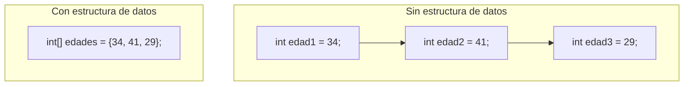

# 💡 Ejemplo 01 — Estructuras de datos

## 🌍 Contexto

Una **estructura de datos** es una forma de organizar varios valores relacionados para almacenarlos y
procesarlos como un conjunto, en vez de como variables independientes. Cuando varios datos son del
mismo tipo y están relacionados entre sí, declarar una variable distinta por cada uno obliga a repetir
código y hace que el programa no escale: si mañana hay 100 pacientes en vez de 3, no se puede seguir
declarando `edad1`, `edad2`, ..., `edad100`.

**Qué busca demostrar este ejemplo**: el mismo resultado (mostrar las edades de tres pacientes) escrito
primero sin ninguna estructura de datos, y después con un arreglo, para ver de un vistazo qué cambia.

## 🏥 Caso de estudio

**MediSalud** necesita registrar la edad de varios pacientes. Con tres pacientes ya es incómodo usar una
variable por cada uno; con muchos más, sería impráctico.

## 🗺️ Diagrama



## 🌳 Árbol de archivos (como se vería en VS Code)

```text
Modulo08ArreglosListasGenericas
└── src
    └── Demo.java   ← nuevo en este ejemplo
```

## 💻 Archivo: Demo.java

```java
public class Demo {
    public static void main(String[] args) {
        // Sin estructura de datos: una variable por cada paciente
        int edad1 = 34;
        int edad2 = 41;
        int edad3 = 29;
        System.out.println("Sin estructura de datos:");
        System.out.println(edad1);
        System.out.println(edad2);
        System.out.println(edad3);

        // Con estructura de datos: un arreglo agrupa las tres edades
        int[] edades = {34, 41, 29};
        System.out.println("Con estructura de datos:");
        System.out.println(edades[0]);
        System.out.println(edades[1]);
        System.out.println(edades[2]);
    }
}
```

## 🧭 Explicación paso a paso

1. La primera parte declara tres variables `int` independientes: `edad1`, `edad2`, `edad3`. Nada las
   relaciona formalmente entre sí más que su nombre parecido.
2. La segunda parte declara **una sola variable**, `edades`, de tipo `int[]` (un arreglo de `int`), que
   guarda los mismos tres valores.
3. Acceder a cada valor del arreglo usa un **índice** entre corchetes: `edades[0]`, `edades[1]`,
   `edades[2]` (el primer índice siempre es `0`, no `1`; se profundiza en el Ejemplo 03).
4. Ambas versiones producen exactamente el mismo resultado: la diferencia no es el resultado, sino qué
   tan bien escala el código si la cantidad de datos cambia.
5. A partir de este módulo, cualquier grupo de datos relacionados del mismo tipo se modela con una
   estructura de datos (un arreglo, o más adelante una `List`), no con variables sueltas.

## ✅ Resultado esperado

```text
Sin estructura de datos:
34
41
29
Con estructura de datos:
34
41
29
```

## 🧪 Casos de prueba

| Versión | Acceso al segundo paciente |
|---|---|
| Sin estructura de datos | `edad2` |
| Con estructura de datos | `edades[1]` |

## 🔍 Análisis: errores frecuentes

**Error conceptual — Pensar que una estructura de datos "esconde" la complejidad, cuando en realidad la
organiza.** El objetivo de una estructura de datos no es hacer que el programa tenga menos líneas de
código en este ejemplo pequeño (de hecho, la versión con arreglo no es más corta aquí); el objetivo es
que el programa **escale**: agregar un paciente 101 a un arreglo (o a una `List`, más adelante) no
requiere declarar una variable nueva ni repetir código.

## ❓ Preguntas de repaso

**1. [Selección]** **Pregunta:** ¿por qué conviene usar un arreglo en vez de una variable independiente
por cada dato del mismo tipo?

- **A.** Porque un arreglo siempre usa menos líneas de código.
- **B.** Porque el programa escala mejor cuando la cantidad de datos crece.
- **C.** Porque las variables independientes no se pueden imprimir.
- **D.** No hay ninguna ventaja real.

<details>
<summary>🔑 Ver respuesta</summary>

**Respuesta correcta: B.** La ventaja de una estructura de datos aparece cuando la cantidad de datos
crece: no hace falta declarar una variable nueva por cada uno.

</details>

**2. [Selección múltiple]** **Pregunta:** ¿cuáles afirmaciones sobre `edades` (el arreglo) son
verdaderas?

- **A.** `edades[0]` accede al primer valor.
- **B.** `edades` es una sola variable que guarda tres valores.
- **C.** `edades` y `edad1`/`edad2`/`edad3` producen el mismo resultado en este ejemplo.
- **D.** Un arreglo solo puede guardar un valor.

<details>
<summary>🔑 Ver respuesta</summary>

**Respuestas correctas: A, B y C.** D es falsa: un arreglo guarda varios valores del mismo tipo.

</details>

**3. [Abierta]** ¿Qué pasaría si `MediSalud` necesitara registrar la edad de 500 pacientes, usando el
enfoque "sin estructura de datos" (una variable por paciente)?

<details>
<summary>🔑 Ver respuesta modelo</summary>

Habría que declarar 500 variables independientes (`edad1` hasta `edad500`), lo cual es impráctico de
escribir, de leer y de mantener. Con un arreglo, basta con `int[] edades = new int[500];` (o un literal
con los 500 valores) y acceder a cada uno por su índice, sin repetir la declaración.

</details>
