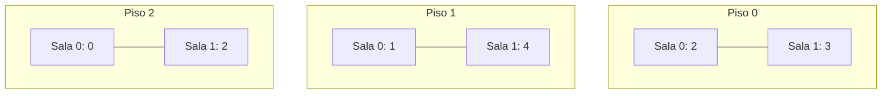

# 💡 Ejemplo 06 — Arreglos multidimensionales

## 🌍 Contexto

Un arreglo multidimensional es un arreglo cuyos elementos son, a su vez, arreglos. El caso más común es
la **matriz** de dos dimensiones (`int[][]`), útil para representar datos organizados en filas y
columnas.

**Qué busca demostrar este ejemplo**: declarar una matriz, acceder a un elemento por sus dos índices
(fila y columna), y recorrerla completa con bucles anidados.

## 🏥 Caso de estudio

**MediSalud** registra cuántas camas están ocupadas en cada sala de cada piso: una matriz donde la fila
es el piso y la columna es la sala.

## 🗺️ Diagrama



## 🌳 Árbol de archivos (como se vería en VS Code)

```text
Modulo08ArreglosListasGenericas
└── src
    └── Demo.java   ← nuevo en este ejemplo
```

## 💻 Archivo: Demo.java

```java
public class Demo {
    public static void main(String[] args) {
        // Filas = pisos, columnas = salas
        int[][] camasOcupadas = {
            {2, 3},
            {1, 4},
            {0, 2}
        };

        System.out.println(camasOcupadas[0][1]);
        System.out.println(camasOcupadas[2][0]);

        int total = 0;
        for (int piso = 0; piso < camasOcupadas.length; piso++) {
            for (int sala = 0; sala < camasOcupadas[piso].length; sala++) {
                total = total + camasOcupadas[piso][sala];
            }
        }
        System.out.println(total);
    }
}
```

## 🧭 Explicación paso a paso

1. `int[][] camasOcupadas = { {2, 3}, {1, 4}, {0, 2} };` declara una matriz de 3 filas (pisos) y 2
   columnas (salas) cada una, con un literal anidado.
2. `camasOcupadas[0][1]` accede a la fila `0` (piso 0), columna `1` (sala 1): el valor `3`. El primer
   índice es la fila, el segundo es la columna.
3. `camasOcupadas[2][0]` accede a la fila `2` (piso 2), columna `0` (sala 0): el valor `0`.
4. Recorrer una matriz completa necesita **dos bucles anidados**: el externo recorre las filas
   (`camasOcupadas.length` filas), el interno recorre las columnas de cada fila
   (`camasOcupadas[piso].length` columnas).
5. El total se acumula sumando cada celda visitada por los bucles anidados.

## ✅ Resultado esperado

```text
3
0
12
```

## 🧪 Casos de prueba

| Acceso | Resultado |
|---|---|
| `camasOcupadas[0][1]` | `3` |
| `camasOcupadas[2][0]` | `0` |
| Suma total de todas las celdas | `12` |

## 🔍 Análisis: errores frecuentes

**Error conceptual — Confundir el orden de fila y columna.** `camasOcupadas[fila][columna]`: el primer
índice siempre es la fila, el segundo la columna. Invertirlos (`camasOcupadas[columna][fila]`) no
siempre produce un error de compilación (si la matriz es cuadrada, ambos índices son válidos), pero
accede a la celda equivocada.

## ❓ Preguntas de repaso

**1. [Selección]** **Pregunta:** en `camasOcupadas[1][0]`, ¿a qué corresponde el índice `1`?

- **A.** A la columna (sala).
- **B.** A la fila (piso).
- **C.** Al valor guardado en esa celda.
- **D.** Al tamaño total de la matriz.

<details>
<summary>🔑 Ver respuesta</summary>

**Respuesta correcta: B.** El primer índice siempre corresponde a la fila; el segundo, a la columna.

</details>

**2. [Selección múltiple]** **Pregunta:** ¿cuáles afirmaciones sobre recorrer una matriz son verdaderas?

- **A.** Se necesitan dos bucles anidados: uno para las filas, uno para las columnas.
- **B.** `camasOcupadas.length` da la cantidad de filas.
- **C.** `camasOcupadas[fila].length` da la cantidad de columnas de esa fila.
- **D.** Un solo bucle `for-each` alcanza para recorrer todas las celdas directamente con un valor
  numérico.

<details>
<summary>🔑 Ver respuesta</summary>

**Respuestas correctas: A, B y C.** D es falsa (para este módulo): recorrer todas las celdas
directamente con un solo bucle simple no es posible sin bucles anidados, ya que cada fila es a su vez
un arreglo.

</details>

**3. [Abierta]** ¿Por qué hacen falta dos bucles anidados para recorrer una matriz completa, en vez de
uno solo?

<details>
<summary>🔑 Ver respuesta modelo</summary>

Porque una matriz de dos dimensiones es, en realidad, un arreglo de arreglos: cada elemento del arreglo
externo (`camasOcupadas[piso]`) es a su vez un arreglo completo (las salas de ese piso). Un solo bucle
recorrería solo las filas (obteniendo arreglos completos, no valores individuales); hace falta un
segundo bucle, anidado, para entrar en cada fila y recorrer sus columnas una por una.

</details>
