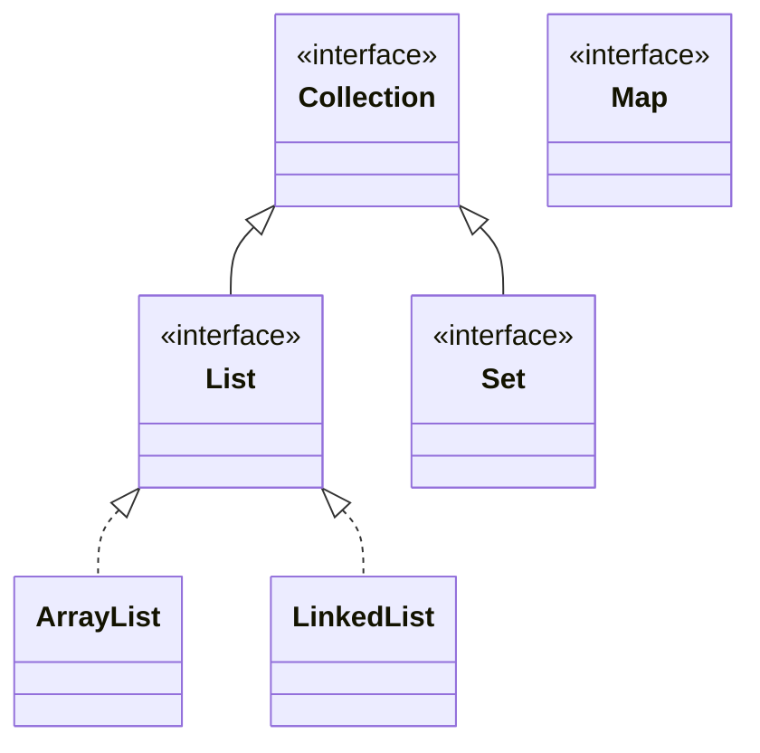

# 💡 Ejemplo 07 — Jerarquía de colecciones

## 🌍 Contexto

El **framework de colecciones** de Java (`java.util`) ofrece estructuras de datos de tamaño dinámico,
como alternativa a los arreglos. `Collection` es la interfaz base; `List`, `Set` y `Map` son sus tres
grandes familias, cada una para un tipo de necesidad distinta.

**Qué busca demostrar este ejemplo**: dónde encaja `List` en esa jerarquía, y que tanto `ArrayList`
como `LinkedList` son dos implementaciones distintas de la **misma** interfaz `List`.

## 🗺️ Diagrama de clases



## 🌳 Árbol de archivos (como se vería en VS Code)

```text
Modulo08ArreglosListasGenericas
└── src
    └── Demo.java   ← nuevo en este ejemplo
```

## 💻 Archivo: Demo.java

```java
import java.util.ArrayList;
import java.util.LinkedList;
import java.util.List;

public class Demo {
    public static void main(String[] args) {
        List<String> conArrayList = new ArrayList<>();
        List<String> conLinkedList = new LinkedList<>();
        conArrayList.add("Ana Torres");
        conLinkedList.add("Ana Torres");
        System.out.println(conArrayList.get(0));
        System.out.println(conLinkedList.get(0));
    }
}
```

## 🧭 Explicación paso a paso

1. `Collection` es la interfaz más general del framework: representa "un grupo de elementos".
2. `List`, `Set` y `Map` son las tres grandes familias: `List` es una secuencia ordenada con acceso por
   índice (este módulo); `Set` no permite elementos repetidos; `Map` asocia una clave con un valor.
   Este módulo solo profundiza en `List` (Clarifications); `Set` y `Map` quedan para un módulo
   posterior.
3. `ArrayList` y `LinkedList` son dos clases **distintas**, pero ambas implementan la **misma**
   interfaz `List`: por eso una variable declarada `List<String> nombre = ...` puede apuntar a
   cualquiera de las dos, sin cambiar el resto del código.
4. `conArrayList.get(0)` y `conLinkedList.get(0)` usan exactamente el mismo método, `get(indice)`,
   porque ambas variables están declaradas como `List<String>`, la interfaz común.
5. Un `Map` (no cubierto en este módulo) no tendría sentido reemplazarlo así con `List`: cada familia
   del framework resuelve una necesidad distinta.

## ✅ Resultado esperado

```text
Ana Torres
Ana Torres
```

## 🧪 Casos de prueba

| Variable | Tipo declarado | Implementación real |
|---|---|---|
| `conArrayList` | `List<String>` | `ArrayList` |
| `conLinkedList` | `List<String>` | `LinkedList` |

## 🔍 Análisis: errores frecuentes

**Error conceptual — Pensar que `List` es una clase que se puede instanciar directamente.** `List` es
una **interfaz**: `new List<>()` no compila. Siempre se instancia una implementación concreta
(`new ArrayList<>()` o `new LinkedList<>()`), aunque la variable se declare con el tipo de la interfaz.

## ❓ Preguntas de repaso

**1. [Selección]** **Pregunta:** ¿qué interfaz implementan tanto `ArrayList` como `LinkedList`?

- **A.** `Set`.
- **B.** `Map`.
- **C.** `List`.
- **D.** `Collection` directamente, sin pasar por ninguna interfaz intermedia.

<details>
<summary>🔑 Ver respuesta</summary>

**Respuesta correcta: C.** Ambas son implementaciones distintas de la misma interfaz `List`.

</details>

**2. [Selección múltiple]** **Pregunta:** ¿cuáles afirmaciones sobre la jerarquía de colecciones son
verdaderas?

- **A.** `Collection` es la interfaz base del framework.
- **B.** `List`, `Set` y `Map` son sus tres grandes familias.
- **C.** `ArrayList` y `LinkedList` son la misma clase con dos nombres distintos.
- **D.** Una variable `List<String>` puede referenciar un `ArrayList` o un `LinkedList` sin cambiar el
  resto del código.

<details>
<summary>🔑 Ver respuesta</summary>

**Respuestas correctas: A, B y D.** C es falsa: son dos clases distintas que implementan la misma
interfaz.

</details>

**3. [Abierta]** ¿Por qué conviene declarar una variable como `List<String> nombre = new
ArrayList<>();` en vez de `ArrayList<String> nombre = new ArrayList<>();`?

<details>
<summary>🔑 Ver respuesta modelo</summary>

Porque declarar la variable con el tipo de la interfaz (`List`) permite cambiar la implementación real
(de `ArrayList` a `LinkedList`, por ejemplo) más adelante, cambiando solo el lado derecho de la
asignación (`new LinkedList<>()`), sin tener que modificar el resto del código que usa esa variable.

</details>
